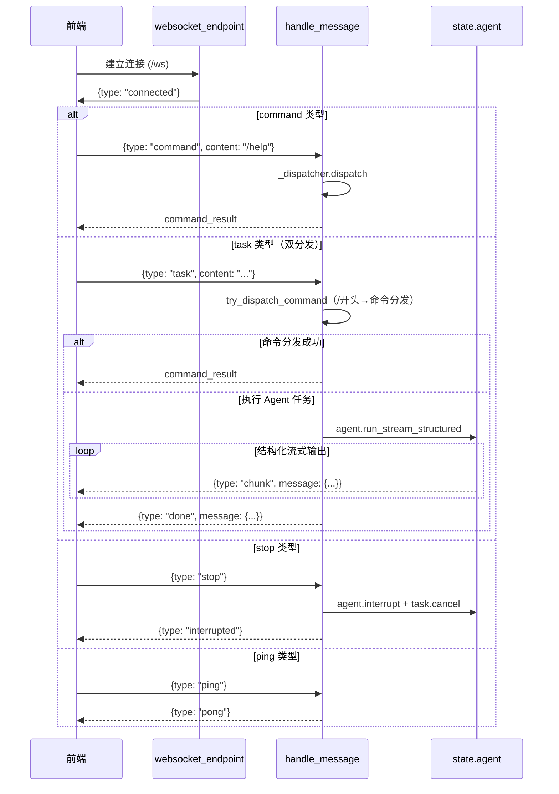

# Rubato API 模块设计文档

## 1. 模块概述

API 模块基于 FastAPI 实现，提供 RESTful API 和 WebSocket 两类接口，负责前端与后端的通信。

**文件清单**：
- `api/__init__.py`：导出 `create_app`
- `api/app.py`：FastAPI 应用创建与配置
- `api/websocket.py`：WebSocket 连接管理与消息处理
- `api/schemas.py`：Pydantic 数据模型
- `api/routes/__init__.py`：导出 `router`、`commands_router`、`sessions_router`
- `api/routes/configs.py`：配置管理 API
- `api/routes/testcases.py`：测试案例与知识文件 API
- `api/routes/commands.py`：命令执行 API
- `api/routes/sessions.py`：会话管理 API

***

## 2. 核心组件

### 2.1 FastAPI 应用 (app.py)

`create_app() -> FastAPI`：创建应用实例，配置 CORS（全开放）、注册路由（REST 统一 `/api` 前缀，WebSocket 无前缀）、挂载 `src/web/static` 到 `/static`、根路径 `GET /` 优先返回 `index.html` 否则返回 API 信息 JSON。

### 2.2 WebSocket 路由 (websocket.py)

**ConnectionManager**：管理活跃连接，支持 `connect`/`disconnect`/`send_message`/`broadcast`。

**模块级状态**：`manager`(连接管理器)、`_app_state`、`_dispatcher`(CommandDispatcher)、`_current_task`(当前异步任务)，通过 `set_app_state`/`get_app_state`/`init_command_dispatcher`/`get_dispatcher` 访问。

**WebSocket 端点**：`/ws`，接收 JSON 消息按 type 分发。

**请求消息类型**：`command`（控制台命令）、`task`（Agent 任务，含双分发逻辑）、`stop`（中断任务）、`ping`（心跳）。

**响应消息类型**：`connected`、`error`、`command_result`、`chunk`（结构化流式片段）、`done`（任务完成）、`interrupted`、`pong`。

**双分发逻辑**：`task` 类型先 `try_dispatch_command`（以 `/` 开头则分发为命令），失败则 `handle_task` 执行 `agent.run_stream_structured`，通过 `_sdk_message_to_structured` 将 SDKMessage 映射为结构化消息（assistant/tool_use/tool_result/error/interrupt → 对应 role/content/streaming/tool_calls 字段），以 `chunk` 发送，完成时发送 `done`。

**任务中断**：`handle_stop` 同时调用 `agent.interrupt` 和 `_current_task.cancel`。

### 2.3 配置路由 (routes/configs.py)

**CONFIG_FILES 映射**：model→model_config.yaml、mcp→mcp_config.yaml、prompt→prompt_config.yaml、skills→skills_config.yaml、test→test_config.yaml。

**API 接口**：
- `GET /api/configs`：列出配置文件信息
- `GET /api/configs/{config_name}`：获取配置内容
- `PUT /api/configs/{config_name}`：更新配置（YAML 校验→保存→`_app_state.reload_config`）
- `GET /api/status`：系统状态（model/mcp/skills/browser）
- `GET /api/skills`：技能列表（从 `_app_state.skill_loader`）
- `GET /api/tools`：工具列表（从 `mcp.tools.get_all_tools`）

### 2.4 测试案例路由 (routes/testcases.py)

从 `test_config.yaml` 读取 `test_case_path`/`knowledge_path`，`build_tree` 递归构建目录树（仅文件夹和 .md 文件）。

**API 接口**（testcases 和 knowledge 各一套，逻辑相同）：
- `GET /api/testcases/tree`、`GET /api/knowledge/tree`：目录树
- `GET /api/testcases/file?path=`、`GET /api/knowledge/file?path=`：文件内容（路径遍历校验 + 仅 .md）
- `PUT /api/testcases/file`、`PUT /api/knowledge/file`：更新文件

### 2.5 命令路由 (routes/commands.py)

**API 接口**：
- `POST /api/command`：通过 `_dispatcher.dispatch` 执行命令
- `GET /api/commands`：通过 `CommandRegistry.list_commands` 列出可用命令

### 2.6 会话路由 (routes/sessions.py)

**API 接口**：
- `GET /api/sessions`：会话列表（从 `agent.get_session_storage()` 获取，Agent 未初始化返回 503）
- `GET /api/sessions/{session_id}`：会话详情（元数据 + `MessageSerializer.serialize_list` 序列化消息 + 子会话引用）
- `POST /api/sessions/{session_id}/load`：加载会话到当前 Agent

### 2.7 数据模型 (schemas.py)

| 模型 | 核心字段 |
|------|---------|
| ConfigInfo | name, file, description |
| ConfigContent | name, content |
| ConfigUpdateRequest | content |
| ConfigUpdateResponse | success, message |
| StatusResponse | model, mcp_enabled, mcp_connected, skills, browser_alive? |
| SkillInfo | name, description, version, triggers |
| ToolInfo | name, description |
| WSMessage | type, content |
| TestCaseTreeNode | name, type, path, children?(自引用) |
| TestCaseFileContent | path, content |
| TestCaseFileUpdateRequest | path, content |
| TestCaseFileUpdateResponse | success, message |
| CommandRequest | command |
| CommandInfo | name, aliases, description, usage |
| CommandResponse | type, message, data?, actions |
| SessionInfo | session_id, role, model, message_count, created_at, updated_at, description, parent_session_id? |
| SessionDetail | SessionInfo 字段 + sub_sessions, messages |
| SessionLoadResponse | success, message, session_id, messages |

***

## 3. 关键流程

### 3.1 WebSocket 消息处理流程

### 3.2 状态共享机制

API 层通过模块级 `_app_state` 与核心层松耦合：`websocket.py`、`configs.py`、`sessions.py` 各自维护 `_app_state`，通过 `set_app_state`/`get_app_state` 访问，间接获取 agent、config、mcp_manager、skill_loader 等核心组件。`websocket.py` 和 `commands.py` 各自维护 `_dispatcher`。
