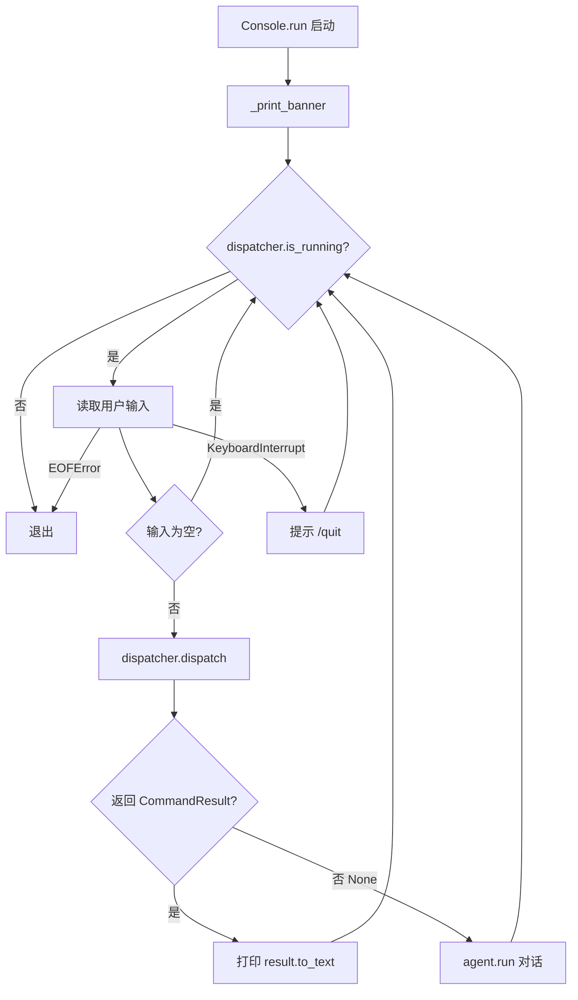
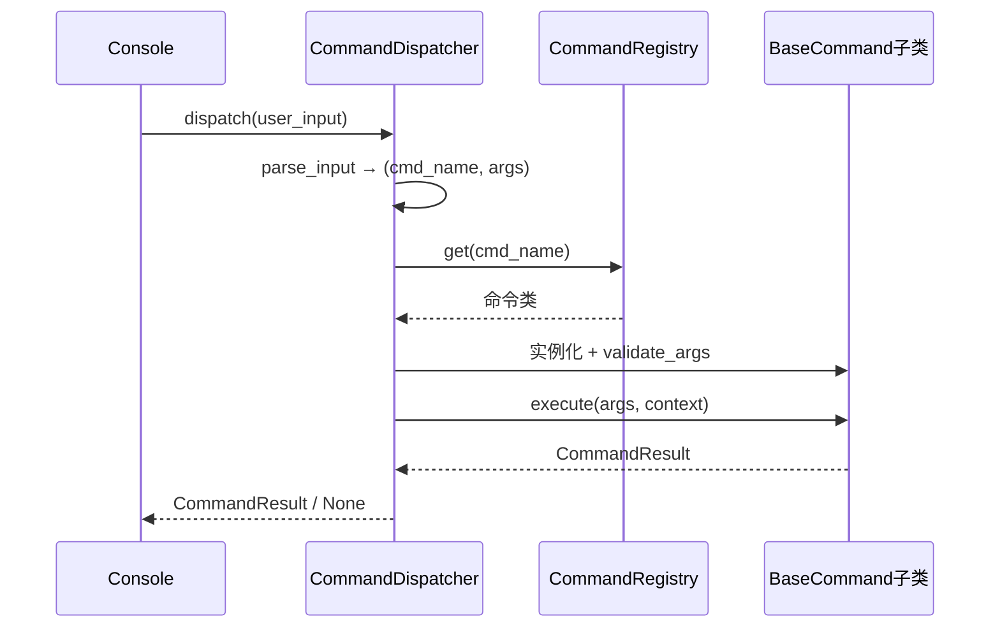
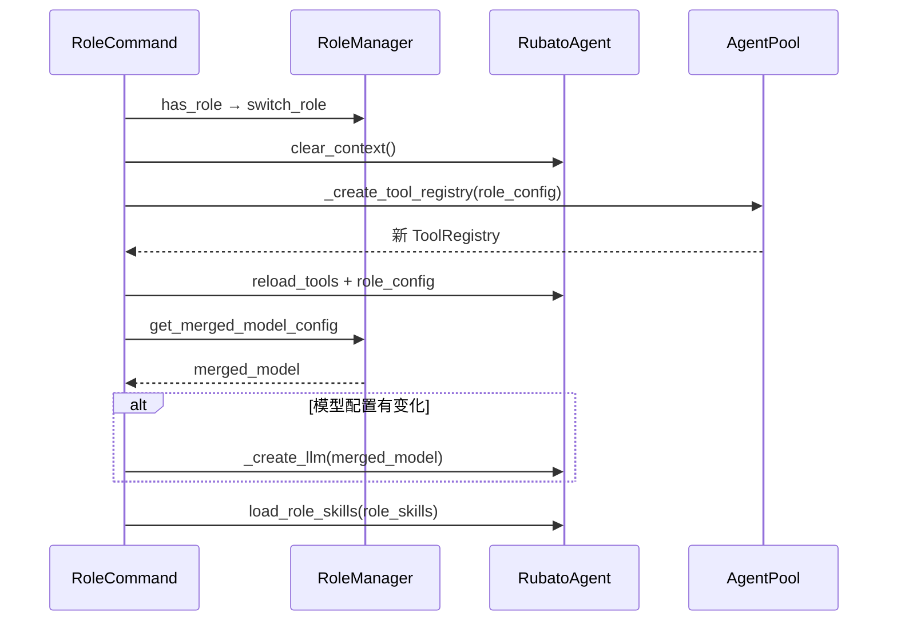

# CLI 模块设计文档

## 1. 模块概述

CLI 模块是 Rubato 的控制台交互层，采用双层架构：`src/cli/` 负责 UI 展示和主循环控制，`src/commands/` 负责命令注册、分发和执行。命令系统可被 CLI 和 Web API 共同复用。

### 文件清单

| 文件 | 核心类 | 职责 |
|------|--------|------|
| `src/cli/__init__.py` | — | 模块导出 |
| `src/cli/console.py` | `Console` | 控制台 UI 主控制器 |
| `src/cli/commands.py` | `CommandHandler` | 命令处理器（遗留，未使用） |
| `src/commands/models.py` | `ResultType`, `CommandResult` | 结果类型与结果模型 |
| `src/commands/context.py` | `CommandContext` | 命令上下文（依赖注入） |
| `src/commands/base.py` | `BaseCommand` | 命令抽象基类 |
| `src/commands/registry.py` | `CommandRegistry`, `command` | 命令注册表（单例）与注册装饰器 |
| `src/commands/dispatcher.py` | `CommandDispatcher` | 命令分发器 |
| `src/commands/impl/` | 14 个命令实现类 | 各命令实现 |

***

## 2. 核心组件

### 2.1 Console（src/cli/console.py）

控制台 UI 主控制器，管理用户交互主循环。

**关键属性**: `agent`, `skill_loader`, `mcp_manager`, `config`, `app_state`, `dispatcher`

**构造**: 接收各组件引用，创建 `CommandContext`（从 `app_state.agent_pool` 获取 `agent_pool`），初始化 `CommandDispatcher`。

**方法**:
- `run()` — 异步主循环：打印横幅 → 循环读取输入 → `dispatcher.dispatch()` 分发命令 → 非 `None` 则打印结果，`None` 则调用 `agent.run()` 对话
- `run_sync()` — 同步包装 `asyncio.run(self.run())`
- `_print_banner()` — 显示模型、MCP、浏览器状态及已加载 Skills
- `_print_prompt()` — 打印 `> ` 提示符

### 2.2 CommandHandler（src/cli/commands.py）— 遗留

> `Console` 已切换到 `CommandDispatcher`，此类未使用。

命令映射字典 `commands: Dict[str, Callable]`，注册 14 个命令（help/quit/config/history/clear/skill/tool/prompt/browser/role/new/reload/status）。核心方法 `handle_async()` / `handle()`，辅助方法包括 `_parse_command_input`、`_parse_sub_cmd`、`_truncate`、`_format_tool_list`、`_update_model_for_role`、`_format_skills_info`、`_get_tools_summary`。

### 2.3 命令系统（src/commands/）

#### CommandResult / ResultType（models.py）

`ResultType` 枚举：`SUCCESS`、`ERROR`、`INFO`、`EXIT`。`CommandResult` 数据类含 `type`、`message`、`data`(Optional[Dict])、`actions`(List[str])，提供 `to_text()` 和 `to_dict()` 方法。`EXIT` 类型触发分发器停止运行。

#### CommandContext（context.py）

数据类，集中管理命令执行依赖：`agent`、`skill_loader`、`mcp_manager`、`role_manager`、`config_loader`、`config`、`agent_pool`、`session_id`、`metadata`。提供 `get_agent()` 等安全访问方法（为 None 时抛 `ValueError`）。

#### BaseCommand（base.py）

抽象基类，类属性 `name`、`aliases`、`description`、`usage`。抽象方法 `execute(args, context) -> CommandResult`，可覆写 `validate_args(args)` 做参数验证。

#### CommandRegistry（registry.py）

单例模式（`__new__` 实现），`_commands: Dict[str, Type[BaseCommand]]` + `_aliases: Dict[str, str]`。方法：`register()`、`get()`（支持别名查找）、`list_commands()`、`get_all_help()`。`@command` 装饰器在类定义时自动注册。

#### CommandDispatcher（dispatcher.py）

持有 `context` 和 `registry`，`_running` 标志控制主循环。`parse_input()` 解析 `/` 前缀输入为 `(cmd_name, args)`，非命令返回 `(None, user_input)`。`dispatch()` 流程：解析 → 查注册表 → 实例化 → `validate_args()` → `execute()` → `EXIT` 类型则设 `_running=False`。

### 2.4 命令实现（src/commands/impl/）

所有命令类使用 `@command` 装饰器自动注册。

| 命令类 | name | aliases | 子命令 |
|--------|------|---------|--------|
| `HelpCommand` | `help` | `?`, `h` | — |
| `QuitCommand` | `quit` | `exit` | — |
| `ConfigCommand` | `config` | — | — |
| `RoleCommand` | `role` | — | `list` / `show <name>` / `<name>`（切换） |
| `SkillCommand` | `skill` | — | `list` / `show <name>` / `load <name> [...]` |
| `ToolCommand` | `tool` | — | `list` |
| `BrowserCommand` | `browser` | — | `status` / `close` / `reopen` |
| `HistoryCommand` | `history` | — | — |
| `ClearCommand` | `clear` | — | — |
| `NewCommand` | `new` | — | — |
| `ReloadCommand` | `reload` | — | — |
| `PromptCommand` | `prompt` | — | `show` |
| `StatusCommand` | `status` | — | （无参数）/ `full` / `tools` / `prompt` |
| `SessionCommand` | `session` | — | `list` / `load <id>` / `save [desc]` / `current` / `delete <id>` |

**RoleCommand 关键方法**: `_list_roles`、`_show_role`、`_switch_role`（核心：清空上下文 → 重建工具注册表 → 重载工具 → 更新模型 → 加载角色 Skills）、`_get_tools_summary`

**SkillCommand 关键方法**: `_list_skills`、`_show_skill`、`_load_skills`（加载 Skill 全文到系统提示词并重建查询引擎）

**StatusCommand 关键方法**: `_status_overview`、`_status_full`（概览+工具+提示词）、`_status_tools`、`_status_prompt`

***

## 3. 关键流程

### 3.1 控制台主循环

### 3.2 命令分发

### 3.3 角色切换

***

## 4. 技术实现要点

- **双层架构**: CLI 层负责 UI，命令系统层负责业务，`CommandResult.data` 为 API 层提供结构化数据
- **装饰器注册**: `@command` 在类定义时自动注册到 `CommandRegistry` 单例，支持别名
- **依赖注入**: `CommandContext` 集中管理依赖，安全访问方法在组件不可用时抛明确错误
- **统一异步**: 所有命令 `execute()` 均为 `async`，`dispatch()` 统一 `await` 调用
- **遗留兼容**: `CommandHandler` 通过 `asyncio.iscoroutine()` 检测协程，区分同步/异步命令
- **错误处理**: 命令未找到/参数验证失败返回 `ERROR` 类型 `CommandResult`，业务异常 `try/except` 捕获
