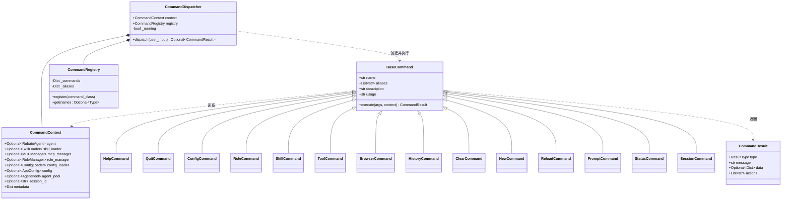
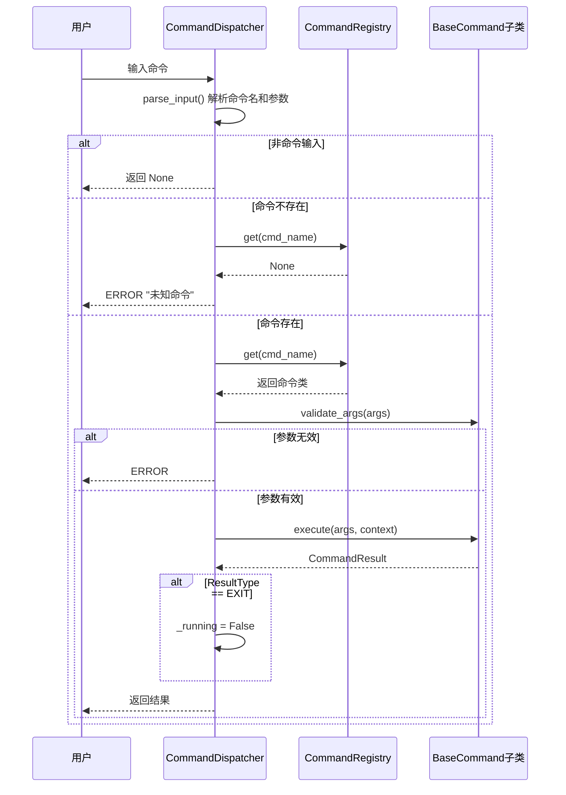
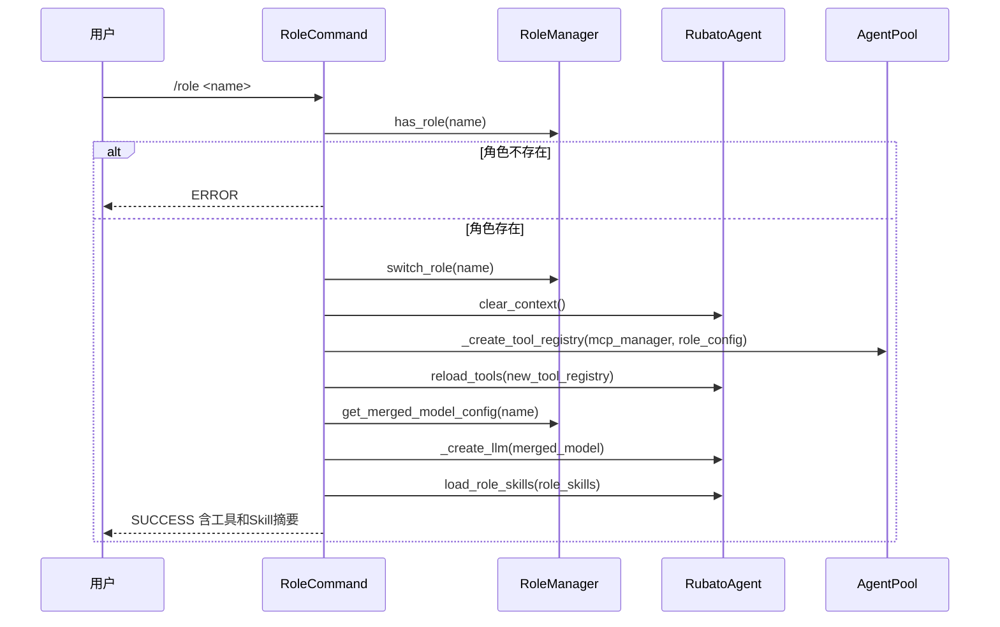

# Commands 模块设计文档

## 1. 模块概述

Commands 模块处理用户以 `/` 前缀输入的命令，核心职责：命令注册（装饰器+单例）、命令解析（提取命令名与参数）、命令分发（查找执行+参数验证+错误处理）、上下文传递（CommandContext）、结果返回（统一 CommandResult 模型）。

### 文件清单

| 文件 | 核心类 | 职责 |
|------|--------|------|
| `base.py` | `BaseCommand` | 命令抽象基类 |
| `context.py` | `CommandContext` | 命令上下文 |
| `dispatcher.py` | `CommandDispatcher` | 命令分发器 |
| `models.py` | `ResultType`, `CommandResult` | 结果类型与结果模型 |
| `registry.py` | `CommandRegistry`, `command` | 命令注册表（单例）与注册装饰器 |
| `impl/` | 14个命令实现类 | 具体命令逻辑 |

***

## 2. 核心组件

### 2.1 BaseCommand

命令抽象基类，所有命令必须继承并实现 `execute`。

- **类属性**：`name: str`、`aliases: List[str]`、`description: str`、`usage: str`
- **核心方法**：`execute(self, args: str, context: CommandContext) -> CommandResult`（抽象）
- **辅助方法**：`validate_args`（参数验证，返回错误信息或None）、`get_help`（生成帮助文本）

### 2.2 CommandContext

命令上下文 dataclass，为命令提供对系统各组件的 Optional 访问。

- **核心字段**：`agent`、`skill_loader`、`mcp_manager`、`role_manager`、`config_loader`、`config`、`agent_pool`、`session_id`、`metadata`
- **辅助方法**：`get_agent()`/`get_skill_loader()`/`get_mcp_manager()`/`get_role_manager()`/`get_config_loader()`/`get_config()` — 获取对应组件，未设置时抛出 ValueError

### 2.3 CommandDispatcher

命令分发器，解析用户输入并分发执行。

- **属性**：`context`、`registry`、`_running`（初始True）
- **`parse_input(user_input) -> (cmd_name, args)`**：以`/`开头则分割为命令名和参数，否则返回`(None, 原始输入)`
- **`dispatch(user_input) -> Optional[CommandResult]`**：解析→查找命令→验证参数→执行→EXIT类型时设`_running=False`

### 2.4 CommandRegistry

命令注册表，单例模式（重写`__new__`）。

- **内部存储**：`_commands: Dict[str, Type[BaseCommand]]`（name→类）、`_aliases: Dict[str, str]`（alias→name）
- **`register(command_class)`**：实例化获取name和aliases，分别存入字典
- **`get(name)`**：先查`_commands`再查`_aliases`
- **`list_commands()`**/`get_all_help()`**：列出命令名/帮助信息
- **`@command`装饰器**：自动将命令类注册到单例

### 2.5 CommandResult 与 ResultType

- **ResultType 枚举**：`SUCCESS`/`ERROR`/`INFO`/`EXIT`
- **CommandResult dataclass**：`type`、`message`、`data`(Optional[Dict])、`actions`(List[str])；辅助方法`to_text()`、`to_dict()`

***

## 3. 命令实现

### 3.1 命令总览

| 命令类 | name | aliases | 子命令 |
|--------|------|---------|--------|
| `HelpCommand` | `help` | `?`, `h` | — |
| `QuitCommand` | `quit` | `exit` | — |
| `ConfigCommand` | `config` | — | — |
| `RoleCommand` | `role` | — | `list` / `show <name>` / `<name>` |
| `SkillCommand` | `skill` | — | `list` / `show <name>` / `load <name> [...]` |
| `ToolCommand` | `tool` | — | `list` |
| `BrowserCommand` | `browser` | — | `status` / `close` / `reopen` |
| `HistoryCommand` | `history` | — | — |
| `ClearCommand` | `clear` | — | — |
| `NewCommand` | `new` | — | — |
| `ReloadCommand` | `reload` | — | — |
| `PromptCommand` | `prompt` | — | `show` |
| `StatusCommand` | `status` | — | (空)概览 / `full` / `tools` / `prompt` |
| `SessionCommand` | `session` | — | `list` / `load <id>` / `save [desc]` / `current` / `delete <id>` |

### 3.2 简单命令

- **HelpCommand**：聚合`CommandRegistry.get_all_help()`命令列表和额外子命令说明
- **QuitCommand**：返回`ResultType.EXIT`
- **ConfigCommand**：从`context.config`读取模型配置，检查MCP连接状态
- **HistoryCommand**：通过`agent._query_engine.get_messages()`获取消息列表
- **ClearCommand**：调用`agent.clear_context()`
- **NewCommand**：`clear_context()`后`reload_system_prompt(current_role)`保留角色和提示词
- **ReloadCommand**：依次重载角色/模型/Skill配置，最后`_rebuild_query_engine()`

### 3.3 RoleCommand（角色切换为核心复杂流程）

- `list`：列出角色并标记当前角色
- `show <name>`：通过`role_manager.get_role_info()`显示角色详情
- `<name>`（切换角色）：验证→`switch_role`→`clear_context`→`_create_tool_registry`→`reload_tools`→合并模型配置→`_create_llm`→`load_role_skills`→返回工具和Skill摘要

### 3.4 SkillCommand

- `list`：通过`skill_loader.list_skills()`列出Skills
- `show <name>`：通过`skill_loader.registry.get_skill()`显示元数据
- `load <name> [...]`：加载Skill全文到系统提示词（`add_skill`→`build`→`_rebuild_query_engine`→`mark_skill_loaded`），跳过已加载和未找到的

### 3.5 其他子命令命令

- **ToolCommand**：`list`从`agent.tools`获取工具列表
- **BrowserCommand**：`status`/`close`/`reopen`分别调用`mcp_manager.check_browser_alive()`/`close_browser()`/`ensure_browser()`
- **PromptCommand**：`show`通过`agent.get_system_prompt()`获取提示词（超500字符截断显示）
- **StatusCommand**：概览显示角色/工具数/提示词长度；`full`聚合概览+工具+提示词；`tools`列出工具；`prompt`显示完整提示词
- **SessionCommand**：通过`agent._query_engine._session_storage`管理会话的CRUD，`delete`不允许删除当前会话

***

## 4. 组件关系

***

## 5. 关键流程

### 5.1 命令分发与执行

### 5.2 角色切换流程

***

## 6. 命令扩展

新增命令步骤：

1. 在`impl/`下创建文件，继承`BaseCommand`，设置`name`/`aliases`/`description`/`usage`
2. 使用`@command`装饰器注册
3. 实现`execute`方法
4. 在`impl/__init__.py`和`commands/__init__.py`中导出
