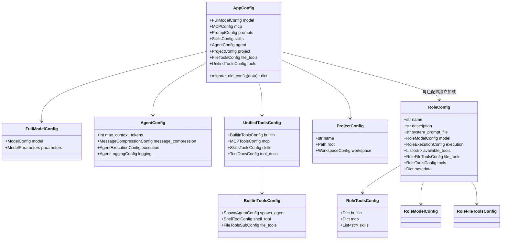
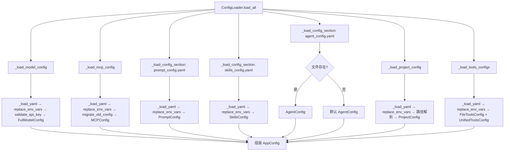
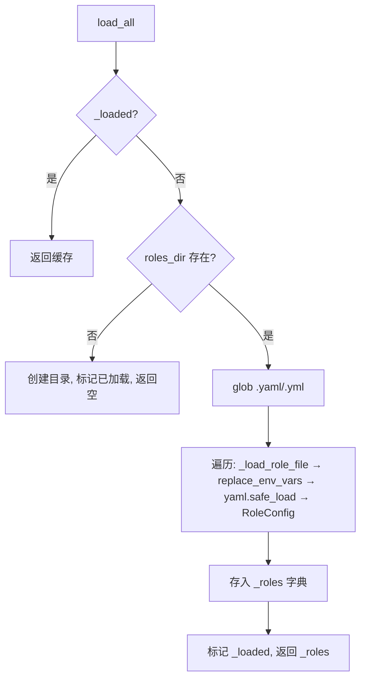

# Config 模块设计文档

## 1. 模块概述

Config 模块是 Rubato 的配置基础设施层，负责：定义配置数据模型（Pydantic BaseModel）、从 YAML 加载应用配置（AppConfig）和角色配置（RoleConfig）、提供配置验证与环境变量替换。

| 文件 | 职责 |
|---|---|
| `models.py` | 配置数据模型定义 |
| `loader.py` | 应用配置加载器 |
| `role_loader.py` | 角色配置加载器 |
| `validators.py` | 配置验证器与环境变量替换 |
| `__init__.py` | 模块统一导出 |

***

## 2. 核心组件设计

### 2.1 配置模型 (models.py)

**枚举与共享验证函数**：`PermissionMode`(ask/allow/deny)、`_validate_positive`、`_validate_temperature`、`_validate_permission_mode_str`、`_validate_permission_dict`。

**项目与工作空间**：`WorkspaceConfig`(main/additional/excluded)、`ProjectConfig`(name/root/workspace)。

**文件工具权限**：`FileToolsConfig`(全局)、`FileToolsSubConfig`(统一工具配置内)、`WorkspaceRestrictionConfig`(目录限制)、`RoleFileToolsConfig`(角色内，permissions 自动补全 {default:ask, custom:{}})。

**角色配置**：`RoleConfig` 为顶层，含 name/description/system_prompt_file/model/execution/available_tools/file_tools/tools/metadata。子模型：`RoleModelConfig`(inherit/provider/name/api_key/auth/base_url/temperature/max_tokens)、`RoleExecutionConfig`(max_context_tokens/timeout/recursion_limit/sub_agent_recursion_limit)、`RoleToolsConfig`(builtin/mcp/skills，validate_builtin 支持 dict/bool/list 三种输入格式)。`RoleConfig.validate_name` 校验非空且仅含字母数字连字符下划线，自动 strip 转 lower。

**模型配置**：`FullModelConfig` = `ModelConfig`(provider 限定 openai/anthropic/local, name, api_key, auth, base_url, temperature, max_tokens) + `ModelParameters`(retry_max_count/retry_initial_delay/retry_max_delay/llm_timeout)。

**MCP 配置**：`MCPConfig`(servers: Dict[str, MCPServerConfig])，含 `PlaywrightConfig`(connection/browser/execution) 和 `MCPServerConfig` 两个服务端配置模型。

**提示词与 Skill**：`PromptConfig`(system_prompt_file/skill_loading_prompt_file/variables)、`SkillsConfig`(directory/auto_load/enabled_skills/skill_loading)。

**Agent 配置**：`AgentConfig` = max_context_tokens + `MessageCompressionConfig`(12个压缩参数) + `AgentExecutionConfig`(recursion_limit/sub_agent_recursion_limit/llm_timeout) + `AgentLoggingConfig`(6个日志开关)。

**统一工具配置**：`UnifiedToolsConfig` = `BuiltinToolsConfig`(spawn_agent/shell_tool/file_tools) + `MCPToolsConfig` + `SkillsToolsConfig` + `ToolDocsConfig`。

**应用配置**：`AppConfig` 为顶层入口，含 model/mcp/prompts/skills/agent/project/file_tools/tools。`migrate_old_config` 处理 MCP 旧格式向后兼容（缺少 servers 键时自动迁移顶层键值对）。

#### 配置模型关系图

### 2.2 配置加载器 (loader.py)

**ConfigLoader**：从 config 目录加载所有 YAML 配置并组装 AppConfig。

核心方法：
- `load_all()` → AppConfig：加载全部配置
- `_load_yaml(filename)` → dict：读取 YAML 并替换环境变量
- `_safe_create_config(config_class, data)`：创建配置对象，统一转换 Pydantic 错误为 ConfigValidationError
- `_load_model_config()`：加载模型配置，含 API Key 环境变量回退
- `_load_mcp_config()`：加载 MCP 配置，含旧格式迁移
- `_load_project_config()`：加载项目配置，相对路径转绝对路径
- `_load_tools_configs()`：从 tools_config.yaml 合并读取 file_tools 和 tools 两个 section

辅助方法：`_load_config_section(filename, section, config_class, optional, default)` 通用 section 加载；`get_config(key)` 配置缓存访问。

**YAML 文件与 section 映射**：

| YAML 文件 | Section | 目标模型 | 可选 |
|---|---|---|---|
| model_config.yaml | (顶层) | FullModelConfig | 否 |
| mcp_config.yaml | mcp | MCPConfig | 否 |
| prompt_config.yaml | prompts | PromptConfig | 否 |
| skills_config.yaml | skills | SkillsConfig | 否 |
| agent_config.yaml | agent | AgentConfig | 是 |
| project_config.yaml | project | ProjectConfig | 是 |
| tools_config.yaml | file_tools / tools | FileToolsConfig / UnifiedToolsConfig | 是 |

### 2.3 角色配置加载器 (role_loader.py)

**RoleConfigLoader**：从 config/roles 目录加载角色 YAML 文件为 RoleConfig 映射。

核心方法：
- `load_all()` → Dict[str, RoleConfig]：懒加载+幂等，扫描 .yaml/.yml 文件
- `load_system_prompt(role_config)` → str：加载系统提示词文件（相对路径基于 cwd）
- `reload()`：重置并重新加载

辅助方法：`get_role(name)`、`get_all_roles()`、`list_roles()` 均自动触发懒加载；`_load_role_file(file_path)` 执行环境变量替换后创建 RoleConfig。

设计特点：懒加载（`_loaded` 标志）、目录自动创建、多格式扫描。

### 2.4 配置验证器 (validators.py)

- `ConfigValidationError`：配置验证错误异常
- `validate_api_key(api_key, env_var)`：API Key 校验，空值或未替换占位符时回退环境变量
- `replace_env_vars(content, config_dir)`：替换 `${VAR}` 占位符，支持 PROJECT_ROOT/CONFIG_DIR/HOME 特殊变量，其余走 os.getenv（不存在则替换为空串）
- `handle_pydantic_error(error)`：将 Pydantic ValidationError 转为 ConfigValidationError，格式化 loc→msg
- `validate_required_configs(configs, required_keys)`、`validate_config_value(value, name, min_val, max_val)`：通用校验

***

## 3. 关键流程

### 3.1 应用配置加载流程

### 3.2 角色配置加载流程

***

## 4. 容错策略

| 场景 | 处理方式 |
|---|---|
| 必需配置文件不存在 | _load_yaml 抛出 ConfigValidationError |
| 可选配置文件不存在 | _load_config_section(optional=True) 返回 default |
| project_config 不存在 | _load_project_config 捕获异常返回 None |
| tools_config 不存在 | _load_tools_configs 捕获异常返回 (None, None) |
| 角色目录不存在 | load_all 自动创建空目录 |
| 角色文件内容为空 | _load_role_file 返回 None 跳过 |
| MCP 旧格式配置 | migrate_old_config 自动迁移 |
