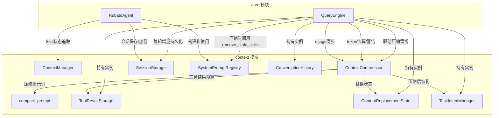
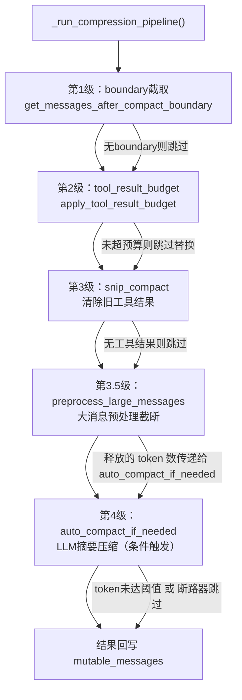
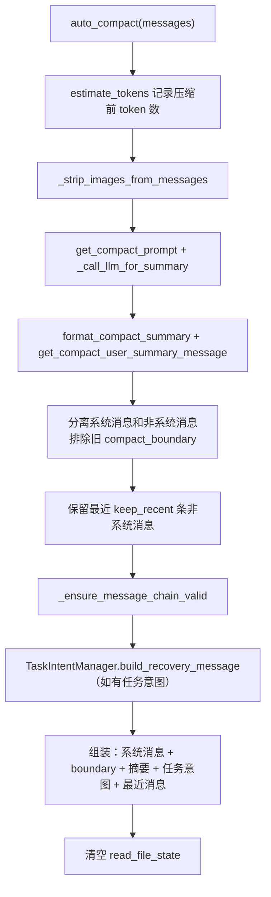
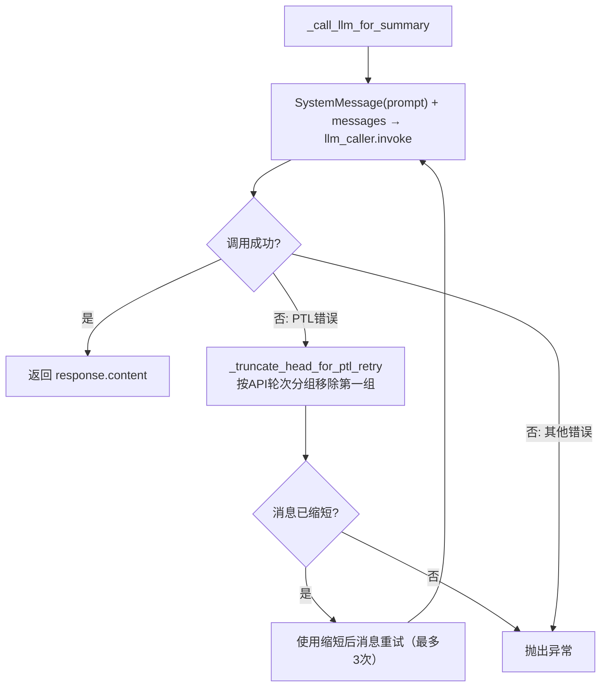
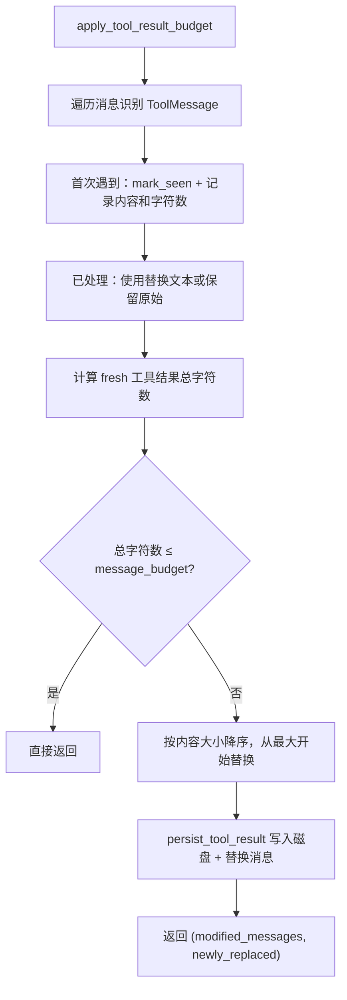
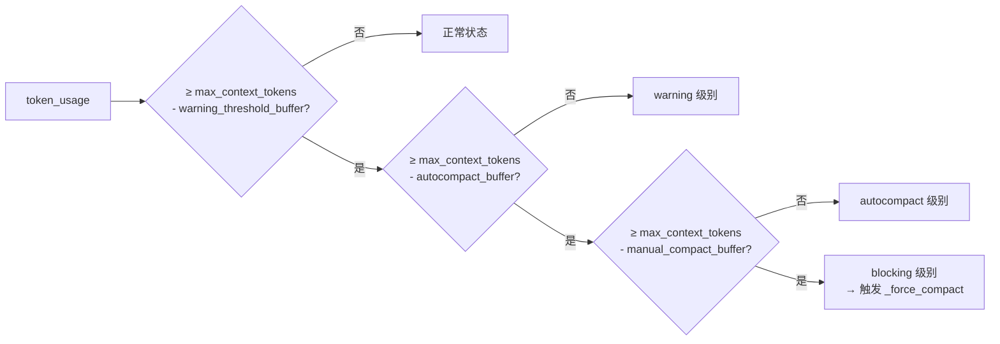
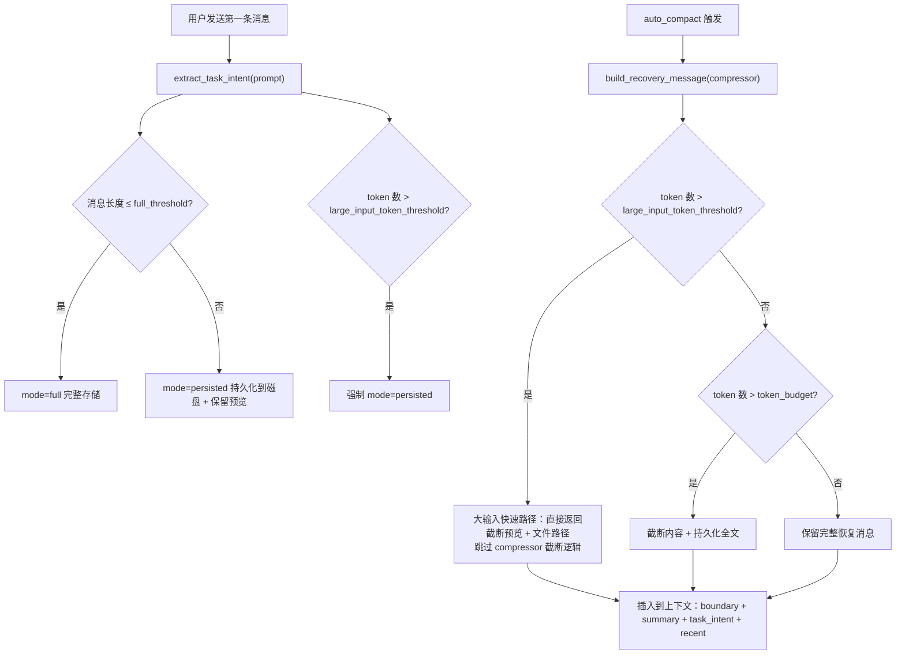

# Context 模块设计文档

## 1. 模块概述

Context 模块是 Rubato 框架的上下文管理核心，负责：上下文状态管理、四级渐进压缩管线、压缩提示词模板、工具结果持久化与预算管理、会话持久化、任务意图保护。

| 依赖 | 用途 |
|------|------|
| tiktoken | Token 计数（cl100k_base） |
| langchain-core | 消息类型定义 |
| threading | 会话存储线程安全 |

| 文件 | 核心类/函数 | 职责 |
|------|------------|------|
| [manager.py](file:///c:/DEV/rubato/src/context/manager.py) | ContextManager | Skill 加载状态与应用状态追踪 |
| [compressor.py](file:///c:/DEV/rubato/src/context/compressor.py) | ContextCompressor | 统一上下文压缩引擎 |
| [compact_prompt.py](file:///c:/DEV/rubato/src/context/compact_prompt.py) | get_compact_prompt 等 | 压缩提示词模板与格式化 |
| [tool_result_storage.py](file:///c:/DEV/rubato/src/context/tool_result_storage.py) | ToolResultStorage, ContentReplacementState, apply_tool_result_budget | 工具结果持久化与预算管理 |
| [session_storage.py](file:///c:/DEV/rubato/src/context/session_storage.py) | SessionStorage, MessageSerializer | 会话持久化存储 |
| [system_prompt_registry.py](file:///c:/DEV/rubato/src/context/system_prompt_registry.py) | SystemPromptRegistry, PromptSection | 系统提示词分段管理（按变化频率分层，支持 Skill 独立加载/卸载/过期移除） |
| [conversation_history.py](file:///c:/DEV/rubato/src/context/conversation_history.py) | ConversationHistory, ConversationTurn, AssistantStep | 对话轮次结构化管理 |
| [task_intent_manager.py](file:///c:/DEV/rubato/src/context/task_intent_manager.py) | TaskIntentManager | 任务意图提取、存储与压缩后恢复 |

***

## 2. 核心组件设计

### 2.1 ContextManager

**文件**: [manager.py](file:///c:/DEV/rubato/src/context/manager.py)

简化辅助角色，仅追踪 Skill 加载状态和应用状态。

| 核心属性 | 说明 |
|----------|------|
| `_loaded_skills: List[str]` | 已加载 Skill 名称列表 |
| `_app_state: dict` | 应用状态字典 |
| `system_prompt_registry` | 关联的 SystemPromptRegistry |

关键方法：`mark_skill_loaded()` 标记 Skill 已加载并同步 registry 引用时间戳；`is_skill_loaded()` 检查加载状态（含 registry 检查）。辅助方法：`clear()`, `get_loaded_skills()`, `get_context()`, `add_context()`, `update_context()`, `set_registry()`。

### 2.2 SystemPromptRegistry

**文件**: [system_prompt_registry.py](file:///c:/DEV/rubato/src/context/system_prompt_registry.py)

系统提示词按变化频率分三层存储（static/skill/dynamic），支持 Skill 独立加载/卸载/过期移除。

**PromptSection**: `content`, `category`（"static"/"skill"/"dynamic"）, `added_at`, `last_referenced`

| 核心属性 | 说明 |
|----------|------|
| `_sections: OrderedDict[str, PromptSection]` | 有序段落字典 |

关键方法：`add_static()`, `add_skill()`, `add_dynamic()` 按类别添加段落；`remove_skill()` 移除 Skill 段落；`mark_skill_referenced()` 更新引用时间戳（Skill 首次加载、触发词再次匹配、/skill load 重复加载时均会调用，确保活跃 Skill 不会被过期清理误删）；`remove_stale_skills(max_age_seconds)` 移除超时未引用的 Skill；`build()` 拼接所有段落返回完整系统提示词。辅助方法：`get_skill_names()`, `get_skill_tokens()`, `get_total_tokens()`, `has_skill()`, `get_section_keys()`。

### 2.3 ConversationHistory

**文件**: [conversation_history.py](file:///c:/DEV/rubato/src/context/conversation_history.py)

对话轮次结构化管理，支持按轮次压缩和展平为消息列表。

**AssistantStep**: `assistant_message: AIMessage`, `tool_results: List[ToolMessage]`

**ConversationTurn**: `user_message: HumanMessage`, `assistant_steps: List[AssistantStep]`, `timestamp: float`

| 核心属性 | 说明 |
|----------|------|
| `_turns: List[ConversationTurn]` | 已完成轮次 |
| `_compact_boundary_turn_idx: int` | 压缩边界索引 |
| `_summary: Optional[str]` | 压缩摘要 |

关键方法：`start_turn()` → `append_assistant_step()` → `finish_turn()` 构成轮次生命周期；`compress_old_turns(summary, keep_recent)` 压缩旧轮次更新摘要和边界索引；`flatten_to_messages()` 展平为 BaseMessage 列表。辅助方法：`add_turn()`, `get_turns_for_compression()`, `get_active_turns()`, `get_turn_count()`, `clear()`。

### 2.4 ContextCompressor

**文件**: [compressor.py](file:///c:/DEV/rubato/src/context/compressor.py)

所有压缩算法的核心实现，被 QueryEngine 驱动。支持四级渐进压缩管线：boundary截取 → tool_result_budget → snip_compact → auto_compact。

**核心构造参数**:

| 参数 | 默认值 | 说明 |
|------|--------|------|
| `max_context_tokens` | 80000 | 最大上下文 token 数 |
| `autocompact_buffer_tokens` | 13000 | 自动压缩缓冲 |
| `manual_compact_buffer_tokens` | 3000 | 手动压缩缓冲（阻塞限制） |
| `warning_threshold_buffer_tokens` | 20000 | 警告阈值缓冲 |
| `keep_recent` | 6 | 压缩保留最近消息数 |
| `snip_keep_recent` | 6 | snip 保留最近工具结果数 |
| `max_consecutive_failures` | 3 | 断路器阈值 |
| `large_message_char_threshold` | 50000 | 大消息预处理字符阈值 |
| `task_intent_manager` | None | 任务意图管理器 |

**内部状态**: `encoding`（cl100k_base 编码器）、`_last_api_usage_tokens`（API 精确用量）、`_consecutive_failures`（断路器计数器）

**Token 计数**: `count_tokens()` / `count_text_tokens()` 使用 tiktoken 精确计数；`estimate_tokens()` 优先使用 `_last_api_usage_tokens`，降级为 tiktoken；`update_usage_from_response()` 从 API 响应更新用量。

**压缩判断**: `needs_compression()` 判断是否达到自动压缩阈值；`calculate_token_warning_state()` 返回三级警告（warning / autocompact / blocking）。

**压缩执行**:

| 方法 | 说明 |
|------|------|
| `compress(messages)` | 基础非 LLM 压缩：截取中间消息生成简单摘要，保留最近 keep_recent×2 条 |
| `snip_compact(messages)` | 轻量压缩：清除旧工具结果为 `TOOL_RESULT_CLEARED_MESSAGE`，返回 `(messages, tokens_freed)` |
| `preprocess_large_messages(messages)` | 大消息预处理：对超过 `large_message_char_threshold` 的 HumanMessage 截断为前 10000 字符 + 截断提示，跳过 compact_summary 消息（以 "This session is being continued" 开头）和 Task Intent 消息（以 "[Task Intent - PRESERVED]" 开头），返回 `(messages, tokens_freed)` |
| `auto_compact(messages)` | LLM 摘要压缩（async）：剥离图片 → LLM 生成 10 段结构化摘要 → 保留系统消息 + boundary + 摘要 + 任务意图恢复 + 最近 keep_recent 条 |
| `auto_compact_if_needed(messages, snip_tokens_freed)` | 条件触发 auto_compact（async），含断路器保护 |

**Boundary 管理**: `get_messages_after_compact_boundary()` 获取最后 boundary 之后的消息；`_create_compact_boundary_message()` 创建 `[compact_boundary]` 标记。

**LLM 摘要生成**: `_call_llm_for_summary()` 调用 LLM 生成摘要，含 PTL（prompt-too-long）重试（最多 3 次，按 API 轮次分组截断头部）；`_ensure_message_chain_valid()` 确保消息链完整（孤立 ToolMessage 转 HumanMessage）；`_strip_images_from_messages()` 将图片/文档替换为占位符。

**工具结果预算**: `apply_tool_result_budget()` 委托给 `tool_result_storage.apply_tool_result_budget()`。

### 2.5 压缩提示词模板（compact_prompt.py）

**文件**: [compact_prompt.py](file:///c:/DEV/rubato/src/context/compact_prompt.py)

提供结构化 LLM 压缩提示词，生成 10 段式摘要。三种作用域模板：

| 作用域 | 常量 | 聚焦 | 第 10 段标题 |
|--------|------|------|-------------|
| full | `BASE_COMPACT_PROMPT` | 完整对话 | Optional Next Step |
| from | `PARTIAL_COMPACT_PROMPT_FROM` | boundary 后的最近消息 | Optional Next Step |
| up_to | `PARTIAL_COMPACT_PROMPT_UP_TO` | 保留最近消息之前的早期消息 | Context for Continuing Work |

10 段结构：Primary Request and Intent → Task Specification → Key Technical Concepts → Files and Code Sections → Errors and Fixes → Problem Solving → All User Messages → Pending Tasks → Current Work → Optional Next Step / Context for Continuing Work

模块级函数：`get_compact_prompt(custom_instructions)` 组装 full 作用域提示词；`get_partial_compact_prompt(custom_instructions, direction)` 组装部分作用域提示词；`format_compact_summary(summary)` 移除 analysis/summary 标签并清理格式；`get_compact_user_summary_message(summary, ...)` 构建用户摘要消息（含续接说明和可选提示）。

所有提示词均包裹 `NO_TOOLS_PREAMBLE` + `NO_TOOLS_TRAILER`，禁止 LLM 调用工具。

### 2.6 ToolResultStorage（工具结果持久化存储）

**文件**: [tool_result_storage.py](file:///c:/DEV/rubato/src/context/tool_result_storage.py)

大尺寸工具结果持久化到磁盘，消息中仅保留预览和文件引用。

**模块常量**: `DEFAULT_MAX_RESULT_SIZE_CHARS=50000`, `MAX_TOOL_RESULTS_PER_MESSAGE_CHARS=200000`, `PREVIEW_SIZE_BYTES=2000`, `TOOL_RESULT_CLEARED_MESSAGE='[Old tool result content cleared]'`

**PersistedToolResult**: `filepath`, `original_size`, `preview`, `has_more`

**ToolResultStorage**: `persist_threshold`（持久化阈值）, `message_budget`（单条消息预算）。关键方法：`maybe_persist_large_tool_result()` 条件持久化；`persist_tool_result()` 写入磁盘返回 PersistedToolResult；`build_large_tool_result_message()` 构建含标签/路径/预览的替换消息；`generate_preview()` 按字节截断并在换行符处对齐。

**ContentReplacementState**: 通过 `seen_ids` 和 `replacements` 追踪工具结果处理状态，确保多次调用 `apply_tool_result_budget` 时已处理结果不重复计算、已替换结果保持替换。

**apply_tool_result_budget()**: 遍历消息识别 ToolMessage → 首次遇到的记录内容和字符数 → 若总字符数超预算则按大小降序替换最大的工具结果（持久化到磁盘 + 替换消息内容）→ 返回 `(modified_messages, newly_replaced)`。

### 2.7 SessionStorage（会话持久化存储）

**文件**: [session_storage.py](file:///c:/DEV/rubato/src/context/session_storage.py)

对话消息的序列化、持久化存储和恢复，JSON 格式，线程安全。

**SubSessionRef**: `session_id`, `agent_name`, `relation`, `timestamp`

**SessionMetadata**: `session_id`, `created_at`, `updated_at`, `message_count`, `total_tokens`, `tags`, `description`, `role`, `model`, `parent_session_id`, `sub_sessions`, `skills`

**MessageSerializer**: 静态类，`serialize()` / `deserialize()` 支持 HumanMessage/AIMessage/ToolMessage/SystemMessage 的双向转换，AIMessage 额外保留 `tool_calls`/`response_metadata`/`id`，ToolMessage 额外保留 `tool_call_id`/`name`。

**SessionStorage**: 线程安全（`_lock`），每个会话存储为 `{session_id}.json`。关键方法：`save_session()` 保存（合并已有元数据，保留 created_at）；`load_session()` 加载；`append_messages()` 增量追加；`save_sub_session_ref()` 向父会话追加子会话引用；`load_session_with_meta()` 返回 `(metadata, messages)` 元组。辅助方法：`list_sessions()`, `delete_session()`, `get_session_metadata()`, `session_exists()`。

### 2.8 TaskIntentManager（任务意图管理器）

**文件**: [task_intent_manager.py](file:///c:/DEV/rubato/src/context/task_intent_manager.py)

提取并保护用户首条消息的任务意图，压缩后自动恢复到上下文中。

| 核心属性 | 说明 |
|----------|------|
| `full_threshold: int` | 完整保留阈值（默认 2000） |
| `token_budget: int` | 恢复消息 token 预算（默认 10000） |
| `large_input_token_threshold: int` | 大输入持久化阈值（默认 10000 tokens） |
| `_mode` | 存储模式（"full"/"persisted"/None） |

双模式存储：短消息（≤full_threshold）完整存储（mode=full）；长消息持久化到磁盘并保留预览（mode=persisted）。当任务意图 token 数超过 `large_input_token_threshold` 时，强制进入 persisted 模式。

`extract_task_intent(user_message)` 仅首次提取，后续不覆盖。`build_recovery_message(compressor)` 构建恢复消息，支持 token 预算控制（超限时二分查找截断 + 自动持久化全文）。大输入快速路径：当任务意图 token 数超过 `large_input_token_threshold` 时，`build_recovery_message` 直接返回截断预览 + 文件路径，跳过 compressor 的截断逻辑。`has_task_intent()`, `clear()`。

***

## 3. 组件间关系

### 3.1 模块内部组件关系

```mermaid
classDiagram
    class ContextCompressor {
        +llm_caller
        +max_context_tokens: int
        +tool_result_storage: ToolResultStorage
        +content_replacement_state: ContentReplacementState
        +task_intent_manager: TaskIntentManager
        +compress(messages) List~BaseMessage~
        +snip_compact(messages) Tuple
        +auto_compact(messages) List~BaseMessage~
        +auto_compact_if_needed(messages, snip_tokens_freed) List~BaseMessage~
        +apply_tool_result_budget(messages) Tuple
    }

    class ToolResultStorage {
        +session_dir: str
        +persist_threshold: int
        +message_budget: int
        +maybe_persist_large_tool_result(content, tool_name, tool_use_id) str
    }

    class ContentReplacementState {
        +seen_ids: Set~str~
        +replacements: Dict~str,str~
    }

    class TaskIntentManager {
        +session_dir: str
        +full_threshold: int
        +token_budget: int
        +extract_task_intent(user_message)
        +build_recovery_message(compressor) Optional~HumanMessage~
    }

    class ContextManager {
        -_loaded_skills: List~str~
        -_app_state: dict
        +system_prompt_registry: SystemPromptRegistry
        +mark_skill_loaded(skill_name)
    }

    class SystemPromptRegistry {
        -_sections: OrderedDict~str,PromptSection~
        +add_static(key, content)
        +add_skill(name, content)
        +remove_skill(name) bool
        +remove_stale_skills(max_age_seconds) List~str~
        +build() str
    }

    class ConversationHistory {
        -_turns: List~ConversationTurn~
        -_compact_boundary_turn_idx: int
        +start_turn(user_message)
        +append_assistant_step(assistant_message, tool_results)
        +finish_turn() Optional~ConversationTurn~
        +flatten_to_messages() List~BaseMessage~
    }

    class SessionStorage {
        +storage_dir: Path
        -_lock: threading.Lock
        +save_session(session_id, messages, metadata) SessionMetadata
        +load_session(session_id) List~BaseMessage~
        +append_messages(session_id, new_messages, metadata) SessionMetadata
    }

    ContextCompressor --> ToolResultStorage : 使用
    ContextCompressor --> ContentReplacementState : 使用
    ContextCompressor --> TaskIntentManager : 使用
    ContextCompressor ..> compact_prompt : 调用
    SessionStorage --> MessageSerializer : 使用
    ContextManager --> SystemPromptRegistry : 关联
```

### 3.2 与外部模块的关系

### 3.3 模块导出

`__init__.py` 导出：`ContextManager`, `ContextCompressor`, `SessionStorage`, `SessionMetadata`, `MessageSerializer`, `SubSessionRef`

`ToolResultStorage`、`ContentReplacementState`、`apply_tool_result_budget`、`compact_prompt` 中的函数由 `ContextCompressor` 和 `QueryEngine` 直接通过模块路径引用。`SystemPromptRegistry`、`ConversationHistory`、`TaskIntentManager` 同样由外部模块直接引用。

***

## 4. 关键流程

### 4.1 上下文压缩管线流程

由 QueryEngine 的 `_run_compression_pipeline()` 驱动，每轮 ReAct 循环开始时执行：

### 4.2 auto_compact 详细流程

最重量的压缩操作，调用 LLM 生成 10 段结构化摘要：

### 4.3 LLM 摘要生成与 PTL 重试

### 4.4 工具结果预算控制流程

### 4.5 Token 警告状态计算

`calculate_token_warning_state` 返回三级 token 警告状态，供 QueryEngine 决定压缩策略：

### 4.6 任务意图保护流程

***

## 5. 技术实现细节

### 5.1 Token 估算双轨制

`estimate_tokens` 优先使用 `_last_api_usage_tokens`（由 `update_usage_from_response` 从 API 响应更新），无 API 数据时降级为 tiktoken 计数。QueryEngine 通过 `_update_usage_from_response()` 同步 API 实际用量。

### 5.2 断路器保护

`auto_compact_if_needed` 中 `_consecutive_failures` 计数器：失败递增、成功重置为 0；达到 `max_consecutive_failures`（默认 3）时跳过自动压缩并记录日志，防止无限重试。

### 5.3 压缩后上下文恢复

`auto_compact` 执行后清空 `tool_result_storage.read_file_state`（文件缓存可能失效）。QueryEngine 的 `_restore_post_compact_context()` 负责恢复文件状态和 Skill 内容。`TaskIntentManager` 负责恢复用户首条消息的任务意图。

### 5.4 compress 与 auto_compact 的保留差异

- **compress**：保留最近 `keep_recent × 2` 条非系统消息，使用 `_create_summary` 生成简单文本摘要（非 LLM）
- **auto_compact**：保留最近 `keep_recent` 条非系统消息，使用 LLM 生成 10 段结构化摘要，排除旧 compact_boundary 系统消息

### 5.5 compact_boundary 标记机制

`_create_compact_boundary_message` 创建 SystemMessage，格式：`[compact_boundary] trigger={trigger} pre_tokens={pre_tokens}`。`get_messages_after_compact_boundary` 查找最后一个 boundary 实现截取，是压缩管线第一级。

### 5.6 会话保存元数据合并

`save_session` 合并已有元数据：`created_at` 保持不变，`updated_at` 更新为当前时间，`message_count` 按实际更新，`sub_sessions` 通过 `_merge_sub_sessions` 合并已有和新传入列表。

### 5.7 预览生成策略

`generate_preview` 按 UTF-8 字节截断，使用 `errors="ignore"` 处理不完整字符，在最后一个换行符处截断确保行边界对齐。

### 5.8 消息链验证

`_ensure_message_chain_valid` 确保 ToolMessage 有对应 AIMessage tool_call：孤立 ToolMessage 转为 `HumanMessage(content="[工具结果摘要]: ...")`。

### 5.9 工具结果替换状态追踪

`ContentReplacementState` 通过 `seen_ids`（已处理 ID）和 `replacements`（已替换 ID→替换文本）追踪状态，确保多次调用 `apply_tool_result_budget` 时已处理结果不重复计算、已替换结果保持替换。

### 5.10 大消息预处理（preprocess_large_messages）

在压缩管线中位于 snip_compact 之后、auto_compact_if_needed 之前，对超过 `large_message_char_threshold`（默认 50000 字符）的 HumanMessage 进行截断处理：

- **截断策略**：保留前 10000 字符 + 追加截断提示（`[... content truncated. Original: {N} characters ...]`）
- **跳过规则**：compact_summary 消息（以 `"This session is being continued"` 开头）和 Task Intent 消息（以 `"[Task Intent - PRESERVED]"` 开头）不截断
- **返回值**：`(modified_messages, tokens_freed)`，其中 `tokens_freed` 传递给 `auto_compact_if_needed` 用于判断是否仍需触发 LLM 摘要压缩

### 5.11 TaskIntentManager 大输入持久化

当任务意图 token 数超过 `large_input_token_threshold`（默认 10000 tokens）时：

- **提取阶段**：`extract_task_intent` 中，无论消息长度是否超过 `full_threshold`，均强制进入 `mode=persisted`
- **恢复阶段**：`build_recovery_message` 中的大输入快速路径——直接返回截断预览 + 文件路径，跳过 compressor 的二分查找截断逻辑，避免对超大输入进行不必要的 token 计数和截断操作

### 5.12 压缩通知前端卡片化展示

Web 前端 `addCompressionNotice` 改为类似 tool-call 的可折叠卡片样式，提升压缩通知的可读性和交互体验：

- **CSS 类**：`compression-card`（卡片容器）、`compression-card-header`（可点击折叠的标题栏）、`compression-card-body`（折叠/展开的内容区）
- **消息字段**：`context_compressed` 消息新增 `trigger` 字段，标识压缩触发原因（如 `auto`、`manual`、`blocking` 等）
- **交互**：点击 header 切换 body 的展开/折叠状态，默认折叠

***

## 6. 新增配置项

### 6.1 agent_config.yaml 新增配置

| 配置项 | 默认值 | 说明 |
|--------|--------|------|
| `large_message_char_threshold` | 50000 | 大消息预处理字符阈值，超过此长度的 HumanMessage 将被截断处理 |
