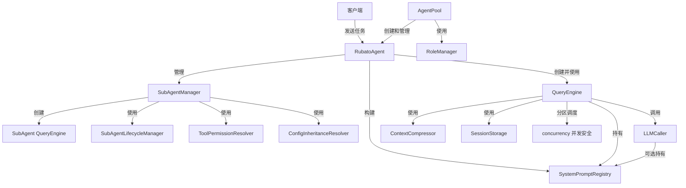
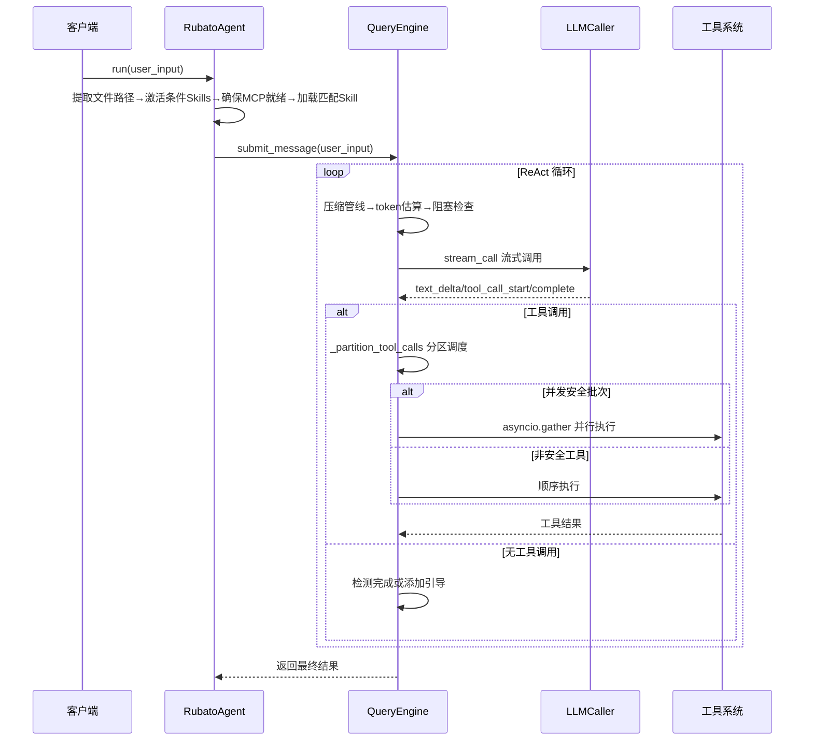
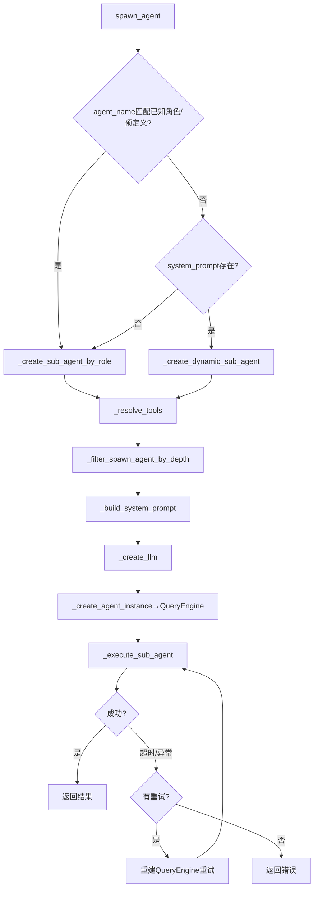
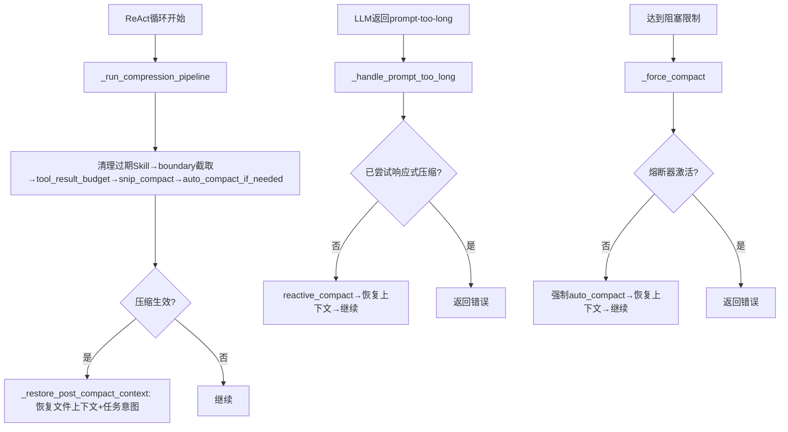
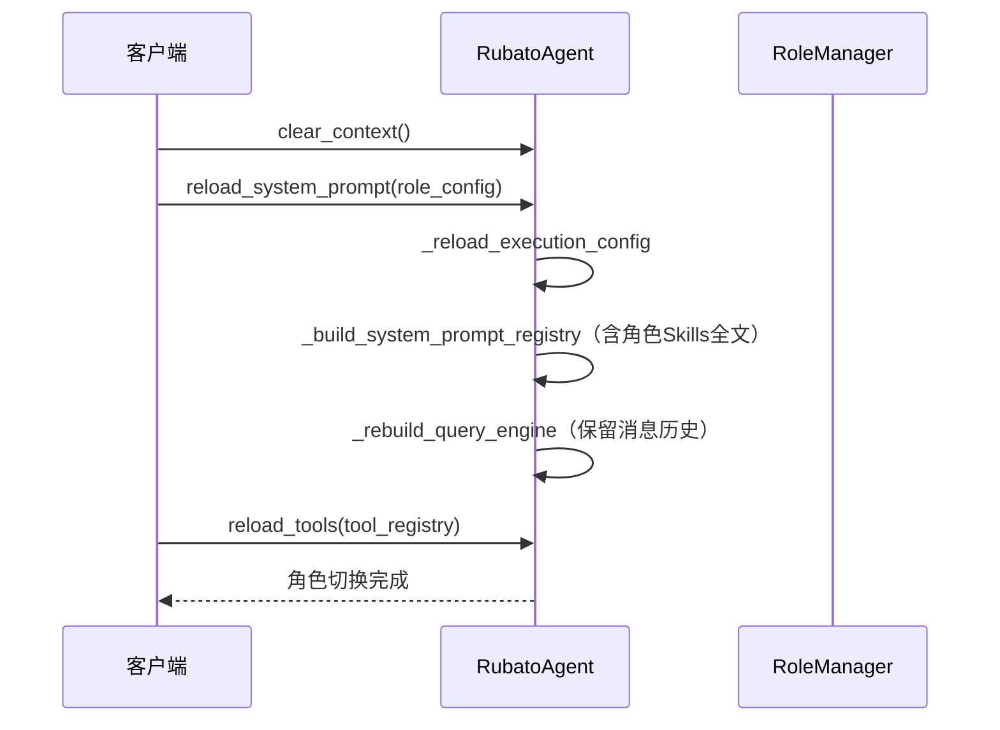
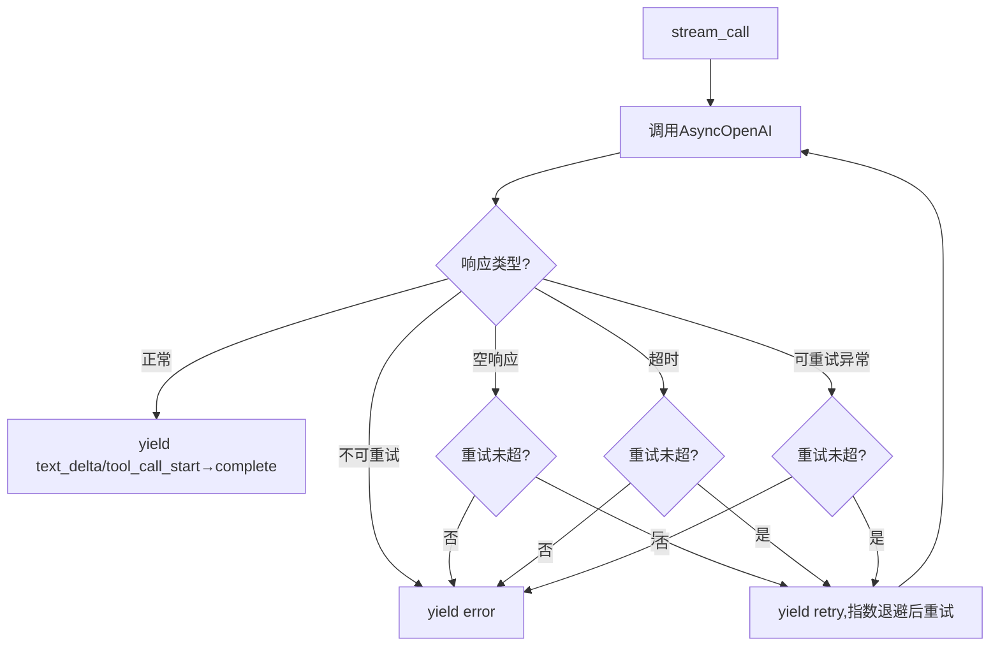

# Rubato 核心模块设计文档

## 1. 模块概述

核心模块（core/）是 Rubato 的执行引擎，负责智能体生命周期管理、ReAct 循环、工具调用、子智能体、上下文压缩、角色切换、工具并发安全。

| 文件 | 职责 |
|------|------|
| `agent.py` | 主智能体 RubatoAgent，任务入口 |
| `agent_pool.py` | Agent 实例池（实例工厂 + 生命周期管理） |
| `llm_wrapper.py` | LLM 调用封装，重试与流式处理 |
| `query_engine.py` | 查询引擎，ReAct 循环核心 |
| `role_manager.py` | 角色管理与模型配置继承 |
| `sub_agents.py` | SubAgent 管理器与工具权限解析 |
| `sub_agent_lifecycle.py` | SubAgent 生命周期管理 |
| `sub_agent_types.py` | SubAgent 数据结构定义 |

***

## 2. 核心组件设计

### 2.1 RubatoAgent（agent.py:24）

智能体主入口，管理系统提示词、工具列表，通过 QueryEngine 执行任务，处理 Skill 加载和激活。

**核心属性**：`config`、`llm`(LLMCaller)、`_current_system_prompt`、`tool_registry`、`role_config`、`context_manager`、`skill_loader`、`_sub_agent_manager`(SubAgentManager)、`tools`、`_query_engine`(QueryEngine)、`_system_prompt_registry`(SystemPromptRegistry)、`_session_storage`(SessionStorage)、`max_context_tokens`、`max_turns`、`compression_config`

**关键方法**：
- `run()`/`run_stream()`/`run_stream_structured()`：三种运行模式，均通过 QueryEngine 执行
- `_build_system_prompt_registry()`：构建 SystemPromptRegistry，管理分段系统提示词
- `_create_query_engine()`/`_rebuild_query_engine()`：创建/重建 QueryEngine（保留消息历史）
- `reload_system_prompt(role_config)`：重载系统提示词、执行配置、工具列表
- `load_session(session_id)`：加载指定会话，恢复消息历史和角色
- `interrupt()`：中断当前任务

辅助方法：`_create_llm`、`_load_system_prompt`、`_get_tools_for_role`、`_ensure_spawn_agent_tool`、`_extract_file_paths_from_input`、`activate_skills_for_paths`、`update_config`、`clear_context` 等。

### 2.2 QueryEngine（query_engine.py:220）

管理单次对话的完整生命周期，实现 ReAct 循环，支持流式处理、中断恢复、预算/轮次控制、多级上下文压缩。

**核心属性**：`config`(QueryEngineConfig)、`mutable_messages`、`abort_controller`(AbortController)、`total_usage`(Usage)、`llm_caller`(LLMCaller)、`_tool_map`、`_compressor`(ContextCompressor)、`_tool_result_storage`、`_content_replacement_state`、`system_prompt_registry`、`conversation_history`、`_task_intent_manager`、`_session_storage`、`_last_persisted_count`(已持久化消息数)

**关键方法**：
- `submit_message(prompt, options)`：提交消息，对首条用户消息提取任务意图，运行 ReAct 循环
- `_run_react_loop(options)`：ReAct 循环主方法——压缩管线→token估算→阻塞检查→流式LLM调用→分区调度工具执行→增量持久化
- `_persist_new_messages()`：增量持久化——将`_last_persisted_count`之后的新消息追加到会话文件
- `_run_compression_pipeline()`：四级压缩（boundary截取→tool_result_budget→snip_compact→auto_compact），先清理过期Skill
- `_restore_post_compact_context()`：压缩后恢复最近文件上下文+任务意图
- `_force_compact()`/`_handle_prompt_too_long()`：强制压缩/响应式压缩（含熔断器保护）
- `_preprocess_tool_args()`：预处理工具参数，修复JSON编码的字符串参数（terminal的commands跳过）

辅助方法：`interrupt`、`get_messages`、`get_session_id`、`get_usage`、`is_running`、`clear_messages`、`set_messages`、`load_session`、`update_session_metadata` 等。

**关键数据类**：

| 类名 | 行号 | 说明 |
|------|------|------|
| `FileStateCache` | :39 | 文件状态缓存，get/set/remove/clear/has |
| `AbortController` | :73 | 中断控制器，abort/is_aborted/get_reason/reset |
| `Usage` | :98 | 使用量统计（prompt_tokens/completion_tokens/total_tokens/cost_usd） |
| `SDKMessage` | :114 | SDK消息，工厂方法：assistant/tool_use/tool_result/error/interrupt/result |
| `SubmitOptions` | :167 | 提交选项（stream/timeout/metadata） |
| `QueryEngineConfig` | :178 | QueryEngine完整配置，含压缩参数、重试参数、session_storage、task_intent参数等 |

### 2.3 SubAgent 类型定义（sub_agent_types.py）

**枚举**：
- `ToolInheritanceMode`（:15）：INHERIT_ALL/INHERIT_SELECTED/INDEPENDENT
- `SubAgentState`（:43）：CREATED/RUNNING/COMPLETED/FAILED/TIMEOUT/CANCELLED

**Pydantic 数据类**：

| 类名 | 行号 | 核心字段 |
|------|------|----------|
| `ToolPermissionConfig` | :53 | inherit_from_parent、allowlist、denylist |
| `SubAgentExecutionConfig` | :74 | timeout、max_retries、recursion_limit、max_context_tokens |
| `SubAgentModelConfig` | :95 | inherit、provider、name、temperature、max_tokens、api_key、base_url、auth |
| `SubAgentDefinition` | :134 | name、system_prompt/system_prompt_file、model、execution、tool_inheritance、tool_permissions、available_tools、skills；提供 `get_system_prompt_content()` |
| `SubAgentInstance` | :216 | instance_id、name、definition、state、task、result、error、parent_session_id、depth |
| `SubAgentSpawnOptions` | :270 | agent_name、task、system_prompt、inherit_parent_tools、session_id、max_recursion_depth、timeout、tool_inheritance、available_tools |

### 2.4 SubAgentManager（sub_agents.py:159）

加载和管理 SubAgent 定义，创建角色配置/动态系统提示词的 SubAgent，处理工具继承和权限过滤、递归深度控制。

**核心属性**：`llm`、`parent_agent`、`sub_agents_dir`、`roles_dir`、`recursion_limit`、`agent_definitions`、`_session_depths`、`_lifecycle_manager`、`_session_storage`

**关键方法**：
- `spawn_agent(options)`：主入口——已知角色/预定义则走角色配置路径（忽略LLM传入的system_prompt），否则动态创建或回退角色配置
- `_create_sub_agent_by_role(options)`：基于角色配置创建，加载角色定义→解析工具→过滤spawn_agent→构建提示词→创建LLM→创建QueryEngine→执行
- `_create_dynamic_sub_agent(options)`：动态创建，使用LLM生成或用户提供的system_prompt
- `_filter_spawn_agent_by_depth()`：达到最大递归深度时移除spawn_agent工具（算法层面限制）
- `_execute_sub_agent()`：执行SubAgent，支持重试（每次重建QueryEngine），超时控制

辅助方法：`_load_role_definition`、`_convert_role_config_to_definition`、`_resolve_tools`、`_build_system_prompt`、`_create_llm`、`_create_agent_instance`、`check_recursion_depth`/`increment_depth`/`decrement_depth` 等。

**辅助类**：
- `ToolPermissionResolver`（:34）：resolve()按继承模式确定初始工具集→应用白名单→应用黑名单
- `ConfigInheritanceResolver`（:99）：resolve_model_config()继承父配置，子配置非None值覆盖
- `create_spawn_agent_tool()`（:1081）：创建绑定到Agent实例的spawn_agent工具

### 2.5 SubAgentLifecycleManager（sub_agent_lifecycle.py:21）

管理 SubAgent 实例的创建/销毁、并发控制（信号量）、超时管理、状态追踪、回调触发。

**核心属性**：`max_concurrent`、`_instances`、`_semaphore`、`_on_created/_on_started/_on_completed/_on_failed`

**关键方法**：`create_instance()`、`start_instance()`（含超时控制）、`cancel_instance()`、`destroy_instance()`、`managed_instance()`（上下文管理器）、`cleanup_completed_instances()`、`on_created/on_started/on_completed/on_failed()`（注册回调）

### 2.6 AgentPool（agent_pool.py:74）

创建和管理多个 Agent 实例，根据角色配置创建 ToolRegistry，管理实例状态和生命周期。

**核心属性**：`config`、`max_instances`、`default_role_name`、`_instances`、`_role_manager`

**关键方法**：
- `initialize()`：初始化，加载角色配置
- `create_instance(role_name)`：创建Agent实例（ContextManager+SkillLoader+ToolRegistry+SessionStorage+RubatoAgent）
- `destroy_instance(instance_id)`：销毁指定实例
- `destroy_all_instances()`：销毁所有实例
- `_create_tool_registry()`：创建工具注册表，整合builtin/shell/MCP/file工具
- `_create_context_manager()`：创建上下文管理器
- `_create_skill_loader()`：创建Skill加载器

**辅助数据类**：`InstanceStatus`（:24，IDLE/BUSY/ERROR/DISPOSED）、`AgentInstance`（:32，含mark_error/dispose）

### 2.7 工具并发安全

工具并发安全机制，确保并发安全工具可并行执行，非安全工具顺序执行。

**concurrency.py（src/tools/concurrency.py）**：
- `is_concurrency_safe(tool_name, tool_instance, tool_args)`：判断工具是否并发安全，默认返回 False，仅显式标记的工具（如 spawn_agent=True）返回 True
- `_CONCURRENCY_SAFE_TOOLS`：并发安全工具注册表，键为工具名，值为是否安全

**query_engine.py 相关数据结构与函数**：

| 类名/函数 | 行号 | 说明 |
|-----------|------|------|
| `ToolCallBatch` | :40 | 数据类，is_concurrent（是否并发安全批次）+ calls（工具调用列表） |
| `_partition_tool_calls()` | :45 | 将 tool_calls 按并发安全性分区为 ToolCallBatch 列表 |

**分区调度策略**：
1. `_partition_tool_calls()` 遍历 tool_calls，通过 `is_concurrency_safe()` 判断每个工具的并发安全性
2. 连续的并发安全工具合并为同一批次（is_concurrent=True），非安全工具各自独立为顺序批次（is_concurrent=False）
3. 并发安全批次中 spawn_agent 工具数量超过 `max_parallel_spawn` 时，按该限制拆分为多个子批次
4. 执行时，并发安全批次（calls>1）使用 `asyncio.gather` 并行执行，非安全工具顺序执行

**max_parallel_spawn 配置**：限制并行 spawn_agent 数量，默认 1，通过 QueryEngineConfig 传入

### 2.8 RoleManager（role_manager.py:12）

加载和管理角色配置，模型配置继承机制，角色切换时加载系统提示词。

**常量**：`DEFAULT_ROLE_NAME = "_default"`

**核心属性**：`loader`(RoleConfigLoader)、`_default_model_config`、`_current_role`、`_merged_model_configs`

**关键方法**：
- `load_roles()`：加载所有角色配置并合并模型配置
- `_merge_model_config()`：inherit=True时继承默认配置，子配置非None值覆盖；inherit=False时必须提供provider和name
- `switch_role(name)`：切换当前角色
- `get_merged_model_config(role_name)`：获取角色的合并后模型配置

辅助方法：`get_role`、`get_current_role`、`list_roles`、`get_role_info`、`load_system_prompt`、`reload_roles`、`has_role` 等。

### 2.9 LLMCaller（llm_wrapper.py:46）

封装 LLM 调用，直接使用 openai.AsyncOpenAI SDK，输入输出仍用 LangChain 消息类型保持兼容。支持流式调用、指数退避重试、错误数据转储。

**核心属性**：`model`、`temperature`、`max_tokens`、`client`(AsyncOpenAI)、`usage_stats`(UsageStats)、`_tool_schemas`、`timeout`、`retry_max_count/retry_initial_delay/retry_max_delay`、`system_prompt_registry`、`logging_config`

**关键方法**：
- `bind_tools()`：绑定工具列表，生成工具JSON Schema
- `invoke()`：非流式调用
- `stream()`：流式调用，返回AIMessageChunk生成器
- `stream_call()`：核心流式调用方法，支持重试，返回字典生成器（text_delta/tool_call_start/complete/retry/error）
- `_prepare_messages()`：优先使用registry.build()获取系统提示词，tiktoken估算token数
- `_is_retryable_error()`：判断超时/连接错误/速率限制/服务端错误是否可重试

辅助方法：`_convert_messages_to_openai`、`_convert_openai_response_to_aimessage`、`_build_request_params`、`_dump_error_request_data`、`_get_tool_schemas` 等。

**辅助数据类**：`UsageStats`（:19，prompt_tokens/completion_tokens/total_tokens/call_count）

***

## 3. 组件间关系

***

## 4. 关键流程

### 4.1 智能体执行流程

### 4.2 子智能体创建流程

### 4.3 上下文压缩流程

### 4.4 角色切换流程

### 4.5 LLM 调用与重试流程

***

## 5. 技术实现要点

### 5.1 ReAct 循环

每轮：压缩管线→token估算→阻塞检查→流式LLM调用→工具执行。连续3轮无工具调用时添加引导消息；基于中文关键词检测任务完成；工具参数预处理修复JSON编码字符串（terminal的commands跳过）。工具执行采用分区调度策略：通过`_partition_tool_calls()`将tool_calls按并发安全性分区为ToolCallBatch列表，并发安全工具（spawn_agent）的批次使用`asyncio.gather`并行执行，非安全工具顺序执行；`max_parallel_spawn`限制spawn_agent并行数，超出时拆分为多个子批次。

### 5.2 上下文压缩

四级管线：boundary截取→tool_result_budget→snip_compact→auto_compact。压缩后恢复最近5个文件上下文（token≤5000）+任务意图。Reactive Compact处理prompt-too-long（每循环仅尝试一次）；强制压缩处理阻塞限制（含熔断器保护）。

### 5.3 子智能体管理

角色优先解析：agent_name匹配已知角色/预定义时强制走角色配置路径（忽略LLM的system_prompt）。递归深度控制：达到最大深度时移除spawn_agent工具（算法层面限制）。执行重试：失败时重建QueryEngine重试。会话关联：通过parent_session_id和SubSessionRef关联父子会话。

### 5.4 会话持久化

QueryEngine初始化时save_session创建空记录；ReAct循环中每轮LLM调用+工具执行完成后通过`_persist_new_messages()`增量保存（仅追加`_last_persisted_count`之后的新消息）；submit_message的finally块保存剩余未保存消息；clear_messages重置`_last_persisted_count`并生成新session_id。RubatoAgent.load_session恢复消息历史和角色。session_storage传递链：RubatoAgent→QueryEngineConfig→QueryEngine；RubatoAgent→SubAgentManager→SubAgent QueryEngineConfig。

### 5.5 日志配置

log_token_estimation控制LLMCaller的token估算日志；log_compression_stats控制压缩统计日志；log_step_details控制ReAct步骤详情日志。

### 5.6 LLM 调用

直接使用AsyncOpenAI SDK，输入输出用LangChain消息类型。stream_call支持指数退避重试（retry_max_count/retry_initial_delay/retry_max_delay）。可重试错误：超时、连接错误、速率限制、服务端错误。错误时dump请求数据到logs/目录。

### 5.7 任务意图保护

QueryEngine初始化时创建TaskIntentManager；submit_message对首条用户消息提取任务意图；压缩恢复时在summary后、recent_messages前插入任务意图恢复消息。消息布局：system_messages + boundary + summary + task_intent + recent_messages，有利于Prompt Caching。
