# Rubato - AI助手框架设计方案

## 文档原则

1. **不保留代码块**：文档中仅保留文件名、类名、方法名等定义，方便大模型通过定义检索实际代码
2. **关键逻辑用图表示**：对于关键逻辑和长链路逻辑，使用 mermaid 图（流程图、时序图、序列图等）体现
3. **保持结构清晰**：按照模块和功能划分章节，便于定位和理解

***

## 1. 项目概述

### 1.1 项目名称

**Rubato** - 自然语言驱动的自动化测试执行框架

### 1.2 核心目标

构建一个自然语言驱动的自动化测试执行系统。用户只需用自然语言描述测试场景，Agent 即可自动解析意图、规划步骤，并通过浏览器自动化工具执行测试。系统统一使用 QueryEngine 作为核心执行引擎，支持工具调用（Playwright MCP）、Skill动态加载、上下文压缩，以及完整的对话生命周期管理。

### 1.3 核心理念

**ReAct + Skills 架构**：

基于 Claude Code 的架构理念，采用 ReAct（推理-行动-观察）模式结合 Skills 系统实现灵活的工作流：

- **自然语言驱动**：用户用自然语言描述任务，无需编写代码脚本
- **ReAct 模式**：Agent 根据自然语言输入自主推理和决策，类似 Trae、Claude Code
- **Skills 系统**：工作流程由自然语言描述定义（Skills），而非代码中的固定节点
- **条件激活**：Skills 可以基于文件路径模式自动激活
- **动态发现**：在文件操作时自动发现嵌套的 Skills 目录
- **QueryEngine**：管理单次对话的完整生命周期，支持流式处理和中断恢复

#### 1.3.1 从传统工作流到 ReAct + Skills

**传统工作流引擎的问题**：

- 需要预定义所有状态和转换
- 难以处理自然语言定义的工作流
- 缺乏灵活性，无法适应变化
- 实现复杂，维护成本高

**Claude Code 的架构启示**：

Claude Code 并没有使用传统的工作流引擎，而是采用了更灵活的架构：

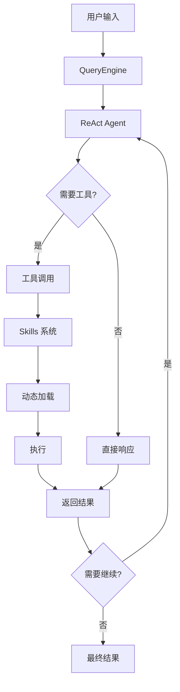
```mermaid
graph TB
    A[用户输入] --> B[QueryEngine]
    B --> C[ReAct Agent]
    C --> D{需要工具?}
    D -->|是| E[工具调用]
    D -->|否| F[直接响应]
    E --> G[Skills 系统]
    G --> H[动态加载]
    H --> I[执行]
    I --> J[返回结果]
    F --> J
    J --> K{需要继续?}
    K -->|是| C
    K -->|否| L[最终结果]
```

**核心组件**：

1. **QueryEngine**: 管理对话生命周期和会话状态
2. **ReAct Agent**: 推理-行动-观察循环
3. **Skills 系统**: 自然语言定义的"工作流片段"
4. **Tools 系统**: 执行具体操作
5. **AsyncGenerator**: 流式处理和中断恢复

#### 1.3.2 架构优势对比

| 维度       | 传统工作流引擎          | ReAct + Skills 架构 |
| -------- | ---------------- | ----------------- |
| **定义方式** | 结构化定义(YAML/JSON) | 自然语言定义            |
| **灵活性**  | 低(需预定义)          | 高(动态适应)           |
| **学习成本** | 高(需学习DSL)        | 低(自然语言)           |
| **维护成本** | 高(复杂状态机)         | 低(简单组件)           |
| **错误处理** | 显式定义             | Agent 自动处理        |
| **人工交互** | 需要特殊节点           | 自然对话              |
| **可扩展性** | 受限于状态机           | 无限(Skills 可扩展)    |

### 1.4 技术栈

- Python >=3.12
- LangChain >=0.3.25
- langchain-mcp-adapters >=0.1.0 (MCP集成)
- langchain-openai >=0.3.0 (OpenAI集成)
- langchain-community >=0.3.0 (社区工具集成)
- langchain-experimental >=0.3.0 (实验性功能)
- FastAPI >=0.109.0 (HTTP服务)
- Uvicorn >=0.27.0 (ASGI服务器)
- websockets >=12.0 (WebSocket支持)
- pathspec >=0.12.0 (路径模式匹配)
- tiktoken >=0.5.0 (Token计算)
- PyYAML >=6.0 (配置解析)
- Pydantic >=2.0 (数据验证)
- Playwright MCP (@playwright/mcp) - 外部MCP服务
- Windows平台

***

## 2. 整体架构设计

### 2.1 架构层次


```mermaid
graph TB
    subgraph WebUI["Web交互层"]
        Browser["浏览器"]
        WSClient["WebSocket客户端"]
    end
    
    subgraph HTTP["HTTP服务层 (api/)"]
        FastAPI["api/app.py<br/>FastAPI应用"]
        WSRouter["api/websocket.py<br/>WebSocket路由"]
        Routes["api/routes/<br/>API路由"]
        ConfigAPI["routes/configs.py<br/>配置API"]
        CommandsAPI["routes/commands.py<br/>命令API"]
        TestcasesAPI["routes/testcases.py<br/>测试案例API"]
    end
    
    subgraph CLI["控制台交互层 (cli/)"]
        Console["cli/console.py<br/>用户输入/输出"]
        CLICommands["cli/commands.py<br/>CLI命令处理"]
    end
    
    subgraph CmdSystem["命令系统 (commands/)"]
        Dispatcher["dispatcher.py<br/>命令分发器"]
        Base["base.py<br/>命令基类"]
        Registry["registry.py<br/>命令注册表"]
        Impl["impl/<br/>命令实现"]
    end
    
    subgraph Core["核心引擎层 (core/)"]
        Agent["agent.py<br/>RubatoAgent"]
        QueryEngine["query_engine.py<br/>查询引擎"]
        AgentPool["agent_pool.py<br/>Agent实例池"]
        RoleManager["role_manager.py<br/>角色管理器"]
        SubAgents["sub_agents.py<br/>子Agent管理"]
        SubAgentLifecycle["sub_agent_lifecycle.py<br/>SubAgent生命周期"]
        SubAgentTypes["sub_agent_types.py<br/>SubAgent类型定义"]
        LLMWrapper["llm_wrapper.py<br/>LLM封装器"]
        TestSuiteExecutor["test_suite_executor.py<br/>测试套件执行器"]
    end
    
    subgraph Tools["工具层 (tools/)"]
        ToolRegistry["mcp/tools.py<br/>工具注册表"]
        ToolProvider["tools/provider.py<br/>工具提供者(ABC)"]
        ToolProviderProtocol["mcp/tools.py<br/>ToolProvider(Protocol)"]
        FileTools["tools/file_tools/<br/>文件工具"]
        FileToolsImpl["file_tools/tools/<br/>文件工具实现"]
        ToolDocs["tools/docs.py<br/>工具说明文档"]
        MCPProvider["tools/mcp_provider.py<br/>MCP工具提供者"]
    end
    
    subgraph MCP["MCP模块 (mcp/)"]
        MCPClient["mcp/client.py<br/>MCPManager"]
        MCPErrors["mcp/errors.py<br/>错误定义"]
    end
    
    subgraph Skills["Skill模块 (skills/)"]
        SkillManager["skills/manager.py<br/>Skill管理器"]
        SkillLoader["skills/loader.py<br/>Skill加载器"]
        SkillRegistry["skills/registry.py<br/>Skill注册表"]
        SkillParser["skills/parser.py<br/>Skill解析器"]
    end
    
    subgraph Support["支撑层 (context/, config/, utils/)"]
        ContextManager["context/manager.py<br/>上下文管理"]
        ContextCompressor["context/compressor.py<br/>统一上下文压缩引擎"]
        ToolResultStorage["context/tool_result_storage.py<br/>工具结果持久化存储"]
        CompactPrompt["context/compact_prompt.py<br/>压缩提示词模板"]
        SessionStorage["context/session_storage.py<br/>会话持久化"]
        ConfigLoader["config/loader.py<br/>配置加载"]
        ConfigValidators["config/validators.py<br/>配置验证器与环境变量替换"]
        RoleLoader["config/role_loader.py<br/>角色配置加载器"]
        Logger["utils/logger.py<br/>日志记录"]
    end
    
    subgraph WebFrontend["Web前端 (web/)"]
        Static["static/<br/>静态资源"]
        Templates["templates/<br/>HTML模板"]
    end
    
    subgraph Config["配置文件层 (config/)"]
        ModelConfig["model_config.yaml"]
        AgentConfig["agent_config.yaml"]
        ToolsConfig["tools_config.yaml"]
        MCPConfig["mcp_config.yaml"]
        PromptConfig["prompt_config.yaml"]
        SkillsConfig["skills_config.yaml"]
        ProjectConfig["project_config.yaml"]
        TestConfig["test_config.yaml"]
        RolesConfig["roles/*.yaml"]
    end
    
    Browser -->|HTTP/WebSocket| HTTP
    HTTP --> Core
    HTTP --> Support
    CLI --> CmdSystem
    CmdSystem --> Core
    Core --> Tools
    Core --> Support
    Core --> MCP
    Core --> Skills
    Support --> Config
    Tools --> MCP
    Tools --> Skills
    HTTP --> WebFrontend
```

#### 2.1.1 Web控制台任务中断机制

Web控制台支持通过停止按钮中断正在执行的Agent任务：

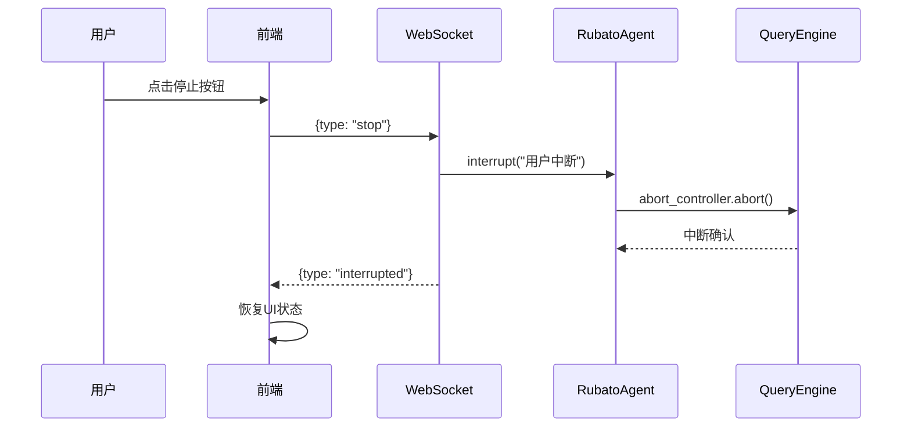
```mermaid
sequenceDiagram
    participant User as 用户
    participant FE as 前端
    participant WS as WebSocket
    participant Agent as RubatoAgent
    participant QE as QueryEngine
    
    User->>FE: 点击停止按钮
    FE->>WS: {type: "stop"}
    WS->>Agent: interrupt("用户中断")
    Agent->>QE: abort_controller.abort()
    QE-->>Agent: 中断确认
    WS-->>FE: {type: "interrupted"}
    FE->>FE: 恢复UI状态
```

**WebSocket 消息类型**:

| 类型 | 方向 | 说明 |
|------|------|------|
| `task` | 前端→后端 | 发送任务或命令 |
| `stop` | 前端→后端 | 请求中断当前任务 |
| `command_result` | 后端→前端 | 命令执行结果 |
| `chunk` | 后端→前端 | 流式输出内容片段 |
| `done` | 后端→前端 | 任务完成 |
| `interrupted` | 后端→前端 | 任务已中断 |
| `error` | 后端→前端 | 错误信息 |

**前端交互规则**:
- 命令输入（以`/`开头）: 不进入流式模式，按钮保持"发送"状态
- 任务输入（非`/`开头）: 进入流式模式，按钮变为"停止"，支持中断

### 2.2 核心设计原则

1. **自然语言驱动**: 用户用自然语言描述测试场景，Agent自动解析并执行
2. **ReAct模式**: 通用的推理(Reason) → 行动(Act) → 观察(Observe) 循环
3. **QueryEngine管理**: 管理单次对话的完整生命周期，支持流式处理和中断恢复
4. **多Agent协作**: 支持主Agent调用子Agent，子Agent继承父角色权限
5. **配置驱动**: 所有配置以文件形式存在，便于管理
6. **统一工具配置**: 工具配置整合为统一格式，支持自动注入说明
7. **角色系统**: 支持多角色配置，系统默认角色自动加载
8. **Skill动态加载**: 启动时加载元数据，对话中按需加载完整内容
9. **条件激活**: Skills 可以基于文件路径模式自动激活
10. **动态发现**: 在文件操作时自动发现嵌套的 Skills 目录
11. **多级上下文压缩**: 统一压缩引擎支持 boundary截取 → tool_result_budget → snip_compact → auto_compact 四级管线，含断路器保护
12. **会话持久化**: 支持会话保存和恢复
13. **统一引擎运行**: 系统统一使用 QueryEngine 作为核心执行引擎，所有对话和任务均通过 QueryEngine 管理

### 2.3 统一引擎架构说明

系统统一使用 QueryEngine 作为核心执行引擎，所有 Agent（包括主 Agent 和 SubAgent）均通过 QueryEngine 管理对话生命周期和 ReAct 循环。

#### 2.3.1 QueryEngine 统一流程

```
用户输入 → Console → RubatoAgent → QueryEngine → LLMCaller → Tools/Skills
                                      ↓
                               AbortController
                                      ↓
                                Usage Tracking
                                      ↓
                               Budget Control
                                      ↓
                          多级上下文压缩管线
```

**特点**：

- 完整的对话生命周期管理
- 支持中断恢复和预算控制
- 详细的使用量统计
- 灵活的消息流控制
- 多级上下文压缩管线（boundary截取 → tool_result_budget → snip_compact → auto_compact）
- 统一的 ReAct 循环引擎

**统一架构**：

```
用户输入 → Console → RubatoAgent → QueryEngine → ReAct Agent → Tools/Skills
                                      ↓
                              AbortController
                                      ↓
                                Usage Tracking
                                      ↓
                               Budget Control
                                      ↓
                          多级上下文压缩管线
                                      
                └→ SubAgentManager → SubAgent(QueryEngine) → Tools/Skills
```

#### 2.3.2 SubAgent 流程（扩展）

```
主 Agent → spawn_agent 工具 → SubAgentManager → SubAgent(QueryEngine实例)
                                      ↓
                              递归深度控制
                                      ↓
                              工具继承解析
                                      ↓
                          独立上下文执行（QueryEngine）
```

**特点**：

- 支持动态创建子智能体
- SubAgent 同样使用 QueryEngine 作为执行引擎，与主 Agent 工作方式完全一致
- 独立的系统提示词和上下文
- 灵活的工具继承机制
- 递归深度控制（通过算法限制 spawn_agent 工具的可用性）

**适用场景**：

- 复杂任务的分解
- 专业化的子任务处理
- 多角色协作场景

***

## 3. 项目目录结构

```
rubato/
├── src/
│   ├── main.py                    # 程序入口
│   ├── api/                       # API服务层
│   │   ├── app.py                 # FastAPI应用
│   │   ├── websocket.py           # WebSocket路由
│   │   ├── schemas.py             # API数据模型
│   │   └── routes/                # API路由
│   │       ├── commands.py        # 命令API
│   │       ├── configs.py         # 配置API
│   │       └── testcases.py       # 测试案例API
│   ├── cli/                       # CLI交互层
│   │   ├── console.py             # 用户输入/输出
│   │   └── commands.py            # CLI命令处理
│   ├── commands/                  # 命令系统
│   │   ├── dispatcher.py          # 命令分发器
│   │   ├── base.py                # 命令基类
│   │   ├── context.py             # 命令上下文
│   │   ├── models.py              # 命令模型
│   │   ├── registry.py            # 命令注册表
│   │   └── impl/                  # 命令实现
│   │       ├── browser.py         # 浏览器命令
│   │       ├── clear.py           # 清空命令
│   │       ├── config.py          # 配置命令
│   │       ├── help.py            # 帮助命令
│   │       ├── history.py         # 历史命令
│   │       ├── new.py             # 新对话命令
│   │       ├── prompt.py          # 提示词命令
│   │       ├── quit.py            # 退出命令
│   │       ├── reload.py          # 重载命令
│   │       ├── role.py            # 角色命令
│   │       ├── skill.py           # Skill命令
│   │       ├── status.py          # 状态命令
│   │       └── tool.py            # 工具命令
│   ├── core/
│   │   ├── agent.py               # RubatoAgent
│   │   ├── query_engine.py        # QueryEngine 查询引擎
│   │   ├── agent_pool.py          # Agent实例池与并行执行器
│   │   ├── role_manager.py        # 角色管理器
│   │   ├── sub_agents.py          # 子Agent工具（spawn_agent）
│   │   ├── sub_agent_lifecycle.py # SubAgent生命周期管理
│   │   ├── sub_agent_types.py     # SubAgent类型定义
│   │   ├── llm_wrapper.py         # LLM封装器
│   │   └── test_suite_executor.py # 测试套件执行器
│   ├── tools/                     # 工具系统
│   │   ├── provider.py            # 工具提供者抽象基类(ABC)
│   │   ├── docs.py                # 工具说明文档生成
│   │   ├── mcp_provider.py        # MCP工具提供者
│   │   └── file_tools/            # 文件工具（内置）
│   │       ├── __init__.py        # 模块导出
│   │       ├── provider.py        # 文件工具提供者
│   │       ├── audit.py           # 文件操作审计
│   │       ├── workspace.py       # 工作空间管理
│   │       ├── permission.py      # 权限检查器
│   │       └── tools/             # 文件工具实现
│   │           ├── _helpers.py    # 权限检查辅助函数
│   │           ├── basic.py       # 基础文件操作
│   │           ├── list.py        # 列表操作
│   │           ├── read.py        # 读取操作
│   │           ├── replace.py     # 替换操作
│   │           ├── search.py      # 搜索操作
│   │           └── write.py       # 写入操作
│   ├── mcp/                       # MCP模块
│   │   ├── client.py              # MCPManager
│   │   ├── tools.py               # ToolRegistry & ToolProvider(Protocol)
│   │   └── errors.py              # MCP错误定义
│   ├── skills/
│   │   ├── manager.py             # SkillManager 管理器
│   │   ├── loader.py              # SkillLoader 加载器
│   │   ├── registry.py            # SkillRegistry 注册表（LRU缓存）
│   │   └── parser.py              # SkillParser 解析器
│   ├── context/
│   │   ├── manager.py             # 上下文管理器
│   │   ├── compressor.py          # 统一上下文压缩引擎
│   │   ├── tool_result_storage.py # 工具结果持久化存储与预算管理
│   │   ├── compact_prompt.py      # 压缩提示词模板与格式化
│   │   └── session_storage.py     # 会话持久化存储
│   ├── config/
│   │   ├── loader.py              # 配置加载器（含公共加载模式抽象）
│   │   ├── models.py              # 配置模型定义（含共享验证器函数）
│   │   ├── role_loader.py         # 角色配置加载器
│   │   └── validators.py          # 配置验证器与环境变量替换
│   ├── utils/
│   │   └── logger.py              # 日志记录器
│   └── web/                       # Web前端资源
│       ├── static/                # 静态资源
│       │   ├── css/               # 样式文件
│       │   ├── js/                # JavaScript文件
│       │   └── lib/               # 第三方库
│       └── templates/             # HTML模板
├── config/
│   ├── model_config.yaml          # 模型配置
│   ├── agent_config.yaml          # Agent配置（消息压缩、执行参数）
│   ├── tools_config.yaml          # 统一工具配置
│   ├── mcp_config.yaml            # MCP配置
│   ├── prompt_config.yaml         # 提示词配置
│   ├── skills_config.yaml         # Skill配置
│   ├── project_config.yaml        # 项目配置（工作空间、根目录）
│   ├── test_config.yaml           # 测试配置
│   └── roles/                     # 角色配置目录
│       ├── _default.yaml          # 系统默认角色
│       ├── test_case_generator.yaml
│       ├── test_case_executor.yaml
│       └── test_suite_executor.yaml
├── prompts/
│   ├── roles/                     # 角色提示词目录
│   │   ├── _default.txt           # 系统默认提示词
│   │   ├── test_case_generator.txt
│   │   ├── test_case_executor.txt
│   │   └── test_suite_executor.txt
│   └── system_prompt.txt          # 系统提示词
├── skills/                        # Skill文件目录
│   ├── knowledge-query.md         # 知识查询Skill
│   └── test-execution.md          # 测试执行Skill
├── sub_agents/                    # SubAgent配置目录
│   ├── element-locator.yaml       # 元素定位器
│   ├── knowledge-query.yaml       # 知识查询
│   └── snapshot-analyzer.yaml     # 快照分析器
└── logs/                          # 日志目录
```

***

## 4. 核心模块设计

### 4.1 Agent引擎 (core/agent.py)

**核心类**: `RubatoAgent`

**关键属性**:

- `config`: 应用配置实例 (AppConfig)
- `llm`: RobustChatOpenAI实例（带有重试逻辑的LLM封装）
- `_current_system_prompt`: 当前生效的系统提示词
- `tool_registry`: 工具注册表实例
- `role_config`: 角色配置
- `context_manager`: 上下文管理器（辅助角色，管理技能加载状态和应用状态）
- `skill_loader`: Skill加载器
- `mcp_manager`: MCP管理器（可选）
- `_role_skills`: 角色配置的 skills 列表
- `_query_engine`: QueryEngine 实例（始终初始化）
- `_file_state_cache`: 文件状态缓存
- `_sub_agent_manager`: SubAgent管理器
- `tools`: 当前可用的工具列表
- `max_context_tokens`: 最大上下文token数
- `max_turns`: 最大轮次限制（QueryEngine 的 ReAct 循环轮次上限）
- `compression_config`: 消息压缩配置

**关键方法**:

- `_create_llm()`: 创建LLM实例（支持自定义模型配置）
- `_load_system_prompt()`: 加载系统提示词，优先使用角色配置
- `_generate_tool_docs()`: 生成工具说明文档
- `_get_tools_for_role()`: 根据角色配置获取可用工具
- `_create_query_engine()`: 创建 QueryEngine 实例
- `_rebuild_query_engine()`: 重建 QueryEngine 实例（保留已有消息）
- `run()`: 运行Agent，通过 QueryEngine 流式处理
- `run_stream()`: 流式运行Agent（用于WebSocket），通过 QueryEngine 流式处理
- `reload_system_prompt()`: 重新加载系统提示词（支持角色切换）
- `reload_tools()`: 重新加载工具列表
- `update_role_skills()`: 更新角色的 skills 配置
- `load_role_skills()`: 异步加载角色配置的 skills 全文
- `activate_skills_for_paths()`: 激活匹配路径的条件 Skills
- `clear_context()`: 清空上下文并重建 QueryEngine
- `update_config()`: 更新配置（支持热重载）
- `get_skill_manager_stats()`: 获取 SkillManager 统计信息
- `interrupt(reason)`: 中断当前运行的任务，通过 QueryEngine 的 abort_controller 实现

> **注意**: `_compress_messages()`、`_ensure_message_chain_valid()`、`_estimate_tokens()` 已移除，压缩逻辑统一由 QueryEngine 内部的 `ContextCompressor` 处理。

**QueryEngine 统一引擎**:

RubatoAgent 统一使用 QueryEngine 作为核心执行引擎，所有对话和任务均通过 QueryEngine 管理。

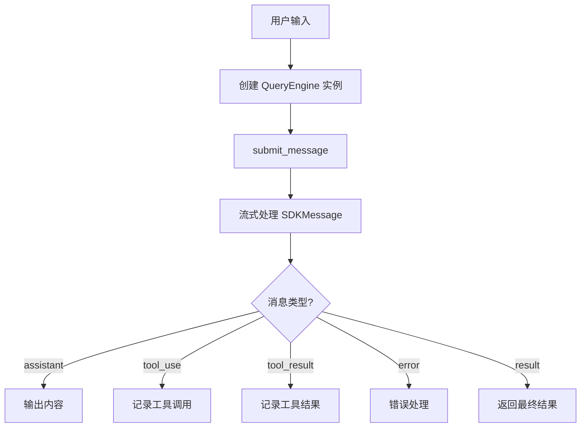
```mermaid
flowchart TD
    A[用户输入] --> B[创建 QueryEngine 实例]
    B --> C[submit_message]
    C --> D[流式处理 SDKMessage]
    D --> E{消息类型?}
    E -->|assistant| F[输出内容]
    E -->|tool_use| G[记录工具调用]
    E -->|tool_result| H[记录工具结果]
    E -->|error| I[错误处理]
    E -->|result| J[返回最终结果]
```

**系统提示词管理流程**:

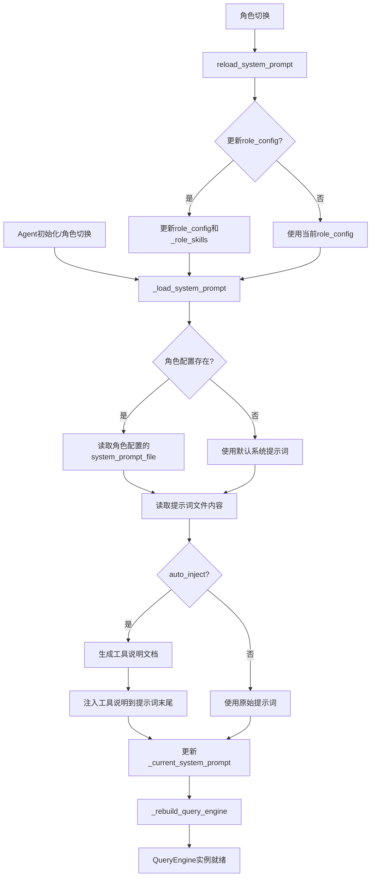
```mermaid
flowchart TD
    A[Agent初始化/角色切换] --> B[_load_system_prompt]
    B --> C{角色配置存在?}
    C -->|是| D[读取角色配置的system_prompt_file]
    C -->|否| E[使用默认系统提示词]
    D --> F[读取提示词文件内容]
    E --> F
    F --> G{auto_inject?}
    G -->|是| H[生成工具说明文档]
    G -->|否| I[使用原始提示词]
    H --> J[注入工具说明到提示词末尾]
    J --> K[更新_current_system_prompt]
    I --> K
    K --> L[_rebuild_query_engine]
    L --> M[QueryEngine实例就绪]
    
    N[角色切换] --> O[reload_system_prompt]
    O --> P{更新role_config?}
    P -->|是| Q[更新role_config和_role_skills]
    P -->|否| R[使用当前role_config]
    Q --> B
    R --> B
```

**核心方法**:

1. **`_load_system_prompt()`**: 加载系统提示词
   - 优先使用角色配置的 `system_prompt_file`
   - 支持自动注入工具说明文档
   - 根据 `_role_skills` 过滤 Skill 元数据
2. **`_create_query_engine()`**: 创建 QueryEngine 实例
   - 配置工具列表和 Skills
   - 设置权限检查回调
   - 配置预算和轮次限制
   - 配置压缩管线参数
3. **`_rebuild_query_engine()`**: 重建 QueryEngine 实例
   - 保留已有的消息历史
   - 使用当前最新的系统提示词和工具配置
   - 在角色切换、工具重载、Skill 加载等场景自动调用
4. **`reload_system_prompt(role_config)`**: 重新加载系统提示词
   - 支持角色切换时动态更新
   - 自动更新 `_role_skills` 配置
   - 重建 QueryEngine 实例以应用新提示词
   - 记录日志便于调试
5. **`load_role_skills(skills)`**: 异步加载角色 Skills 全文
   - 加载角色配置的 skills 列表
   - 将 Skills 内容注入到系统提示词
   - 标记已加载的 Skills 避免重复加载
6. **`activate_skills_for_paths(file_paths)`**: 激活条件 Skills
   - 从用户输入提取文件路径
   - 调用 SkillManager 的条件激活和动态发现
   - 返回激活的 Skill 名称列表

**工具说明文档生成**:

`_generate_tool_docs()` 方法负责生成工具说明文档：

- 收集内置工具（spawn\_agent, shell\_tool, file\_tools 等）
- 收集 MCP 工具（browser\_\* 等）
- 收集 Skill 元数据（根据 `_role_skills` 过滤）
- 格式化为统一的文档格式
- 支持配置是否包含使用示例

### 4.2 角色管理系统 (core/role\_manager.py)

**核心类**: `RoleManager`

**关键功能**:

- 加载所有角色配置（含系统默认角色 `_default`）
- 模型配置继承机制
- 角色切换时加载系统提示词

**角色配置模型**:

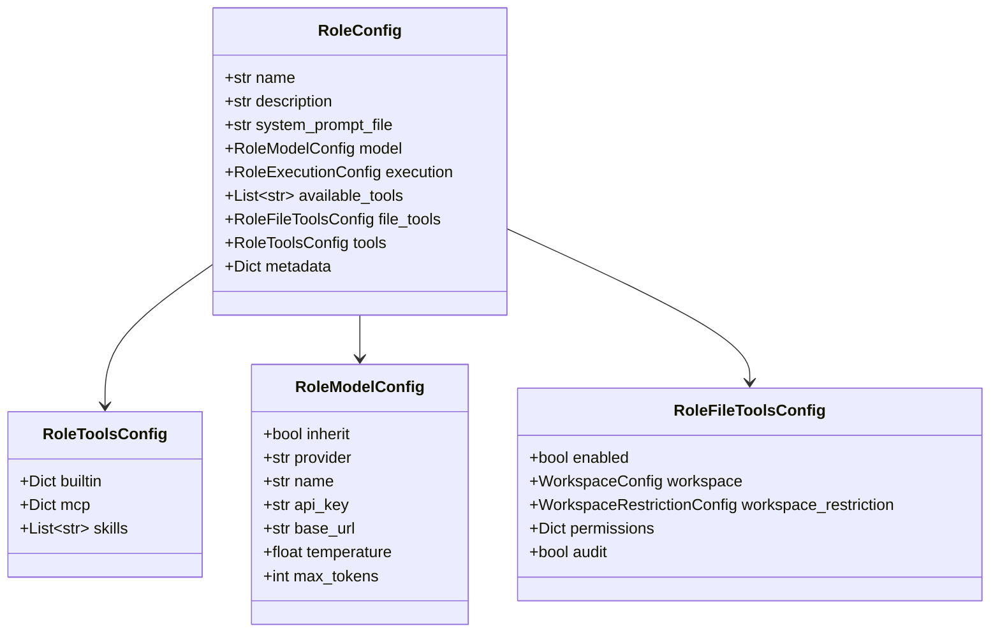
```mermaid
classDiagram
    class RoleConfig {
        +str name
        +str description
        +str system_prompt_file
        +RoleModelConfig model
        +RoleExecutionConfig execution
        +List~str~ available_tools
        +RoleFileToolsConfig file_tools
        +RoleToolsConfig tools
        +Dict metadata
    }
    
    class RoleToolsConfig {
        +Dict builtin
        +Dict mcp
        +List~str~ skills
    }
    
    class RoleModelConfig {
        +bool inherit
        +str provider
        +str name
        +str api_key
        +str base_url
        +float temperature
        +int max_tokens
    }
    
    class RoleFileToolsConfig {
        +bool enabled
        +WorkspaceConfig workspace
        +WorkspaceRestrictionConfig workspace_restriction
        +Dict permissions
        +bool audit
    }
    
    RoleConfig --> RoleToolsConfig
    RoleConfig --> RoleModelConfig
    RoleConfig --> RoleFileToolsConfig
```

**字段说明**:

- `available_tools`: 角色可用的工具名称列表，用于工具过滤
- `file_tools`: 角色级别的文件工具配置，包括工作空间、权限等
- `metadata`: 角色的元数据信息，如版本、作者等

**角色切换流程**:

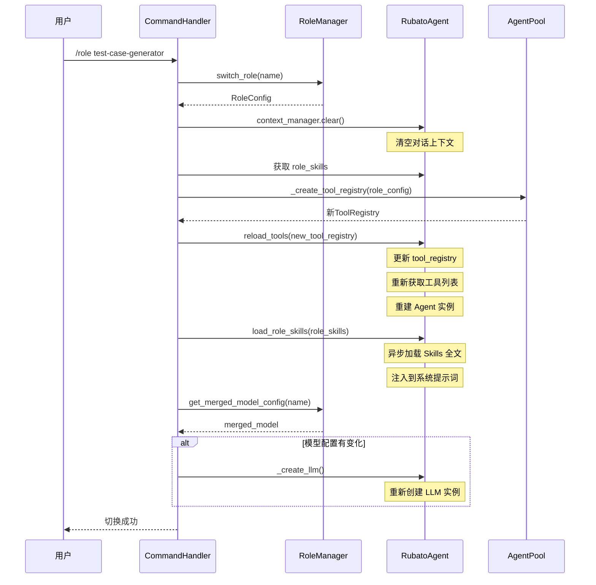
```mermaid
sequenceDiagram
    participant User as 用户
    participant Handler as CommandHandler
    participant RM as RoleManager
    participant Agent as RubatoAgent
    participant Pool as AgentPool

    User->>Handler: /role test-case-generator
    Handler->>RM: switch_role(name)
    RM-->>Handler: RoleConfig
    
    Handler->>Agent: context_manager.clear()
    Note over Agent: 清空对话上下文
    
    Handler->>Agent: 获取 role_skills
    Handler->>Pool: _create_tool_registry(role_config)
    Pool-->>Handler: 新ToolRegistry
    
    Handler->>Agent: reload_tools(new_tool_registry)
    Note over Agent: 更新 tool_registry
    Note over Agent: 重新获取工具列表
    Note over Agent: 重建 Agent 实例
    
    Handler->>Agent: load_role_skills(role_skills)
    Note over Agent: 异步加载 Skills 全文
    Note over Agent: 注入到系统提示词
    
    Handler->>RM: get_merged_model_config(name)
    RM-->>Handler: merged_model
    
    alt 模型配置有变化
        Handler->>Agent: _create_llm()
        Note over Agent: 重新创建 LLM 实例
    end
    
    Handler-->>User: 切换成功
```

**切换步骤详解**:

1. **清空上下文**: 调用 `context_manager.clear()` 清空对话历史
2. **创建工具注册表**: 根据新角色配置创建 `ToolRegistry`
3. **重新加载工具**: 调用 `reload_tools()` 更新工具列表
4. **加载角色 Skills**: 调用 `load_role_skills()` 加载角色专用的 Skills
5. **更新模型配置**: 如果模型配置有变化，重新创建 LLM 实例

**关键设计点**:

- **工具重载**: 角色切换时重新创建 `ToolRegistry`，确保工具权限正确
- **Skills 加载**: 支持角色级别的 Skills 白名单，按需加载全文
- **模型继承**: 支持模型配置继承，减少重复配置
- **上下文隔离**: 切换角色时清空上下文，避免角色间干扰

### 4.3 工具系统

#### 4.3.1 统一工具配置 (config/tools\_config.yaml)

```yaml
tools:
  builtin:
    enabled: true
    spawn_agent:
      enabled: true
    shell_tool:
      enabled: true
    file_tools:
      enabled: true
      permission_mode: "ask"
      permissions:
        "read:*": "allow"
        "write:*": "ask"
        "delete:*": "deny"
  
  mcp:
    config_file: mcp_config.yaml
    auto_connect: true
    cache_ttl: 300
  
  skills:
    config_file: skills_config.yaml
    auto_load_metadata: true

tool_docs:
  auto_inject: true
  include_examples: true
```

#### 4.3.2 工具说明文档系统 (tools/docs.py)

**核心类**: `ToolDocsGenerator`

**功能**:

- 为内置工具生成默认说明文档
- 支持MCP工具说明注入
- 支持Skill元数据注入

**注入时机**: 角色初始化时，加载系统提示词后自动注入

#### 4.3.2 MCP管理器 (mcp/client.py)

**核心类**: `MCPManager`

**关键属性**:

- `config`: MCP服务器配置字典
- `_client`: MultiServerMCPClient实例
- `_tools`: 已加载的MCP工具列表
- `_connected`: 连接状态标志
- `_sessions`: 服务器session映射
- `_session_cms`: session上下文管理器映射
- `_browser_alive`: 浏览器存活标志

**核心方法**:

- `_parse_connection_config(connection_cfg)`: 静态方法，从连接配置中提取重试参数（retry_times, retry_delay, timeout）
- `_connect_single_server(server_name, connection_cfg, warn_on_failure)`: 连接单个MCP服务器（带重试机制），返回连接是否成功
- `connect()`: 连接所有配置的MCP服务器
- `ensure_browser()`: 确保浏览器可用，失败时自动重连
- `check_browser_alive()`: 检查浏览器是否存活
- `close_browser()`: 显式关闭浏览器
- `disconnect(close_browser)`: 断开所有MCP连接
- `_cleanup_server_session(server_name)`: 清理指定服务器的session资源

**模块级常量**:

- `_DEFAULT_RETRY_TIMES = 3`: 默认重试次数
- `_DEFAULT_RETRY_DELAY = 5`: 默认重试间隔（秒）
- `_DEFAULT_TIMEOUT = 30`: 默认连接超时（秒）

#### 4.3.3 工具注册表 (mcp/tools.py)

**核心类**: `ToolRegistry`

**设计特点**:

- 实例级别：每个Agent实例拥有独立的ToolRegistry
- 工具提供者：支持注册多种工具源
- 工具去重：直接注册的工具优先级高于提供者提供的工具

**废弃全局函数**:

- `_ensure_global_registry()`: 内部辅助函数，确保全局注册表实例存在（不触发废弃警告）
- `get_tool_registry()`: 获取全局注册表（已废弃，触发DeprecationWarning）
- `register_mcp_tools()`: 注册MCP工具到全局注册表（已废弃，触发DeprecationWarning）
- `get_all_tools()`: 获取所有已注册工具（已废弃，触发DeprecationWarning）
- `get_tools_by_names()`: 根据名称获取工具（已废弃，触发DeprecationWarning）

> **注意**: 废弃函数通过 `_ensure_global_registry()` 访问全局注册表，避免调用 `get_tool_registry()` 导致双重废弃警告。

**ToolProvider 双重定义**:

项目中存在两种 `ToolProvider` 定义：

1. **Protocol定义** (`src/mcp/tools.py`):
   - 使用 `@runtime_checkable` 装饰器
   - 定义为 Protocol，支持结构化类型
   - 用于类型检查和协议匹配
2. **ABC定义** (`src/tools/provider.py`):
   - 继承自 `ABC`（抽象基类）
   - 提供默认实现和辅助方法
   - 用于实际工具提供者的基类

**建议**: 在未来版本中统一使用一种定义方式，推荐使用 Protocol（更灵活，支持结构化类型）。

**工具提供者实现**:

| 提供者类                | 文件路径                               | 功能说明                   |
| ------------------- | ---------------------------------- | ---------------------- |
| `LocalToolProvider` | `src/tools/provider.py`            | 本地工具提供者（spawn\_agent等） |
| `ShellToolProvider` | `src/tools/provider.py`            | Shell工具提供者             |
| `MCPToolProvider`   | `src/tools/mcp_provider.py`        | MCP工具提供者               |
| `FileToolProvider`  | `src/tools/file_tools/provider.py` | 文件工具提供者                |

#### 4.3.4 文件工具权限检查辅助 (file_tools/tools/_helpers.py)

**核心函数**:

- `check_permission(provider, tool_name, path, operation)`: 单路径权限检查，返回 `(resolved_path, error)` 元组
- `check_dual_permission(provider, tool_name, src, dst, src_operation, dst_operation)`: 双路径权限检查（用于复制/移动），返回 `(src_resolved, dst_resolved, error)` 元组

**设计目的**: 消除10个文件工具函数中重复的权限检查+拒绝日志模式，将5-7行样板代码简化为2行调用。

#### 4.3.5 权限检查器辅助方法 (file_tools/permission.py)

**PermissionChecker 辅助方法**:

- `_make_denied_result(path_obj, operation, reason, resolved_path)`: 构造拒绝结果
- `_make_ask_result(path_obj, operation, reason, resolved_path)`: 构造需确认结果
- `_make_allowed_result(path_obj, operation, resolved_path)`: 构造允许结果

**设计目的**: 消除 `check()` 方法中7处重复的 `PermissionResult` 构造，将方法从90行简化为50行。

#### 4.3.6 MCP工具提供者辅助方法 (mcp_provider.py)

**MCPToolProvider 辅助方法**:

- `_has_config_and_manager()`: 检查配置和管理器是否同时存在
- `_reset_state()`: 重置初始化状态和工具列表

**设计目的**: 消除多个方法中重复的守卫检查和状态重置代码。

### 4.4 Skill系统 (skills/)

#### 4.4.1 Skill解析器 (skills/parser.py)

**核心类**: `SkillParser`

**功能**:

- 解析 Skill 文件的 YAML 头（元数据）
- 提取 Skill 的正文内容
- 返回 `SkillMetadata` 对象和内容字符串

**关键方法**:

- `_split_yaml_header(content)`: 分离YAML头和正文，供 `parse_content` 和 `extract_yaml_header` 复用
- `parse_file(file_path)`: 解析Skill文件，返回元数据和内容
- `parse_content(content)`: 解析Skill内容字符串
- `extract_yaml_header(content)`: 仅提取YAML头字典

**SkillMetadata 字段**:

- `name`: Skill 名称
- `description`: Skill 描述
- `version`: Skill 版本（默认 "1.0"）
- `author`: Skill 作者
- `triggers`: 触发词列表
- `tools`: 所需工具列表
- `paths`: 路径模式列表（用于条件激活）
- `file_path`: Skill 文件路径

#### 4.4.2 Skill加载器 (skills/loader.py)

**核心类**: `SkillLoader`

**关键参数**:

- `disabled_skills`: 黑名单，非空时跳过列表中的skill

**关键方法**:

- `_load_skills_from_dir(dir_path, skip_existing)`: 从指定目录加载Skill元数据的公共方法，支持 `skip_existing` 参数控制是否跳过已注册的同名Skill，供 `load_skill_metadata` 和子类 `SkillManager._load_from_dir` 复用
- `load_skill_metadata()`: 启动时加载所有Skill的元数据（委托 `_load_skills_from_dir`）
- `load_full_skill(skill_name)`: 对话中按需加载完整Skill内容
- `get_all_skill_metadata()`: 获取所有Skill的元数据字典（使用 `metadata.tools` 字段）

**加载策略**:

1. 启动时：通过 `SkillParser` 加载YAML头（元数据）
2. 对话中：根据触发词匹配，按需加载完整内容
3. 缓存管理：已加载的内容缓存到 Registry

#### 4.4.3 Skill注册表 (skills/registry.py)

**核心类**: `SkillRegistry`

**缓存机制**:

基于 `OrderedDict` 实现内容缓存：

- `store_content()`: 存储内容
- `get_content()`: 获取内容
- `find_matching_skill()`: 根据用户输入匹配触发词

#### 4.4.4 Skill管理器 (skills/manager.py)

**核心类**: `SkillManager`（继承自 `SkillLoader`）

**关键属性**:

- `conditional_skills`: 条件激活的 Skills 列表
- `dynamic_skills`: 动态发现的 Skills 列表
- `discovered_dirs`: 已发现的 Skills 目录集合
- `additional_dirs`: 额外的 Skills 目录列表

**关键方法**:

- `_load_from_dir(dir_path, source)`: 从指定目录加载Skills，复用父类 `_load_skills_from_dir(skip_existing=True)` 避免重复注册
- `activate_for_paths(file_paths)`: 激活匹配路径的条件Skills，使用构建新列表方式避免迭代中修改列表
- `get_all_active_skills()`: 获取所有激活的Skills，预计算 `base_names` 集合避免循环内重复计算

**条件激活机制**:

`ConditionalSkill` 类实现基于路径模式的条件激活：

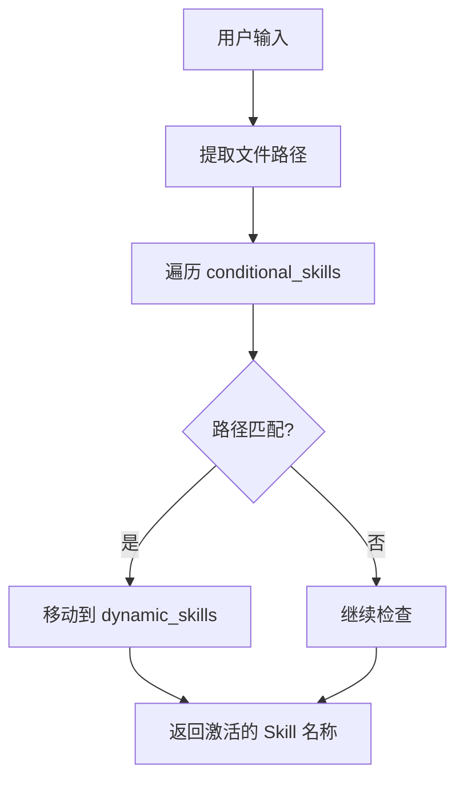
```mermaid
flowchart TD
    A[用户输入] --> B[提取文件路径]
    B --> C[遍历 conditional_skills]
    C --> D{路径匹配?}
    D -->|是| E[移动到 dynamic_skills]
    D -->|否| F[继续检查]
    E --> G[返回激活的 Skill 名称]
    F --> G
```

**动态发现机制**:

`discover_for_paths()` 方法在文件操作时自动发现嵌套的 Skills 目录：

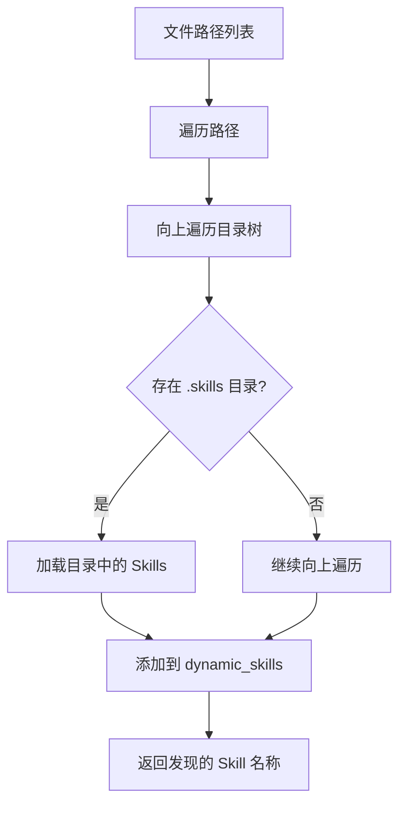
```mermaid
flowchart TD
    A[文件路径列表] --> B[遍历路径]
    B --> C[向上遍历目录树]
    C --> D{存在 .skills 目录?}
    D -->|是| E[加载目录中的 Skills]
    D -->|否| F[继续向上遍历]
    E --> G[添加到 dynamic_skills]
    F --> G
    G --> H[返回发现的 Skill 名称]
```

**并行加载**:

`load_skills()` 方法支持从多个来源并行加载 Skills：

- 项目 Skills 目录
- 托管 Skills 目录
- 用户 Skills 目录
- 额外配置的目录

**核心方法**:

- `activate_for_paths(file_paths)`: 激活匹配路径的条件 Skills
- `discover_for_paths(file_paths)`: 发现嵌套的 Skills 目录
- `get_all_active_skills()`: 获取所有激活的 Skills
- `get_conditional_skills_count()`: 获取条件 Skills 数量
- `get_dynamic_skills_count()`: 获取动态 Skills 数量

### 4.5 子Agent机制 (core/sub\_agents.py)

**核心类**: `SubAgentManager`

**设计特点**:

- **实例级别**: 每个 Agent 实例拥有独立的 SubAgentManager
- **权限继承**: 子Agent完全继承父角色的工具权限和配置
- **递归深度控制**: 通过 session\_id 追踪递归深度，防止无限嵌套
- **双模式创建**: 支持动态创建和基于角色配置创建两种模式

**关键属性**:

- `llm`: LLM 实例（继承自父 Agent）
- `parent_agent`: 父 Agent 实例引用
- `recursion_limit`: 子 Agent 的递归限制
- `_session_depths`: 会话递归深度映射表（实例级别）
- `agent_definitions`: 预定义的 SubAgent 定义字典

**核心方法**:

- `spawn_agent()`: 生成并运行 SubAgent（主入口）
- `_create_dynamic_sub_agent()`: 动态创建 SubAgent
- `_create_sub_agent_by_role()`: 基于角色配置创建 SubAgent
- `_load_role_definition()`: 加载角色定义
- `check_recursion_depth()`: 检查递归深度是否超限
- `increment_depth()`: 增加递归深度
- `decrement_depth()`: 减少递归深度

#### 4.5.1 SubAgent 工作模式概述

SubAgent 支持两种创建模式：

| 创建模式         | 入口判断                        | 适用场景      | 工具继承模式                        |
| ------------ | --------------------------- | --------- | ----------------------------- |
| **动态创建**     | `options.system_prompt` 存在  | 临时性、一次性任务 | `INHERIT_ALL` 或 `INDEPENDENT` |
| **基于角色配置创建** | `options.system_prompt` 不存在 | 重复性、标准化任务 | `INHERIT_SELECTED`            |

**工具继承模式** (`ToolInheritanceMode`):

- `INHERIT_ALL`: 继承所有父工具，受权限配置约束
- `INHERIT_SELECTED`: 继承选定的工具，需明确指定工具列表
- `INDEPENDENT`: 独立工具集，不继承父 Agent 的任何工具

#### 4.5.2 动态创建模式

**入口判断**: `options.system_prompt` 是否存在

**系统提示词来源**:

1. **用户传入**: 直接使用 `options.system_prompt`
2. **LLM 动态生成**: 调用 `_generate_system_prompt()` 方法，让 LLM 根据任务描述生成

**工具继承模式**:

- `inherit_parent_tools=True`: 使用 `INHERIT_ALL` 模式
- `inherit_parent_tools=False`: 使用 `INDEPENDENT` 模式

**动态创建流程**:

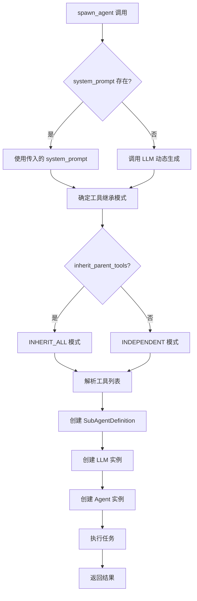
```mermaid
flowchart TD
    A[spawn_agent 调用] --> B{system_prompt 存在?}
    B -->|是| C[使用传入的 system_prompt]
    B -->|否| D[调用 LLM 动态生成]
    
    C --> E[确定工具继承模式]
    D --> E
    
    E --> F{inherit_parent_tools?}
    F -->|是| G[INHERIT_ALL 模式]
    F -->|否| H[INDEPENDENT 模式]
    
    G --> I[解析工具列表]
    H --> I
    
    I --> J[创建 SubAgentDefinition]
    J --> K[创建 LLM 实例]
    K --> L[创建 Agent 实例]
    L --> M[执行任务]
    M --> N[返回结果]
```

**适用场景**:

- 临时性的数据分析任务
- 一次性的内容生成任务
- 需要灵活定制系统提示词的场景

#### 4.5.3 基于角色配置创建模式

**入口判断**: `options.system_prompt` 不存在

**配置加载优先级**:

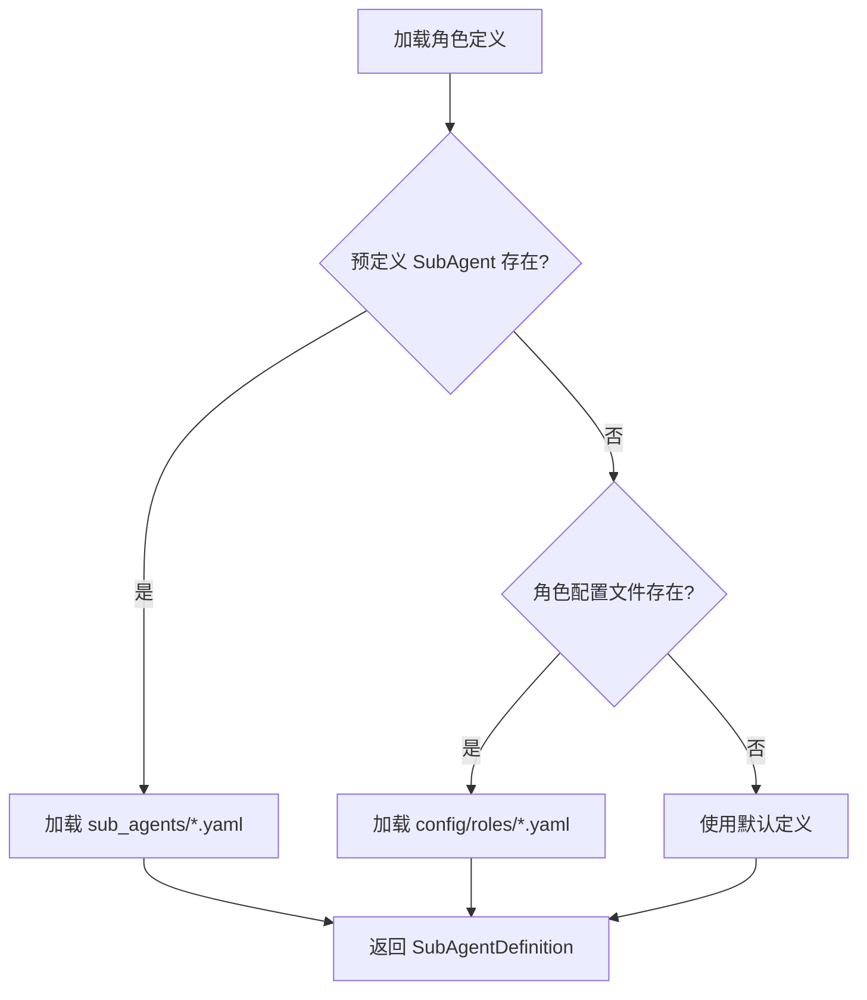
```mermaid
flowchart TD
    A[加载角色定义] --> B{预定义 SubAgent 存在?}
    B -->|是| C[加载 sub_agents/*.yaml]
    B -->|否| D{角色配置文件存在?}
    
    D -->|是| E[加载 config/roles/*.yaml]
    D -->|否| F[使用默认定义]
    
    C --> G[返回 SubAgentDefinition]
    E --> G
    F --> G
```

**详细优先级**:

1. **预定义的 SubAgent 定义** (`sub_agents/*.yaml`)
   - 专门的 SubAgent 配置文件
   - 包含完整的系统提示词、工具配置、执行参数
   - 适用于专门的子任务处理
2. **角色配置文件** (`config/roles/*.yaml`)
   - 复用已有的角色配置
   - 通过 `system_prompt_file` 加载系统提示词
   - 通过 `available_tools` 指定可用工具
3. **默认定义**
   - 动态生成简单的系统提示词
   - 使用默认的执行参数

**工具继承模式**: `INHERIT_SELECTED`

- 从 `available_tools` 字段获取工具列表
- 如果未指定，则继承父 Agent 的所有工具

**角色配置创建流程**:

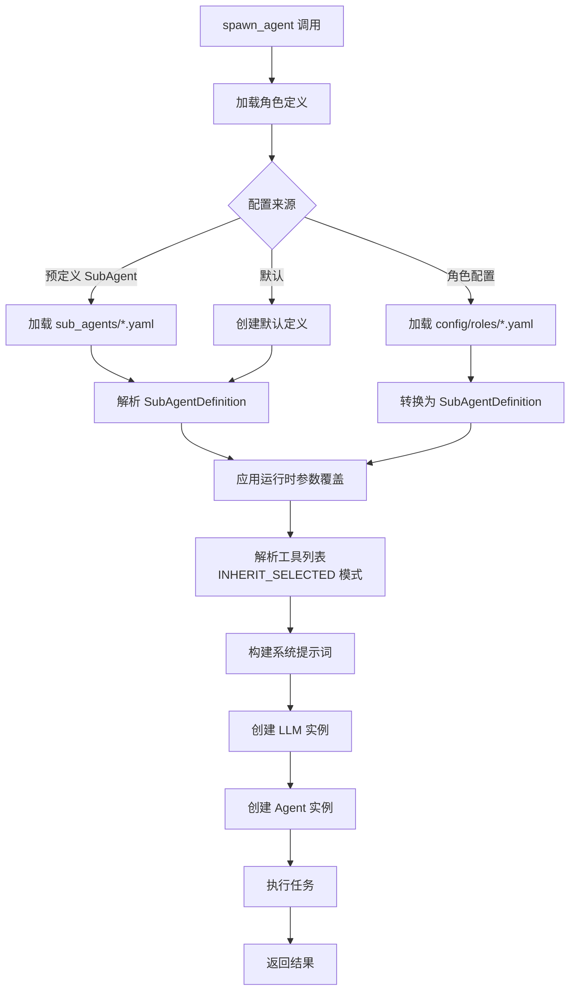
```mermaid
flowchart TD
    A[spawn_agent 调用] --> B[加载角色定义]
    B --> C{配置来源}
    
    C -->|预定义 SubAgent| D[加载 sub_agents/*.yaml]
    C -->|角色配置| E[加载 config/roles/*.yaml]
    C -->|默认| F[创建默认定义]
    
    D --> G[解析 SubAgentDefinition]
    E --> H[转换为 SubAgentDefinition]
    F --> G
    
    G --> I[应用运行时参数覆盖]
    H --> I
    
    I --> J[解析工具列表<br/>INHERIT_SELECTED 模式]
    J --> K[构建系统提示词]
    K --> L[创建 LLM 实例]
    L --> M[创建 Agent 实例]
    M --> N[执行任务]
    N --> O[返回结果]
```

**适用场景**:

- 标准化的测试执行任务
- 重复性的数据分析任务
- 需要统一配置管理的场景

#### 4.5.4 角色配置加载能力

**系统提示词加载**:

- `system_prompt`: 内联系统提示词（优先级高）
- `system_prompt_file`: 系统提示词文件路径（相对或绝对路径）
- `_build_system_prompt()`: 构建最终的系统提示词，自动注入工具说明

**工具配置加载**:

- `tool_inheritance`: 工具继承模式
- `available_tools`: 可用工具列表
- `tool_permissions`: 工具权限配置
  - `inherit_from_parent`: 是否继承父 Agent 工具权限
  - `allowlist`: 允许的工具列表（白名单）
  - `denylist`: 禁止的工具列表（黑名单）

**模型配置加载**:

- `model.inherit`: 是否继承父 Agent 的模型配置
- `model.provider`: 模型提供商（可选覆盖）
- `model.name`: 模型名称（可选覆盖）
- `model.temperature`: 温度参数（可选覆盖）
- `model.max_tokens`: 最大输出 token 数（可选覆盖）

**执行配置加载**:

- `execution.timeout`: 执行超时时间（秒）
- `execution.max_retries`: 最大重试次数
- `execution.recursion_limit`: 递归调用限制
- `execution.max_context_tokens`: 最大上下文 token 数

**运行时参数覆盖**:

通过 `SubAgentSpawnOptions` 可以在运行时覆盖配置：

- `timeout`: 覆盖默认超时时间
- `tool_inheritance`: 覆盖工具继承模式
- `available_tools`: 覆盖可用工具列表

#### 4.5.5 SubAgent 调用流程

**完整调用流程**:

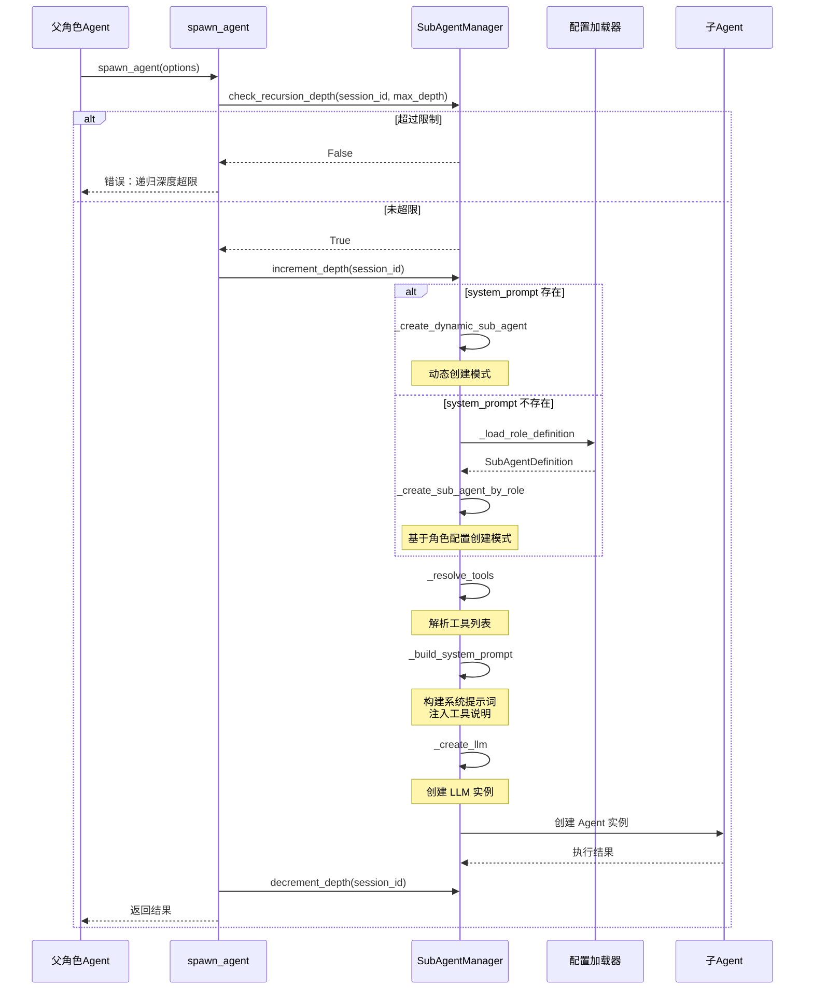
```mermaid
sequenceDiagram
    participant Parent as 父角色Agent
    participant SpawnTool as spawn_agent
    participant SubManager as SubAgentManager
    participant ConfigLoader as 配置加载器
    participant Child as 子Agent

    Parent->>SpawnTool: spawn_agent(options)
    
    SpawnTool->>SubManager: check_recursion_depth(session_id, max_depth)
    
    alt 超过限制
        SubManager-->>SpawnTool: False
        SpawnTool-->>Parent: 错误：递归深度超限
    else 未超限
        SubManager-->>SpawnTool: True
        SpawnTool->>SubManager: increment_depth(session_id)
        
        alt system_prompt 存在
            SubManager->>SubManager: _create_dynamic_sub_agent
            Note over SubManager: 动态创建模式
        else system_prompt 不存在
            SubManager->>ConfigLoader: _load_role_definition
            ConfigLoader-->>SubManager: SubAgentDefinition
            SubManager->>SubManager: _create_sub_agent_by_role
            Note over SubManager: 基于角色配置创建模式
        end
        
        SubManager->>SubManager: _resolve_tools
        Note over SubManager: 解析工具列表
        
        SubManager->>SubManager: _build_system_prompt
        Note over SubManager: 构建系统提示词<br/>注入工具说明
        
        SubManager->>SubManager: _create_llm
        Note over SubManager: 创建 LLM 实例
        
        SubManager->>Child: 创建 Agent 实例
        Child-->>SubManager: 执行结果
        SpawnTool->>SubManager: decrement_depth(session_id)
        SpawnTool-->>Parent: 返回结果
    end
```

**工具说明注入**:

子 Agent 创建时自动注入工具说明文档：

- `_generate_tool_docs_for_sub_agent()` 方法生成工具说明
- 区分内置工具和 MCP 工具
- 自动注入到系统提示词末尾

**权限继承机制**:

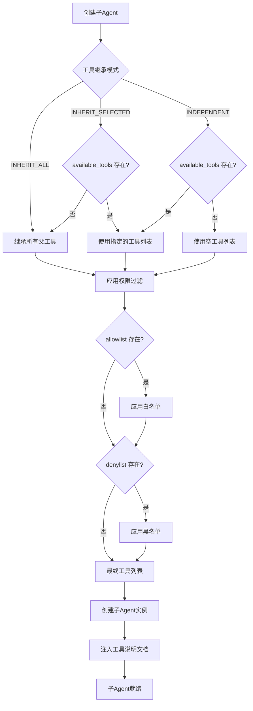
```mermaid
flowchart TD
    A[创建子Agent] --> B{工具继承模式}
    B -->|INHERIT_ALL| C[继承所有父工具]
    B -->|INHERIT_SELECTED| D{available_tools 存在?}
    B -->|INDEPENDENT| E{available_tools 存在?}
    
    D -->|是| F[使用指定的工具列表]
    D -->|否| C
    
    E -->|是| F
    E -->|否| G[使用空工具列表]
    
    C --> H[应用权限过滤]
    F --> H
    G --> H
    
    H --> I{allowlist 存在?}
    I -->|是| J[应用白名单]
    I -->|否| K{denylist 存在?}
    
    J --> K
    K -->|是| L[应用黑名单]
    K -->|否| M[最终工具列表]
    L --> M
    
    M --> N[创建子Agent实例]
    N --> O[注入工具说明文档]
    O --> P[子Agent就绪]
```

### 4.6 Agent实例池 (core/agent\_pool.py)

**核心类**: `AgentPool`

**关键功能**:

- 创建和管理多个Agent实例
- 根据角色配置创建ToolRegistry
- 工具加载摘要日志

**工具加载流程**:

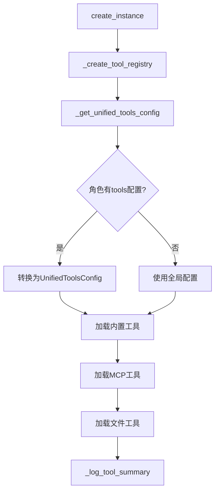
```mermaid
flowchart TD
    A[create_instance] --> B[_create_tool_registry]
    B --> C[_get_unified_tools_config]
    C --> D{角色有tools配置?}
    D -->|是| E[转换为UnifiedToolsConfig]
    D -->|否| F[使用全局配置]
    E --> G[加载内置工具]
    F --> G
    G --> H[加载MCP工具]
    H --> I[加载文件工具]
    I --> J[_log_tool_summary]
```

### 4.7 QueryEngine (core/query\_engine.py)

**核心类**: `QueryEngine`

**设计目标**:

- 管理单次对话的完整生命周期
- 维护会话状态（消息、文件缓存、使用量等）
- 支持流式处理和中断恢复
- 支持预算和轮次控制
- 支持 SubAgent 调用和管理
- **支持多级上下文压缩管线**: boundary截取 → tool_result_budget → snip_compact → auto_compact

**关键属性**:

- `config`: QueryEngineConfig 配置实例
- `mutable_messages`: 可变消息列表
- `abort_controller`: 中断控制器
- `permission_denials`: 权限拒绝记录列表
- `total_usage`: 使用量统计
- `read_file_state`: 文件状态缓存
- `discovered_skill_names`: 发现的 Skill 名称集合
- `_compressor: ContextCompressor` - 统一压缩引擎实例
- `_tool_result_storage: ToolResultStorage` - 工具结果持久化存储
- `_content_replacement_state: ContentReplacementState` - 内容替换状态追踪
- `_compression_enabled: bool` - 压缩是否启用
- `_reactive_compact_attempted: bool` - 每轮重置，防止同一轮多次 reactive compact

**配置类 QueryEngineConfig**:

- `cwd`: 工作目录
- `tools`: 工具列表
- `skills`: Skills 列表
- `can_use_tool`: 工具使用权限检查回调
- `get_app_state`: 获取应用状态回调
- `set_app_state`: 设置应用状态回调
- `initial_messages`: 初始消息列表
- `read_file_cache`: 文件状态缓存
- `custom_system_prompt`: 自定义系统提示词
- `max_turns`: 最大轮次限制
- `max_budget_usd`: 预算限制（美元）
- `compression_enabled: bool` - 是否启用压缩（默认 True）
- `max_context_tokens: int` - 最大上下文 token 数（默认 80000）
- `autocompact_buffer_tokens: int` - 自动压缩缓冲 token 数（默认 13000）
- `keep_recent: int` - 保留最近消息数（默认 6）
- `snip_keep_recent: int` - snip 压缩保留最近消息数（默认 6）
- `tool_result_persist_threshold: int` - 工具结果持久化阈值（默认 50000 字符）
- `tool_result_budget_per_message: int` - 单条消息工具结果预算（默认 200000 字符）
- `max_consecutive_failures: int` - 最大连续压缩失败次数（默认 3）

**消息类型 SDKMessage**:

- `assistant`: 助手消息
- `tool_use`: 工具使用消息
- `tool_result`: 工具结果消息
- `error`: 错误消息
- `interrupt`: 中断消息
- `result`: 结果消息

**核心方法**:

**公共方法**:
- `submit_message(prompt, options)`: 提交消息并返回异步生成器
- `interrupt(reason)`: 中断当前查询
- `get_messages()`: 获取消息列表
- `get_session_id()`: 获取会话ID
- `get_usage()`: 获取使用量统计
- `add_permission_denial(tool_name, reason)`: 添加权限拒绝记录
- `update_usage(response)`: 手动更新使用量统计
- `add_message(message)`: 添加消息到 mutable_messages
- `clear_messages()`: 清空消息并重置会话
- `is_running()`: 检查是否正在运行
- `get_tool_names()`: 获取工具名称列表
- `get_skill_names()`: 获取 Skill 名称列表

**ReAct 循环核心**:
- `_run_react_loop(prompt, options)`: ReAct 循环主方法，每轮执行：压缩管线 → token估算 → 阻塞检查(含强制压缩) → 流式LLM调用(含reactive compact) → 工具执行
- `_stream_llm_call()`: 调用 `_prepare_messages_for_llm()` 后流式调用 LLM
- `_prepare_messages_for_llm()`: 返回 `mutable_messages` 的浅拷贝（压缩已由 `_run_compression_pipeline` 前置处理）

**压缩管线方法**:
- `_run_compression_pipeline()`: 压缩管线入口（async），执行 boundary截取 → tool_result_budget → snip_compact → auto_compact_if_needed，结果回写 `mutable_messages`
- `_force_compact()`: 强制压缩（async），当阻塞限制触发时调用，跳过阈值判断直接执行 auto_compact，受熔断器保护
- `_handle_prompt_too_long()`: Reactive Compact（async），当 API 返回 prompt-too-long 错误时调用，尝试压缩并重试。每轮最多执行一次（由 `_reactive_compact_attempted` 标志控制）
- `_restore_post_compact_context()`: 压缩后恢复关键上下文（文件、skill）
- `_check_blocking_limit()`: 检查是否达到阻塞限制

**工具执行方法**:
- `_preprocess_tool_args()`: 检测并修复 JSON 编码的字符串参数
- `_build_format_hint()`: 构建参数格式修正提示
- `_execute_tool_safe()`: 安全执行工具，优先 ainvoke

**使用量同步**:
- `_update_usage_from_response()`: 从 API 响应更新使用量并同步到 compressor
- `_check_budget_exceeded()`: 检查预算是否超限
- `_check_max_turns_reached()`: 检查是否达到最大轮次
- `_get_final_result()`: 从消息列表反向查找最后一条 AIMessage

#### 4.7.1 QueryEngine 与 SubAgent 集成

**集成方式**:

QueryEngine 通过工具系统与 SubAgent 集成，`spawn_agent` 作为内置工具参与 ReAct 循环。

**工具注册**:

- `spawn_agent` 工具在 `LocalToolProvider` 中注册
- 工具绑定到当前 Agent 实例的 `SubAgentManager`
- 支持 SubAgent 的递归调用和深度控制

**在 ReAct 循环中调用 SubAgent**:

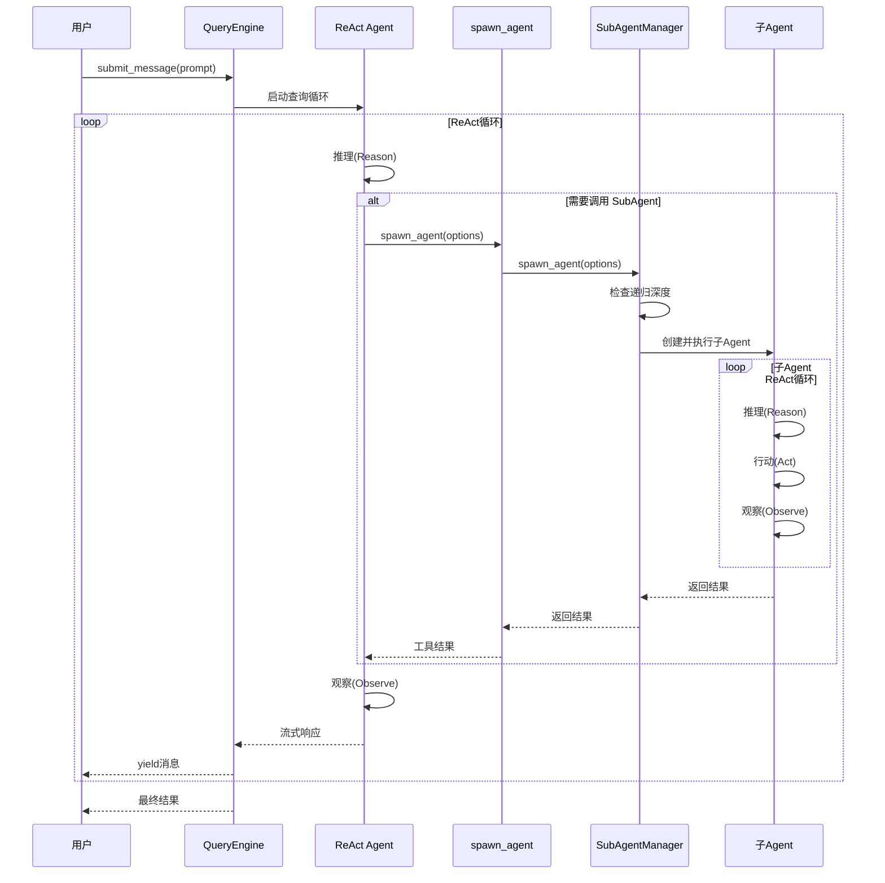
```mermaid
sequenceDiagram
    participant User as 用户
    participant QE as QueryEngine
    participant Agent as ReAct Agent
    participant SpawnTool as spawn_agent
    participant SubManager as SubAgentManager
    participant SubAgent as 子Agent
    
    User->>QE: submit_message(prompt)
    QE->>Agent: 启动查询循环
    
    loop ReAct循环
        Agent->>Agent: 推理(Reason)
        
        alt 需要调用 SubAgent
            Agent->>SpawnTool: spawn_agent(options)
            SpawnTool->>SubManager: spawn_agent(options)
            
            SubManager->>SubManager: 检查递归深度
            SubManager->>SubAgent: 创建并执行子Agent
            
            loop 子Agent ReAct循环
                SubAgent->>SubAgent: 推理(Reason)
                SubAgent->>SubAgent: 行动(Act)
                SubAgent->>SubAgent: 观察(Observe)
            end
            
            SubAgent-->>SubManager: 返回结果
            SubManager-->>SpawnTool: 返回结果
            SpawnTool-->>Agent: 工具结果
        end
        
        Agent->>Agent: 观察(Observe)
        Agent-->>QE: 流式响应
        QE-->>User: yield消息
    end
    
    QE-->>User: 最终结果
```

**SubAgent 调用场景**:

1. **任务分解**: 将复杂任务分解为多个子任务
2. **专业处理**: 调用专门的 SubAgent 处理特定领域任务
3. **并行执行**: 多个 SubAgent 并行执行独立任务
4. **上下文隔离**: SubAgent 拥有独立的上下文，避免污染主对话

**递归深度控制**:

- QueryEngine 通过 `session_id` 追踪递归深度
- 每次调用 `spawn_agent` 时检查深度限制
- 超过限制时返回错误，防止无限嵌套

**权限传递**:

- SubAgent 继承父 Agent 的工具权限
- 通过 `tool_permissions` 配置进行权限过滤
- 权限拒绝记录传递回 QueryEngine

#### 4.7.2 ReAct 循环流程

每轮 `_run_react_loop()` 的执行流程：

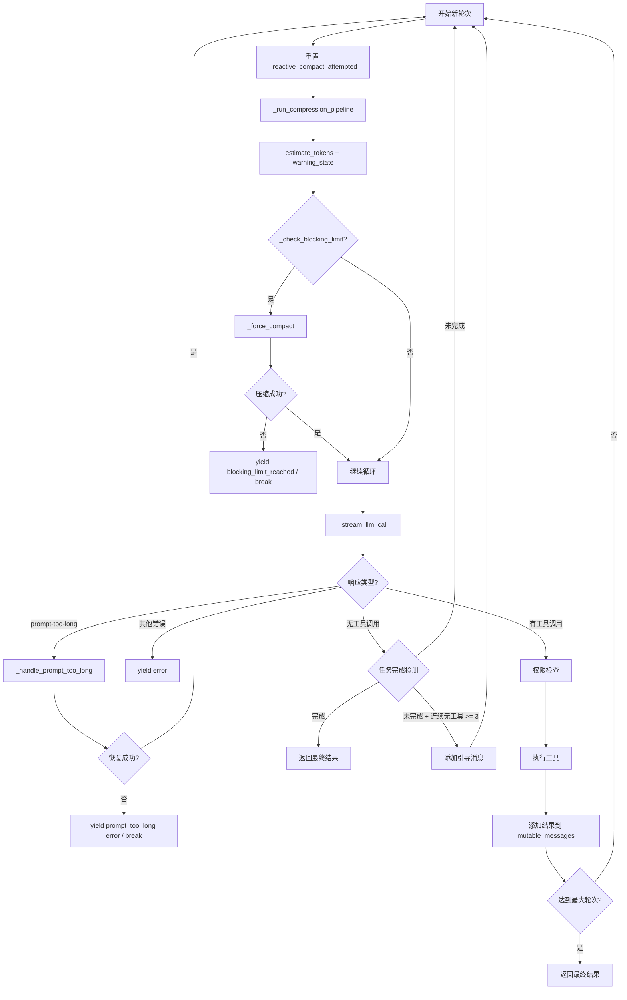
```mermaid
flowchart TD
    A[开始新轮次] --> A1[重置 _reactive_compact_attempted]
    A1 --> B[_run_compression_pipeline]
    B --> C[estimate_tokens + warning_state]
    C --> D{_check_blocking_limit?}
    D -->|是| E[_force_compact]
    E --> E1{压缩成功?}
    E1 -->|是| F[继续循环]
    E1 -->|否| E2[yield blocking_limit_reached / break]
    D -->|否| F
    F --> G[_stream_llm_call]
    G --> H{响应类型?}
    H -->|prompt-too-long| I[_handle_prompt_too_long]
    I --> I1{恢复成功?}
    I1 -->|是| A
    I1 -->|否| I2[yield prompt_too_long error / break]
    H -->|其他错误| J[yield error]
    H -->|无工具调用| K{任务完成检测}
    K -->|完成| L[返回最终结果]
    K -->|未完成 + 连续无工具 >= 3| M[添加引导消息]
    M --> A
    K -->|未完成| A
    H -->|有工具调用| N[权限检查]
    N --> O[执行工具]
    O --> P[添加结果到 mutable_messages]
    P --> Q{达到最大轮次?}
    Q -->|是| R[返回最终结果]
    Q -->|否| A
```

**关键状态标志**:
- `_reactive_compact_attempted`: 每轮重置为 False，防止同一轮多次 reactive compact
- `_consecutive_failures`（compressor 内）: 熔断器计数器，连续 3 次压缩失败后停止尝试

**无工具调用引导机制**:
当 LLM 连续 3 轮不调用工具时，自动添加引导消息，列出可用工具并提示使用工具或声明任务完成。同时通过中文关键词检测（"完成"、"已完成"、"成功"等）判断任务是否已完成。

**任务完成检测**:
基于中文关键词（completion_indicators）检测 LLM 回复中的任务完成信号，避免无意义的循环继续。

### 4.8 SessionStorage (context/session\_storage.py)

**核心类**: `SessionStorage`

**设计目标**:

- 会话持久化存储
- 支持消息序列化/反序列化
- 支持会话管理（保存、加载、删除、列表）

**关键属性**:

- `storage_dir`: 存储目录
- `_lock`: 线程锁

**消息序列化器 MessageSerializer**:

- `serialize(message)`: 序列化消息对象为字典
- `deserialize(msg_dict)`: 反序列化字典为消息对象
- `serialize_list(messages)`: 序列化消息列表
- `deserialize_list(msg_dicts)`: 反序列化消息列表

**支持的消息类型**:

- `HumanMessage`: 用户消息
- `AIMessage`: AI消息（含 tool\_calls）
- `ToolMessage`: 工具消息
- `SystemMessage`: 系统消息

**会话元数据 SessionMetadata**:

- `session_id`: 会话ID
- `created_at`: 创建时间
- `updated_at`: 更新时间
- `message_count`: 消息数量
- `total_tokens`: 总token数
- `tags`: 标签列表
- `description`: 描述

**核心方法**:

- `_metadata_from_dict(metadata_dict, default_id)`: 从字典构建 SessionMetadata（静态辅助方法）
- `save_session(session_id, messages, metadata)`: 保存会话
- `load_session(session_id)`: 加载会话
- `list_sessions()`: 列出所有会话
- `delete_session(session_id)`: 删除会话
- `get_session_metadata(session_id)`: 获取会话元数据
- `session_exists(session_id)`: 检查会话是否存在

### 4.9 日志系统 (utils/logger.py)

> **详细设计文档**: [utils_module_design.md](utils_module_design.md)

**核心类**: `LLMLogger`

**工具日志摘要模式**:

- `tool_log_mode`: "summary"（摘要）或 "detailed"（详细）
- 摘要模式下只打印工具名称列表，不打印详细参数

**辅助方法**:

- `_get_role_str()`: 获取格式化的角色字符串，用于日志前缀（消除8处重复的角色前缀获取模式）
- `_extract_tool_name(tool)`: 静态方法，从各种工具表示中提取工具名称（统一 `_format_tools_summary` 和 `log_request_raw` 中的工具名称提取逻辑）
- `_LOG_FORMAT`: 类常量，统一日志格式字符串（消除3处重复）

### 4.10 CLI命令处理器 (cli/commands.py)

**核心类**: `CommandHandler`

**辅助方法**:

- `_parse_command_input(user_input)`: 静态方法，解析命令输入（提取命令名和参数），消除 `handle_async` 和 `handle` 中的重复解析逻辑
- `_parse_sub_cmd(args)`: 静态方法，解析子命令和子参数，消除6个命令方法中重复的子命令解析模式
- `_truncate(text, max_len)`: 静态方法，文本截断并添加省略号，消除4处重复的截断模式
- `_format_tool_list(tools, desc_max_len)`: 格式化工具列表，供 `_cmd_tool` 和 `_status_tools` 复用
- `_update_model_for_role(name)`: 角色切换时更新模型配置，从 `_role_switch` 中提取
- `_format_skills_info(role_skills)`: 格式化角色Skills信息，从 `_role_switch` 中提取

**优化点**:

- `_cmd_browser` 中3处重复的 MCP 连接检查合并为1处前置检查
- `_role_switch` 方法从55行简化为37行，通过提取 `_update_model_for_role` 和 `_format_skills_info` 降低复杂度


***

## 5. 配置文件设计

### 5.1 配置文件列表

| 配置文件                  | 说明                       |
| --------------------- | ------------------------ |
| `model_config.yaml`   | 模型配置（provider、API密钥、参数等） |
| `agent_config.yaml`   | Agent配置（消息压缩、执行参数、日志等）   |
| `tools_config.yaml`   | 统一工具配置（内置工具、MCP、Skill）   |
| `mcp_config.yaml`     | MCP服务器配置                 |
| `prompt_config.yaml`  | 提示词配置（系统提示词文件路径）         |
| `skills_config.yaml`  | Skill配置（目录、黑名单、缓存限制）     |
| `project_config.yaml` | 项目配置（工作空间、根目录）           |
| `test_config.yaml`    | 测试配置                     |
| `sub_agents/*.yaml`   | SubAgent 配置文件            |

### 5.2 SubAgent 配置文件 (sub\_agents/\*.yaml)

**配置文件结构**:

| 字段                   | 类型     | 必填 | 说明                |
| -------------------- | ------ | -- | ----------------- |
| `name`               | string | 是  | SubAgent 名称（唯一标识） |
| `description`        | string | 否  | SubAgent 描述       |
| `version`            | string | 否  | 版本号，默认 "1.0"      |
| `system_prompt`      | string | 否  | 内联系统提示词           |
| `system_prompt_file` | string | 否  | 系统提示词文件路径         |
| `model`              | object | 否  | 模型配置              |
| `execution`          | object | 否  | 执行配置              |
| `tool_inheritance`   | string | 否  | 工具继承模式            |
| `tool_permissions`   | object | 否  | 工具权限配置            |
| `available_tools`    | list   | 否  | 可用工具列表            |
| `metadata`           | object | 否  | 元数据               |

**model 配置**:

| 字段            | 类型      | 默认值  | 说明                 |
| ------------- | ------- | ---- | ------------------ |
| `inherit`     | boolean | true | 是否继承父 Agent 的模型配置  |
| `provider`    | string  | -    | 模型提供商（可选覆盖）        |
| `name`        | string  | -    | 模型名称（可选覆盖）         |
| `temperature` | float   | -    | 温度参数（可选覆盖）         |
| `max_tokens`  | int     | -    | 最大输出 token 数（可选覆盖） |

**execution 配置**:

| 字段                 | 类型      | 默认值   | 说明                |
| ------------------ | ------- | ----- | ----------------- |
| `timeout`          | int     | 120   | 执行超时时间（秒）         |
| `max_retries`      | int     | 0     | 最大重试次数            |
| `recursion_limit`  | int     | 50    | 递归调用限制            |
| `max_context_tokens` | int   | None  | 最大上下文 token 数     |

**tool\_permissions 配置**:

| 字段                    | 类型      | 默认值  | 说明               |
| --------------------- | ------- | ---- | ---------------- |
| `inherit_from_parent` | boolean | true | 是否继承父 Agent 工具权限 |
| `allowlist`           | list    | -    | 允许的工具列表（白名单）     |
| `denylist`            | list    | -    | 禁止的工具列表（黑名单）     |

**配置示例**:

```yaml
name: snapshot-analyzer
description: 页面快照分析专家，分析页面布局、识别可交互元素、推荐下一步操作
version: 1.0

system_prompt: |
  你是页面快照分析专家，专门分析浏览器页面快照，为主任务提供决策支持。
  
  ## 核心职责
  
  1. 页面布局分析
  2. 可交互元素识别
  3. 下一步操作推荐

execution:
  timeout: 60
  max_retries: 1

tool_permissions:
  inherit_from_parent: true
```

**配置加载流程**:

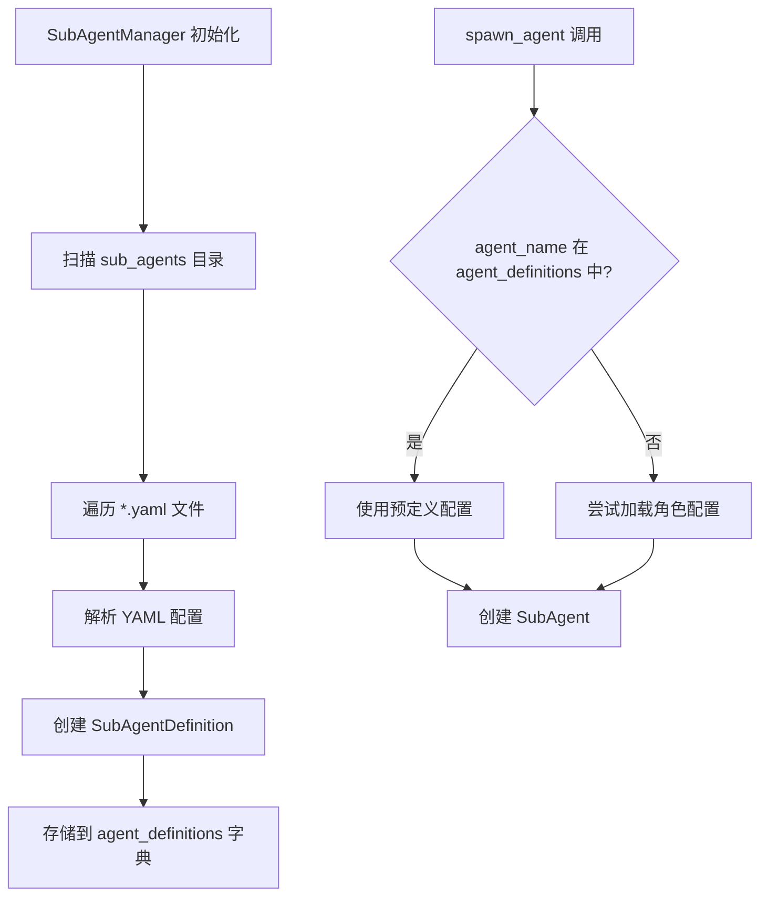
```mermaid
flowchart TD
    A[SubAgentManager 初始化] --> B[扫描 sub_agents 目录]
    B --> C[遍历 *.yaml 文件]
    C --> D[解析 YAML 配置]
    D --> E[创建 SubAgentDefinition]
    E --> F[存储到 agent_definitions 字典]
    
    G[spawn_agent 调用] --> H{agent_name 在 agent_definitions 中?}
    H -->|是| I[使用预定义配置]
    H -->|否| J[尝试加载角色配置]
    
    I --> K[创建 SubAgent]
    J --> K
```

### 5.3 角色配置在 SubAgent 中的应用

**角色配置复用**:

SubAgent 可以复用 `config/roles/*.yaml` 中的角色配置，实现配置的统一管理。

**转换规则**:

| 角色配置字段                       | SubAgent 配置字段                | 说明     |
| ---------------------------- | ---------------------------- | ------ |
| `name`                       | `name`                       | 直接映射   |
| `description`                | `description`                | 直接映射   |
| `system_prompt_file`         | `system_prompt`              | 读取文件内容 |
| `available_tools`            | `available_tools`            | 直接映射   |
| `execution.timeout`          | `execution.timeout`          | 直接映射   |
| `execution.recursion_limit`  | `execution.recursion_limit`  | 直接映射   |

**转换流程**:

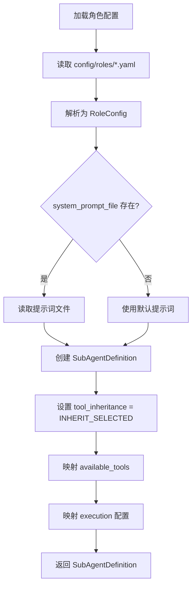
```mermaid
flowchart TD
    A[加载角色配置] --> B[读取 config/roles/*.yaml]
    B --> C[解析为 RoleConfig]
    C --> D{system_prompt_file 存在?}
    
    D -->|是| E[读取提示词文件]
    D -->|否| F[使用默认提示词]
    
    E --> G[创建 SubAgentDefinition]
    F --> G
    
    G --> H[设置 tool_inheritance = INHERIT_SELECTED]
    H --> I[映射 available_tools]
    I --> J[映射 execution 配置]
    J --> K[返回 SubAgentDefinition]
```

**优先级说明**:

当 `spawn_agent` 指定一个角色名称时，配置加载优先级为：

1. **预定义 SubAgent 配置** (`sub_agents/*.yaml`)
   - 优先级最高
   - 专门的 SubAgent 定义
2. **角色配置** (`config/roles/*.yaml`)
   - 优先级次之
   - 复用已有角色配置
3. **默认配置**
   - 优先级最低
   - 动态生成简单配置

**应用场景**:

| 场景       | 推荐配置方式      | 说明        |
| -------- | ----------- | --------- |
| 专门的子任务处理 | SubAgent 配置 | 独立配置，职责明确 |
| 复用已有角色能力 | 角色配置        | 减少配置重复    |
| 临时性任务    | 默认配置        | 无需预定义配置   |

### 5.4 统一工具配置 (config/tools\_config.yaml)

**完整配置结构**:

| 配置项                                         | 说明                   |
| ------------------------------------------- | -------------------- |
| `tools.builtin.enabled`                     | 内置工具总开关              |
| `tools.builtin.spawn_agent.enabled`         | spawn\_agent工具开关     |
| `tools.builtin.shell_tool.enabled`          | shell\_tool工具开关      |
| `tools.builtin.shell_tool.safe_mode`        | Shell安全模式            |
| `tools.builtin.shell_tool.allowed_commands` | 允许的命令列表              |
| `tools.builtin.file_tools.enabled`          | 文件工具开关               |
| `tools.builtin.file_tools.permission_mode`  | 权限模式（ask/allow/deny） |
| `tools.builtin.file_tools.permissions`      | 自定义权限规则              |
| `tools.builtin.file_tools.audit`            | 是否启用审计               |
| `tools.mcp.config_file`                     | MCP配置文件路径            |
| `tools.mcp.auto_connect`                    | 是否自动连接               |
| `tools.mcp.cache_ttl`                       | 缓存过期时间               |
| `tools.skills.config_file`                  | Skill配置文件路径          |
| `tools.skills.auto_load_metadata`           | 是否自动加载元数据            |
| `tool_docs.auto_inject`                     | 是否自动注入工具说明           |
| `tool_docs.inject_position`                 | 注入位置                 |
| `tool_docs.format`                          | 文档格式                 |
| `tool_docs.include_examples`                | 是否包含使用示例             |

### 5.3 角色配置 (config/roles/\*.yaml)

```yaml
name: test-case-generator
description: 测试案例生成者
system_prompt_file: prompts/roles/test_case_generator.txt

model:
  inherit: true

execution:
  max_context_tokens: 80000
  timeout: 300
  sub_agent_recursion_limit: 50

tools:
  builtin:
    spawn_agent: true
    shell_tool: true
    file_tools:
      enabled: true
      permissions:
        "read:*": "allow"
        "write:*.md": "allow"

metadata:
  version: "1.0"
```

### 5.4 Skill配置 (config/skills\_config.yaml)

| 配置项                               | 说明          |
| --------------------------------- | ----------- |
| `directory`                       | Skill文件目录   |
| `auto_load`                       | 是否自动加载      |
| `disabled_skills`                 | 黑名单，为空则加载所有 |

### 5.5 Agent配置 (config/agent\_config.yaml)

| 配置项                                         | 说明           |
| ------------------------------------------- | ------------ |
| `max_context_tokens`                        | 最大上下文token数  |
| `message_compression.enabled`               | 是否启用消息压缩     |
| `message_compression.max_tokens`            | 压缩后的最大token数 |
| `message_compression.keep_recent`           | 保留最近N条消息     |
| `message_compression.summary_max_length`    | 摘要最大长度       |
| `message_compression.history_summary_count` | 历史摘要数量       |
| `message_compression.autocompact_buffer_tokens`    | 自动压缩缓冲token数，剩余空间低于此值时触发 auto_compact |
| `message_compression.manual_compact_buffer_tokens`  | 手动压缩缓冲token数，用于计算阻塞限制 |
| `message_compression.warning_threshold_buffer_tokens` | 警告阈值缓冲token数，用于计算 token 警告状态 |
| `message_compression.snip_keep_recent`             | snip 压缩时保留最近 N 条工具结果 |
| `message_compression.tool_result_persist_threshold` | 工具结果持久化阈值（字符数），超过此值写入磁盘 |
| `message_compression.tool_result_budget_per_message` | 单条消息中工具结果的预算上限（字符数） |
| `message_compression.max_consecutive_failures`      | 最大连续压缩失败次数，超过后断路器跳过自动压缩 |
| `execution.recursion_limit`                 | Agent递归限制    |
| `execution.sub_agent_recursion_limit`       | 子Agent递归限制   |
| `execution.default_timeout`                 | 默认超时时间       |
| `logging.log_token_estimation`              | 是否记录token估算  |
| `logging.log_compression_stats`             | 是否记录压缩统计     |
| `logging.log_step_details`                  | 是否记录步骤详情     |

### 5.6 项目配置 (config/project\_config.yaml)

| 配置项                    | 说明       |
| ---------------------- | -------- |
| `name`                 | 项目名称     |
| `root`                 | 项目根目录    |
| `workspace.main`       | 主工作空间    |
| `workspace.additional` | 附加工作空间列表 |
| `workspace.excluded`   | 排除的目录模式  |

***

## 6. 工作流程设计

### 6.1 应用启动流程

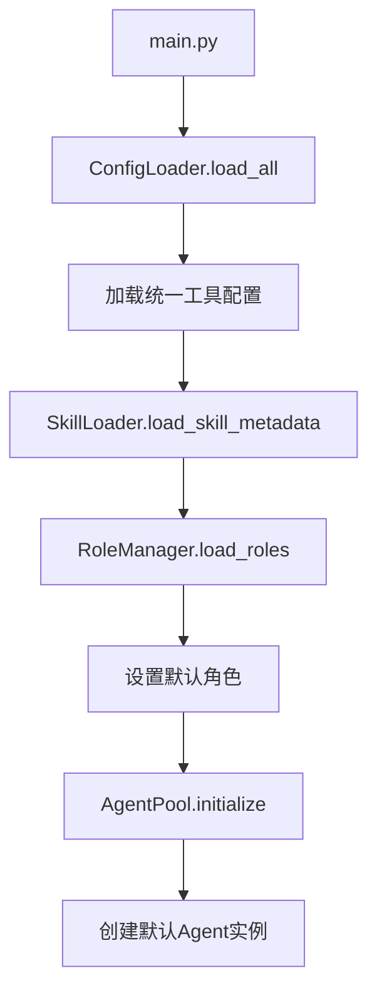
```mermaid
flowchart TD
    A[main.py] --> B[ConfigLoader.load_all]
    B --> C[加载统一工具配置]
    C --> D[SkillLoader.load_skill_metadata]
    D --> E[RoleManager.load_roles]
    E --> F[设置默认角色]
    F --> G[AgentPool.initialize]
    G --> H[创建默认Agent实例]
```

### 6.2 工具说明注入流程

```mermaid
flowchart TD
    A[角色初始化] --> B[加载系统提示词]
    B --> C{auto_inject?}
    C -->|是| D[收集工具说明]
    C -->|否| E[跳过注入]
    
    D --> F[获取内置工具说明]
    D --> G[获取MCP工具说明]
    D --> H[获取Skill元数据]
    
    F --> I[格式化说明文档]
    G --> I
    H --> I
    
    I --> J[注入到系统提示词末尾]
    J --> K[创建Agent实例]
    E --> K
```

***

## 7. 总结

本框架构建了一个**自然语言驱动的自动化测试执行框架**，采用 **ReAct + Skills 架构**，统一使用 QueryEngine 作为核心执行引擎，核心特点：

1. **统一 QueryEngine 引擎**: 所有 Agent（主 Agent 和 SubAgent）统一使用 QueryEngine 作为执行引擎，管理完整的对话生命周期
2. **ReAct + Skills 架构**: 自然语言定义工作流，无需预定义状态机
3. **多级上下文压缩**: 统一压缩引擎支持 boundary截取 → tool_result_budget → snip_compact → auto_compact 四级管线，含断路器保护
4. **统一工具配置**: 工具配置整合为统一格式，支持自动注入说明
5. **角色系统**: 支持多角色配置，系统默认角色自动加载，切换角色时工具重载
6. **权限继承**: 子Agent完全继承父角色权限，支持递归深度控制
7. **Skill 条件激活**: 基于路径模式自动激活 Skills
8. **Skill 动态发现**: 在文件操作时自动发现嵌套的 Skills 目录
9. **LRU 缓存**: Skill 内容缓存机制，支持黑名单过滤
10. **会话持久化**: 支持会话保存和恢复
11. **日志优化**: 工具日志摘要模式，减少日志输出

