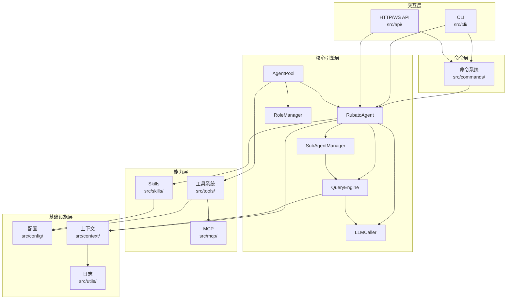
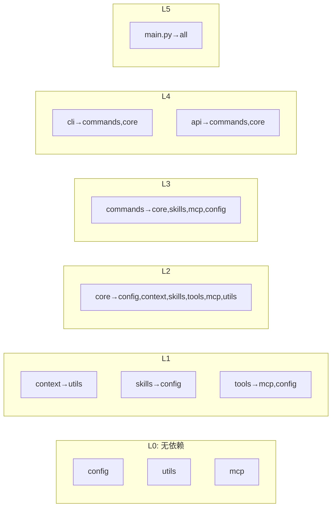
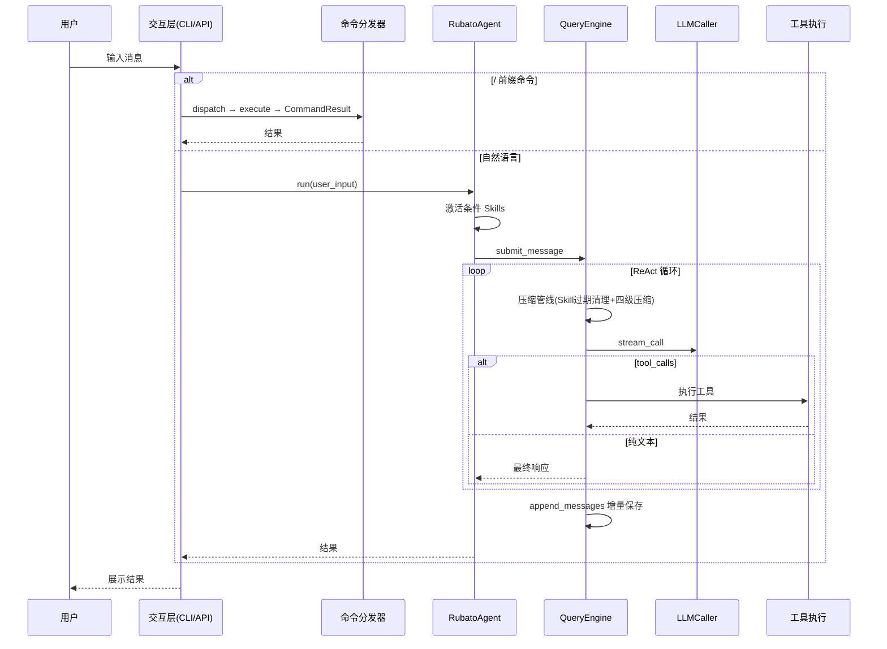
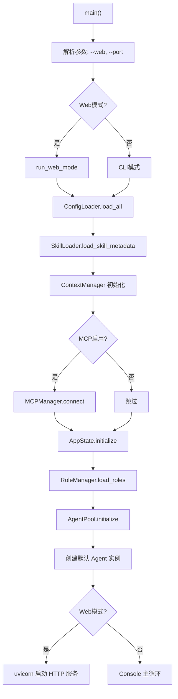

# Rubato 整体框架设计文档

## 第一章 文档原则

1. **不保留代码块**：文档中仅保留文件名、类名、方法名等定义，方便大模型通过定义检索实际代码
2. **关键逻辑用图表示**：对于关键逻辑和长链路逻辑，使用 mermaid 图（流程图、时序图、序列图等）体现
3. **保持结构清晰**：按照模块和功能划分章节，便于定位和理解

***

## 第二章 项目概述

**Rubato** — 自然语言驱动的自动化测试执行框架，基于 ReAct + Skills 架构。

核心能力：智能体管理、ReAct 循环执行、四级上下文压缩、子智能体机制、工具系统集成（内置/MCP/文件/Shell）、Skill 工作流（条件激活与动态发现）、Skill 自改进（Agent 自主创建/优化 Skill）、角色系统、双模式交互（CLI + Web）、会话持久化与恢复、系统提示词分段管理。

| 技术 | 用途 |
|------|------|
| Python >=3.12, asyncio | 主体语言，全异步架构 |
| LangChain >=0.3.25 | LLM 调用、工具集成、回调 |
| FastAPI + Uvicorn | HTTP 服务层 |
| Pydantic >=2.0 | 配置与 API 数据模型 |
| langchain-mcp-adapters | MCP 服务器连接与工具加载 |
| tiktoken / pathspec / PyYAML | Token 计数 / 路径匹配 / 配置解析 |

***

## 第三章 整体架构设计

五层架构：交互层（CLI/Web）→ 命令层（命令解析分发）→ 核心引擎层（智能体/ReAct/子智能体/角色）→ 能力层（Skills/工具/MCP）→ 基础设施层（配置/上下文/日志）。

***

## 第四章 模块目录

| 模块 | 目录 | 核心职责 | 设计文档 |
|------|------|----------|----------|
| **core** | `src/core/` | 智能体管理、ReAct 循环、子智能体、AgentPool、角色管理、LLM 封装 | [core_module_design.md](core_module_design.md) |
| **api** | `src/api/` | FastAPI 应用、WebSocket 实时通信、REST API 路由、数据模型 | [api_module_design.md](api_module_design.md) |
| **commands** | `src/commands/` | 命令基类、注册表、分发器、上下文、14 个命令实现 | [commands_module_design.md](commands_module_design.md) |
| **config** | `src/config/` | Pydantic 数据模型、YAML 加载器、角色加载器、验证器、环境变量替换 | [config_module_design.md](config_module_design.md) |
| **context** | `src/context/` | 系统提示词分段管理、对话轮次结构化、四级压缩引擎、工具结果持久化、会话持久化 | [context_module_design.md](context_module_design.md) |
| **skills** | `src/skills/` | 解析、注册（LRU 缓存）、加载、触发词匹配、条件激活、动态发现 | [skills_module_design.md](skills_module_design.md) |
| **tools** | `src/tools/` | ToolProvider ABC、本地/Shell/MCP/文件工具提供者、工具说明文档、文件工具安全体系 | [tools_module_design.md](tools_module_design.md) |
| **mcp** | `src/mcp/` | MCP 连接管理、工具聚合、浏览器生命周期、ToolRegistry、错误定义 | [mcp_module_design.md](mcp_module_design.md) |
| **cli** | `src/cli/` | Console 主控制器、输入/输出、主循环 | [cli_module_design.md](cli_module_design.md) |
| **utils** | `src/utils/` | LLMLogger 三通道日志、双格式输出、角色上下文追踪、LangChain 回调集成 | [utils_module_design.md](utils_module_design.md) |

***

## 第五章 模块间依赖关系

关键依赖：core 依赖所有能力层和基础设施层；tools 桥接 mcp；context 仅依赖 utils；config/mcp/utils 为独立基础层。

***

## 第六章 核心数据流

***

## 第七章 启动与初始化流程

AppState.initialize 核心步骤：创建 RoleManager → 加载角色 → 创建 AgentPool → 初始化实例池 → 创建默认 RubatoAgent（含 LLM、工具注册表、QueryEngine）。

***

## 第八章 各模块详细设计文档索引

| 模块 | 设计文档 | 核心类 |
|------|----------|--------|
| **core** | [core_module_design.md](core_module_design.md) | `RubatoAgent`, `QueryEngine`, `SubAgentManager`, `SubAgentLifecycleManager`, `AgentPool`, `RoleManager`, `LLMCaller` |
| **api** | [api_module_design.md](api_module_design.md) | `ConnectionManager`, `create_app`, FastAPI 路由, Pydantic 数据模型 |
| **commands** | [commands_module_design.md](commands_module_design.md) | `BaseCommand`, `CommandDispatcher`, `CommandRegistry`, `CommandContext`, `CommandResult`, 14 个命令实现 |
| **config** | [config_module_design.md](config_module_design.md) | `AppConfig`, `ConfigLoader`, `RoleConfigLoader`, `ConfigValidationError`, `replace_env_vars` |
| **context** | [context_module_design.md](context_module_design.md) | `ContextManager`, `ContextCompressor`, `ToolResultStorage`, `SessionStorage`, `SystemPromptRegistry`, `ConversationHistory`, `TaskIntentManager` |
| **skills** | [skills_module_design.md](skills_module_design.md) | `SkillMetadata`, `SkillParser`, `SkillRegistry`, `SkillLoader`, `SkillManager`, `ConditionalSkill` |
| **tools** | [tools_module_design.md](tools_module_design.md) | `ToolProvider`(ABC), `LocalToolProvider`, `ShellToolProvider`, `MCPToolProvider`, `FileToolProvider`, `WorkspaceManager`, `PermissionChecker`, `AuditLogger`, `ToolDocsGenerator` |
| **mcp** | [mcp_module_design.md](mcp_module_design.md) | `MCPManager`, `MCPToolProvider`, `ToolProvider`(Protocol), `ToolRegistry`, `MCPError` |
| **cli** | [cli_module_design.md](cli_module_design.md) | `Console`, `CommandHandler`(遗留) |
| **utils** | [utils_module_design.md](utils_module_design.md) | `LLMLogger`, `LLMRequestCallbackHandler`, `get_llm_logger` |
