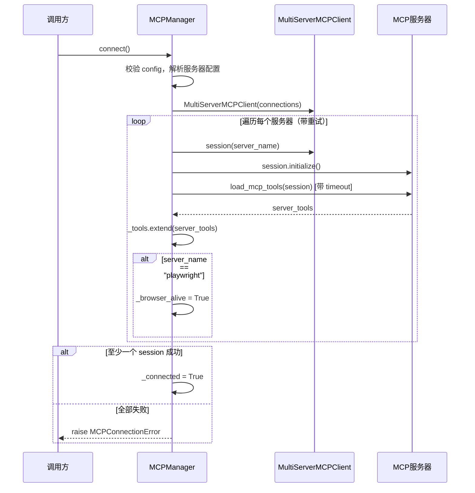
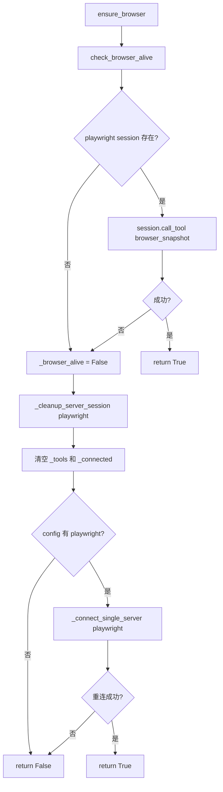
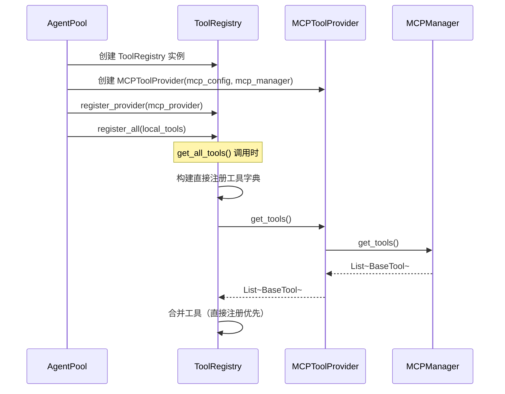

# Rubato MCP 模块设计文档

## 1. 模块概述

MCP 模块是框架与外部工具服务之间的桥梁，负责：多服务器连接管理（带重试）、工具聚合、Playwright 浏览器生命周期管理、工具注册表。

### 1.1 技术栈

| 依赖 | 用途 |
|------|------|
| `langchain-mcp-adapters` | `MultiServerMCPClient`、`load_mcp_tools` |
| `langchain-core` | `BaseTool` |
| `asyncio` | 异步连接、超时控制 |

### 1.2 文件结构

| 文件 | 核心定义 | 职责 |
|------|----------|------|
| `src/mcp/client.py` | `MCPManager` | MCP 连接管理器 |
| `src/mcp/tools.py` | `ToolProvider`(Protocol)、`ToolRegistry` | 工具注册表与提供者协议 |
| `src/mcp/errors.py` | `MCPError`、`MCPConnectionError`、`MCPToolCallError` | 错误层次 |
| `src/tools/mcp_provider.py` | `MCPToolProvider` | 桥接 MCPManager 与工具系统 |
| `src/tools/provider.py` | `ToolProvider`(ABC) | 工具提供者抽象基类 |
| `src/main.py` | `build_mcp_config`、`has_enabled_mcp_servers` | 配置构建与检查 |
| `src/config/models.py` | `MCPServerConfig`、`MCPConfig` | 配置模型 |

***

## 2. 核心组件

### 2.1 MCPManager（src/mcp/client.py）

管理多个 MCP 服务器的连接生命周期和工具加载，使用 `client.session()` 管理持久连接。

**关键属性**：`config`(dict)、`_client`(MultiServerMCPClient)、`_tools`(List[BaseTool])、`_connected`(bool)、`_sessions`(Dict)、`_session_cms`(Dict)、`_browser_alive`(bool)

**模块级常量**：`_DEFAULT_RETRY_TIMES=3`、`_DEFAULT_RETRY_DELAY=5`、`_DEFAULT_TIMEOUT=30`

**关键方法**：

| 方法 | 说明 |
|------|------|
| `connect()` | 连接所有配置服务器（带重试），至少一个成功即视为连接成功 |
| `get_tools()` | 获取所有已加载的 MCP 工具 |
| `ensure_browser()` | 检测浏览器存活，失败时自动重连 |
| `disconnect(close_browser=False)` | 断开所有连接，默认不关闭浏览器 |

**辅助方法**：`__aenter__`/`__aexit__`(上下文管理器)、`is_connected`/`browser_alive`(属性)、`check_browser_alive`(通过 `browser_snapshot` 检测)、`close_browser`(显式关闭)、`_connect_single_server`(单服务器重试连接)、`_cleanup_server_session`(清理 session 资源)、`_parse_connection_config`(提取重试参数)

### 2.2 ToolProvider 协议与 ToolRegistry（src/mcp/tools.py）

`ToolProvider` 是 `@runtime_checkable` Protocol，仅要求 `get_tools() -> List[BaseTool]`。`ProviderType = Union[Callable[[], List[BaseTool]], ToolProvider]`。

**ToolRegistry** 是实例级工具注册表，每个 Agent 拥有独立实例。

**关键属性**：`_providers`(List[ProviderType])、`_tools`(Dict[str, BaseTool])

**关键方法**：

| 方法 | 说明 |
|------|------|
| `register_provider(provider)` | 注册工具提供者 |
| `register_all(tools)` | 批量注册工具 |
| `get_all_tools()` | 合并直接注册和提供者工具，直接注册优先去重 |
| `get_tools_by_names(names)` | 按名称列表获取工具 |

**辅助方法**：`register`(单个注册)、`unregister`(注销)、`get_tool`(按名获取)、`list_tool_names`(列出名称)

**废弃全局函数**：`get_tool_registry()`、`register_mcp_tools()`、`get_all_tools()`、`get_tools_by_names()` 均已废弃，应创建 `ToolRegistry` 实例使用。

### 2.3 错误定义（src/mcp/errors.py）

`MCPError`(Exception) → `MCPConnectionError`、`MCPToolCallError`

### 2.4 MCPToolProvider（src/tools/mcp_provider.py）

继承 `ToolProvider`(ABC)，桥接 MCPManager 与工具系统，支持同步/异步双模式。

**关键属性**：`_mcp_config`(Dict)、`_mcp_manager`(Optional[MCPManager])、`_tools`(List[BaseTool])、`_initialized`(bool)

**关键方法**：

| 方法 | 说明 |
|------|------|
| `get_tools()` | 同步获取工具，未连接时自动尝试同步连接 |
| `async_get_tools()` | 异步获取工具，未连接时自动调用 `async_connect()` |
| `async_connect()` | 异步连接 MCP 服务器 |
| `async_disconnect(close_browser=False)` | 异步断开连接并重置状态 |
| `refresh_tools()` / `async_refresh_tools()` | 重置状态后重新获取工具 |

**辅助方法**：`is_available`(配置+管理器+已连接)、`set_mcp_manager`(设置管理器并重置)、`get_server_names`/`is_server_enabled`(服务器查询)、`_try_sync_connect`(仅事件循环未运行时可用)、`_reset_state`、`_has_config_and_manager`

### 2.5 ToolProvider ABC（src/tools/provider.py）

抽象基类，定义 `get_tools()` 和 `is_available()` 两个抽象方法。具体实现：`LocalToolProvider`、`ShellToolProvider`、`MCPToolProvider`。

### 2.6 配置模型（src/config/models.py）

`MCPServerConfig`：`enabled`(bool, True)、`command`(str, 必填)、`args`(List[str])、`connection`(Optional[dict])、`browser`(Optional[dict])、`execution`(Optional[dict])

`MCPConfig`：`servers`(Dict[str, MCPServerConfig])

### 2.7 配置构建（src/main.py）

`build_mcp_config(config)`：从 `config.mcp.servers` 提取 `enabled=True` 的服务器，转换为 MCPManager 所需字典格式；`connection` 为空时填充默认值 `{retry_times:3, retry_delay:5, timeout:30}`。

`has_enabled_mcp_servers(config)`：检查是否有启用的 MCP 服务器。

### 2.8 ToolProvider 双重定义

| 定义 | 文件 | 类型 | 用途 |
|------|------|------|------|
| `ToolProvider`(Protocol) | `src/mcp/tools.py` | `@runtime_checkable` Protocol | ToolRegistry 提供者协议 |
| `ToolProvider`(ABC) | `src/tools/provider.py` | 抽象基类 | 实际工具提供者基类，含 `is_available()` |

`MCPToolProvider` 实现 ABC 版本，同时满足 Protocol 版本（均有 `get_tools()`）。`ToolRegistry` 通过 `ProviderType` 联合类型同时支持两种形式。

***

## 3. 关键流程

### 3.1 MCP 连接流程

### 3.2 浏览器存活检测与自动重连

### 3.3 工具注册与获取

***

## 4. 技术实现要点

- **持久连接**：通过 `_session_cms`/`_sessions` 字典手动管理 session 生命周期（`__aenter__`/`__aexit__`），而非 `async with` 短生命周期模式
- **浏览器持久化**：移除 `--isolated` 参数使 profile 保存在磁盘；`disconnect(close_browser=False)` 不主动关闭浏览器；用户关闭后由 `ensure_browser` 自动重连
- **重试机制**：每个服务器独立配置 `retry_times`/`retry_delay`/`timeout`，失败后清理 session 再重试
- **工具去重**：`get_all_tools()` 中直接注册的工具优先于 provider 提供的同名工具
- **同步/异步双模式**：`MCPToolProvider.get_tools()` 同步连接仅在事件循环未运行时可用，推荐使用 `async_get_tools()`
- **状态缓存**：`MCPToolProvider` 在 `_initialized=True` 且 `_tools` 非空时直接返回缓存
