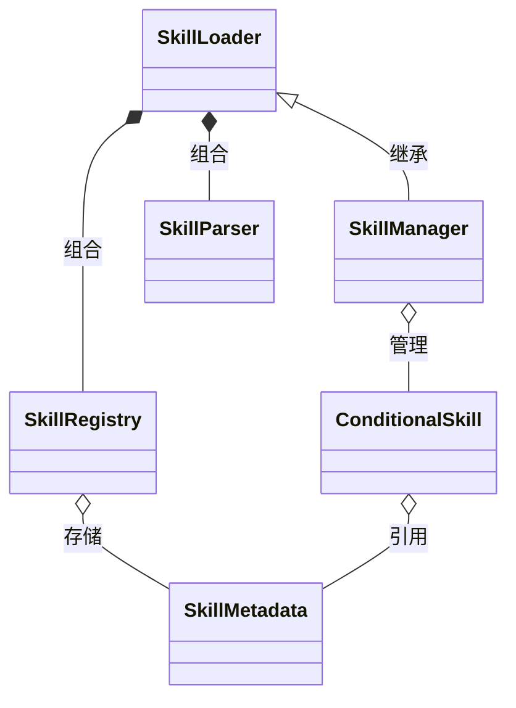
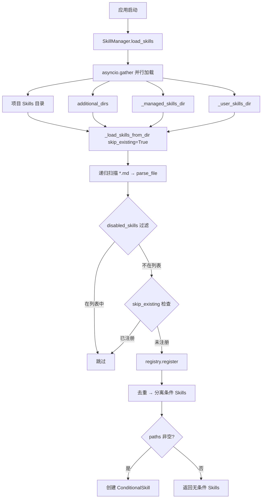
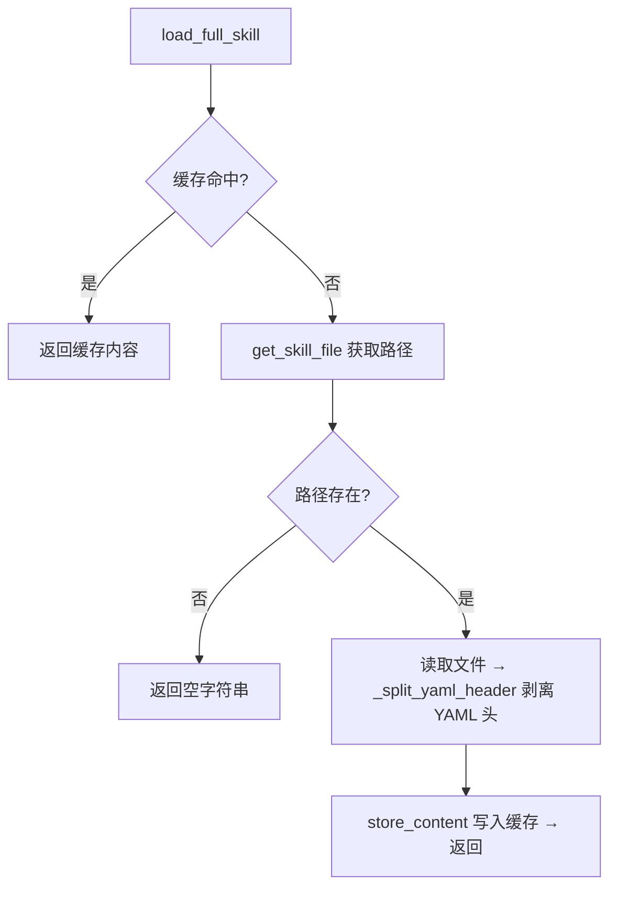
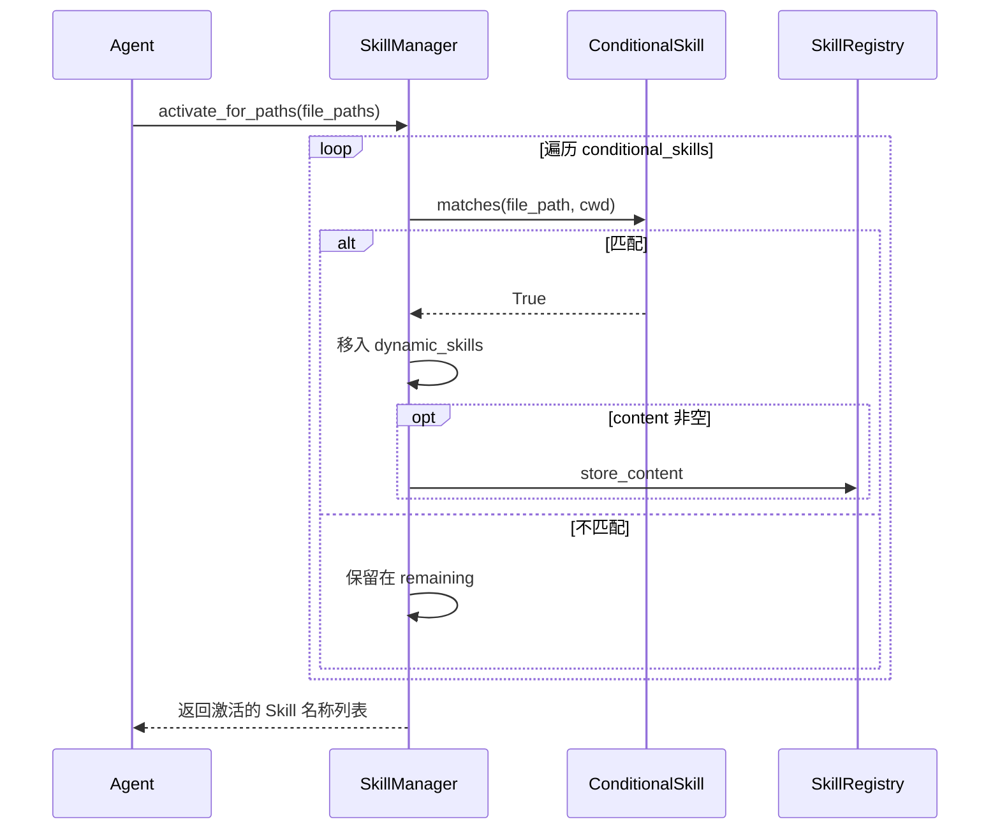
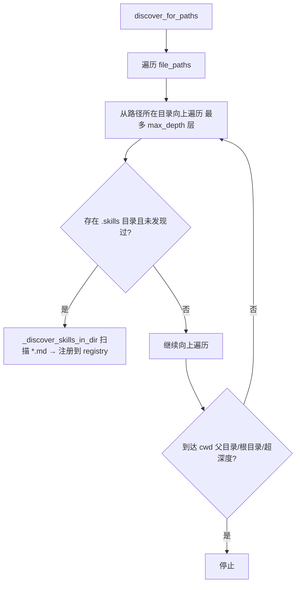

# Skills 模块设计文档

## 1. 模块概述

Skills 模块负责 Skill 的解析、注册、加载、匹配与动态管理，为 ReAct + Skills 架构提供自然语言定义的"工作流片段"能力。

| 依赖 | 用途 |
|------|------|
| Pydantic >=2.0 | SkillMetadata 数据模型验证 |
| PyYAML >=6.0 | YAML 头解析 |
| pathspec >=0.12.0 | 路径模式匹配（GitWildMatchPattern） |

| 文件 | 核心类 | 职责 |
|------|--------|------|
| `parser.py` | `SkillMetadata`, `SkillParser` | 解析 Skill 文件 |
| `registry.py` | `SkillRegistry` | 注册表与内容缓存 |
| `loader.py` | `SkillLoader` | 元数据加载 + 按需全文加载 |
| `manager.py` | `ConditionalSkill`, `SkillManager` | 条件激活 + 动态发现 |

***

## 2. 核心组件设计

### 2.1 SkillMetadata（parser.py）

基于 Pydantic BaseModel 的数据模型。

| 字段 | 类型 | 默认值 | 说明 |
|------|------|--------|------|
| `name` | `str` | — | Skill 名称（唯一标识） |
| `description` | `str` | — | Skill 描述 |
| `version` | `str` | `"1.0"` | 版本号 |
| `author` | `str` | `""` | 作者 |
| `triggers` | `List[str]` | `[]` | 触发词列表 |
| `tools` | `List[str]` | `[]` | 所需工具列表 |
| `paths` | `List[str]` | `[]` | 路径模式列表（非空时为条件 Skill） |
| `file_path` | `str` | `""` | Skill 文件路径 |
| `category` | `str` | `""` | 分类标签 |
| `created_by` | `str` | `"human"` | 创建者（human/agent） |
| `updated_at` | `str` | `""` | 最后更新时间 |

### 2.2 SkillParser（parser.py）

解析 Markdown 格式的 Skill 文件，分离 YAML 头与正文。所有方法为静态方法。

| 方法 | 说明 |
|------|------|
| `parse_file(file_path) -> tuple[SkillMetadata, str]` | 解析文件，返回元数据和内容 |
| `parse_content(content) -> tuple[SkillMetadata, str]` | 解析内容字符串 |
| `extract_yaml_header(content) -> Optional[dict]` | 仅提取 YAML 头字典 |

内部通过 `_split_yaml_header` 以 `---` 分隔符识别 YAML 头；YAML 头缺失时返回空 SkillMetadata（`name=''`）。

### 2.3 SkillRegistry（registry.py）

Skill 注册表，管理元数据存储和内容缓存。

**核心属性**：`skills: Dict[str, SkillMetadata]`（元数据字典）、`skill_contents: Dict[str, str]`（内容缓存）

| 方法 | 说明 |
|------|------|
| `register(metadata, content="")` | 注册元数据，有内容时写入缓存 |
| `unregister(name)` | 注销 Skill，移除元数据和缓存 |
| `find_matching_skill(user_input) -> Optional[str]` | 触发词匹配（大小写不敏感），返回首个匹配名称 |
| `store_content(name, content)` | 存储内容 |
| `get_content(name) -> Optional[str]` | 获取内容 |

辅助方法：`get_skill`、`get_skill_file`、`list_skills`、`has_skill`、`get_loaded_count`。

### 2.4 SkillLoader（loader.py）

Skill 加载器，负责元数据批量加载和全文按需加载。

**核心属性**：`skills_dir: Path`（根目录）、`disabled_skills: Set[str]`（黑名单）、`registry: SkillRegistry`、`parser: SkillParser`

| 方法 | 说明 |
|------|------|
| `load_skill_metadata() -> List[SkillMetadata]` | 启动时加载所有 Skill 元数据 |
| `load_full_skill(skill_name) -> str` | 对话中按需加载 Skill 正文（不含 YAML 头），先查缓存再从文件读取 |
| `get_skill_content_sync(skill_name) -> str` | 同步版 `load_full_skill`，供非 async 上下文使用 |
| `get_all_skill_metadata() -> dict` | 获取所有 Skill 元数据字典 |

内部通过 `_load_skills_from_dir(dir_path, skip_existing)` 递归扫描 `.md` 文件，受 `disabled_skills` 黑名单过滤。

辅助方法：`get_registry`、`find_matching_skill`、`list_skills`、`get_loaded_skills_count`、`is_skill_enabled`、`has_skill`。

**加载策略**：启动时仅加载 YAML 头（元数据），对话中按需加载完整内容并缓存到 Registry。

### 2.5 ConditionalSkill（manager.py）

条件激活的 Skill 数据类，基于路径模式实现条件激活。

| 字段 | 类型 | 说明 |
|------|------|------|
| `skill` | `SkillMetadata` | 关联的 Skill 元数据 |
| `path_patterns` | `List[str]` | 路径模式列表（GitWildMatch 语法） |
| `content` | `str` | Skill 内容缓存 |
| `_spec` | `Optional[pathspec.PathSpec]` | 编译后的路径匹配规范 |

`__post_init__` 中从 `path_patterns` 构建 `pathspec.PathSpec`；`matches(file_path, cwd)` 将绝对路径转为相对路径后匹配。

### 2.6 SkillManager（manager.py）

继承 `SkillLoader`，扩展条件激活和动态发现能力。

**额外属性**：`additional_dirs: List[str]`、`cwd: str`、`conditional_skills: List[ConditionalSkill]`、`dynamic_skills: List[SkillMetadata]`、`discovered_dirs: Set[str]`、`_managed_skills_dir: Optional[str]`、`_user_skills_dir: Optional[str]`

| 方法 | 说明 |
|------|------|
| `load_skills() -> List[SkillMetadata]` | 并行加载多个来源，去重后分离条件 Skills |
| `activate_for_paths(file_paths) -> List[str]` | 激活匹配路径的条件 Skills，匹配的移入 `dynamic_skills` |
| `discover_for_paths(file_paths, max_depth=5) -> List[str]` | 向上遍历目录树发现嵌套的 `.skills` 目录 |
| `get_all_active_skills() -> List[SkillMetadata]` | 获取基础 + 动态 Skills（按 name 去重） |

辅助方法：`set_managed_skills_dir`、`set_user_skills_dir`、`get_conditional_skills_count`、`get_dynamic_skills_count`、`get_discovered_dirs_count`、`clear_dynamic_skills`、`reset_conditional_skills`。

内部：`_load_from_dir` 复用父类 `_load_skills_from_dir(skip_existing=True)`；`_deduplicate_skills` 按 name 去重保留首次；`_separate_conditional_skills` 将 `paths` 非空的包装为 `ConditionalSkill`。

***

## 3. 组件间关系

***

## 4. 关键流程

### 4.1 Skill 加载流程（启动时）

### 4.2 Skill 全文按需加载流程（对话中）

### 4.3 条件激活流程

### 4.4 动态发现流程

***

## 5. 技术实现要点

- **Skill 文件格式**：Markdown + YAML 头（`---` 分隔），YAML 头含元数据，正文为 Skill 内容；`paths` 非空时为条件 Skill
- **黑名单过滤**：`disabled_skills` 非空时排除指定 Skill，空时加载全部，过滤在解析后注册前执行
- **并行加载**：`load_skills` 使用 `asyncio.gather(return_exceptions=True)` 并行加载多来源，异常不中断其他来源
- **skip_existing**：多来源并行加载时跳过已注册同名 Skill，确保先注册者不被覆盖
- **路径匹配**：`ConditionalSkill` 使用 `pathspec.GitWildMatchPattern`，匹配时绝对路径转相对路径并统一分隔符为 `/`

***

## 6. Skill 自改进能力

### 6.1 SkillManageTool（src/tools/skill_manage.py）

LLM 可调用的 Skill 管理工具，支持在交互过程中创建、修改和查看 Skill。

| 操作 | 说明 | 关键参数 |
|------|------|----------|
| `create` | 创建新 Skill | `name`, `description`, `content`（含 YAML 头） |
| `patch` | 局部查找替换 | `name`, `old_string`, `new_string` |
| `edit` | 全量替换 | `name`, `content` |
| `list` | 列出所有 Skill | 无 |
| `view` | 查看指定 Skill 全文 | `name` |

**创建流程**：验证名称格式 → 检查冲突 → 验证 frontmatter → 写入 `skills/.self-improved/{name}/SKILL.md` → 注册到 Registry

**修改流程**：备份原文件 → 执行修改 → 验证 frontmatter 完整性 → 更新 Registry

### 6.2 备份机制

修改已有 Skill 时，自动备份到 `skills/.backups/{name}_{YYYYMMDD}_{HHMMSS}.md`。备份为完整文件副本，用户可自行 diff 确认变更。

### 6.3 迭代计数 Nudge 机制

`RubatoAgent` 维护 `_iters_since_skill_op` 计数器，每次工具调用递增，`skill_manage` 调用时重置。达到 `_skill_nudge_interval`（默认 10）阈值时，在响应末尾附加提示，引导 Agent 考虑保存 Skill。

### 6.4 系统提示引导

当 `skill_manage` 工具可用时，在工具说明文档的 Skill 区段附加自改进引导文本，引导 Agent 在完成复杂任务后保存 Skill、在使用 Skill 发现缺陷时即时修补。

### 6.5 配置

| 配置项 | 位置 | 默认值 | 说明 |
|--------|------|--------|------|
| `skills.self_improve.enabled` | AppConfig | true | 是否启用 Skill 自改进 |
| `skills.self_improve.nudge_interval` | AppConfig | 10 | Nudge 提示阈值 |
| `skills.self_improve.max_content_chars` | AppConfig | 100000 | Skill 内容最大字符数 |
| `skills.self_improve.backup_enabled` | AppConfig | true | 修改时是否自动备份 |
| `skills.self_improve.agent_skills_dir` | AppConfig | ".self-improved" | Agent 创建的 Skill 存放子目录 |
| `tools.builtin.skill_manage.enabled` | RoleConfig | true | 角色级别开关 |

### 6.6 名称触发机制

`SkillRegistry.find_matching_skill` 支持两层匹配：首先匹配 trigger 词，若未命中则匹配 Skill 名称。当用户输入（或案例文档内容）中包含某个已注册 Skill 的名称时，自动触发该 Skill 的全文加载。这使得测试案例 md 文档中的 `[参考skill]` 章节能自动触发对应 Skill 的加载。

### 6.7 后台审查 Agent

当配置 `skills.self_improve.background_review.enabled` 为 true 时，主 Agent 完成响应后，在后台线程中创建审查 Agent，异步审查对话历史，决定是否创建/更新 Skill。审查 Agent 使用与主 Agent 相同的模型，max_iterations=8，仅能使用 skill_manage 工具，不修改主对话历史。

审查 Agent 优先从 SessionStorage 读取压缩前的完整消息（包含完整工具结果），而非从 QueryEngine.mutable_messages（可能已被压缩）读取。这解决了上下文压缩清空旧工具结果后审查 Agent 无法看到完整对话信息的问题。当 SessionStorage 不可用时，降级使用压缩后的消息。

### 6.8 智能化 Nudge 策略

默认 Nudge 阈值为 30（而非 10），避免在常规测试案例执行中过度触发。Nudge 提示词明确引导"只有遇到需要反复尝试才能成功的操作时才保存"，而非泛泛的"考虑保存"。支持按角色配置不同阈值（`tools.builtin.skill_manage.nudge_interval`）。
