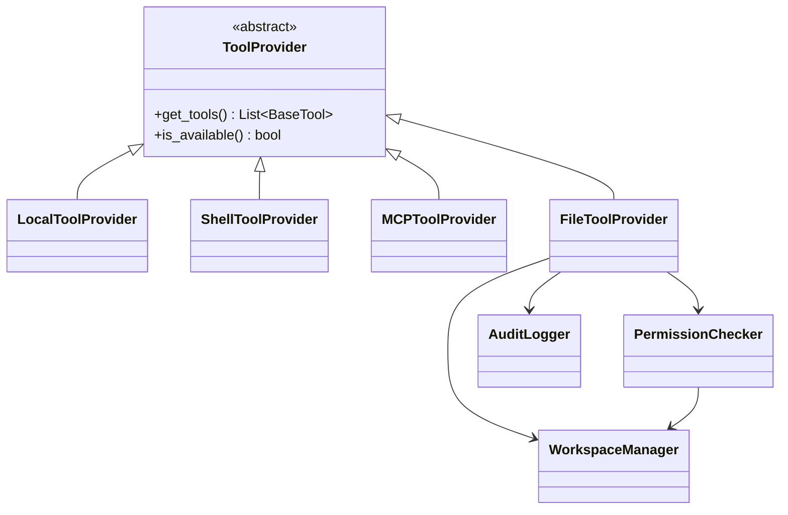
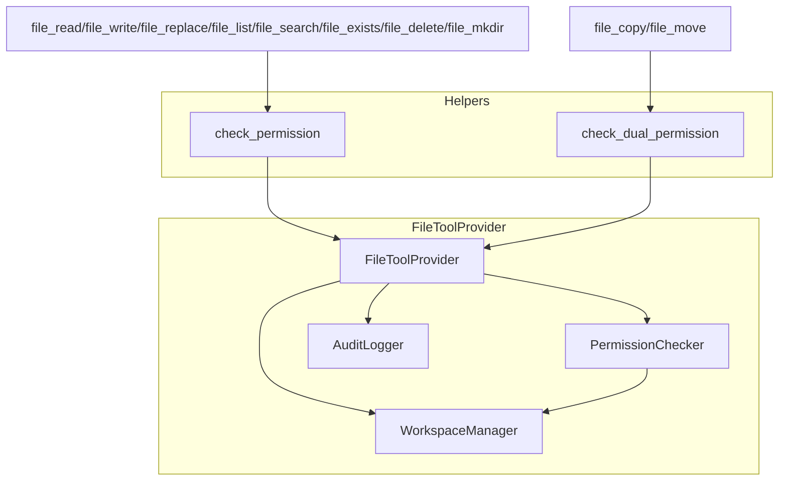
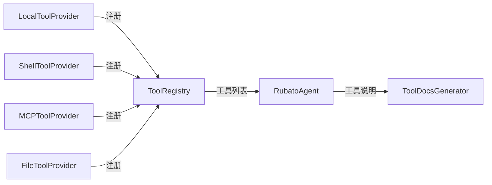
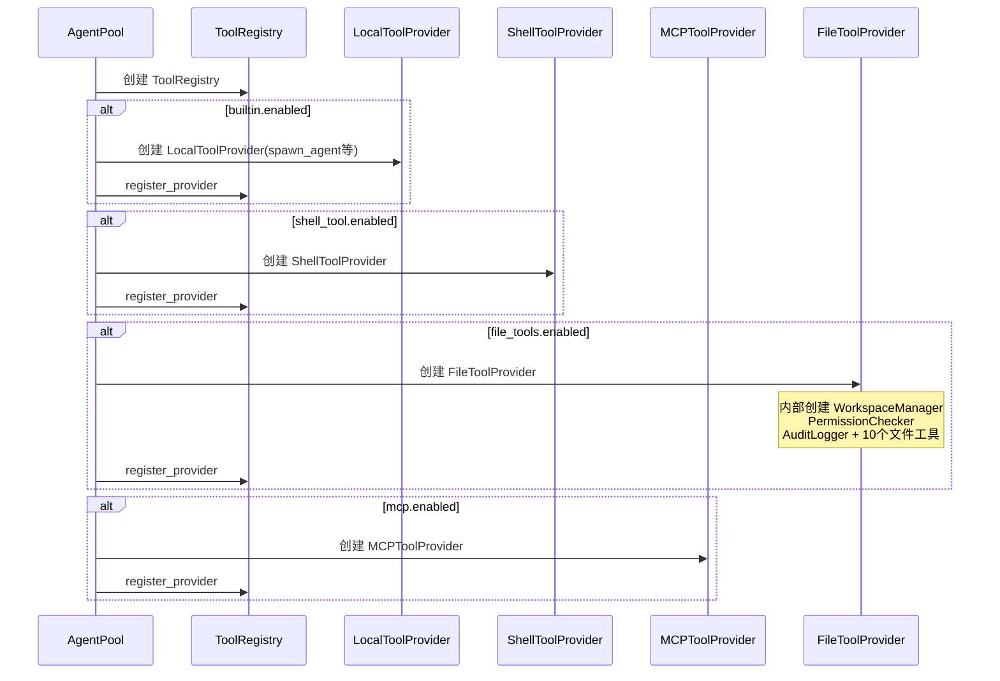
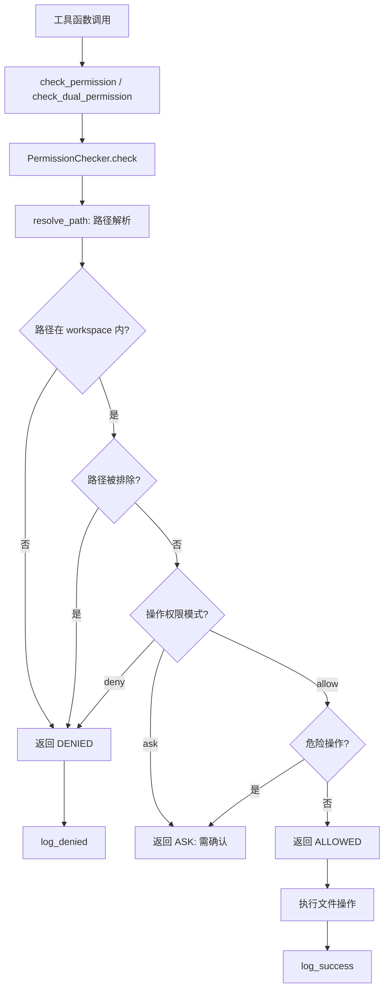
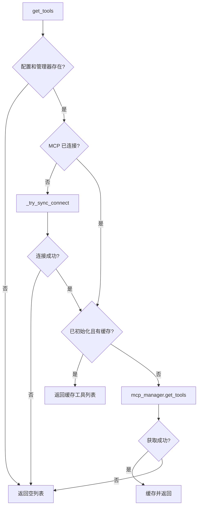

# Tools 模块设计文档

## 1. 模块概述

Tools 模块是 Rubato 框架的工具抽象层，负责：

1. **工具提供者抽象**：统一接口（ToolProvider ABC），支持本地工具、Shell 工具、MCP 工具、文件工具四种来源
2. **工具说明文档生成**：为系统提示词自动生成工具说明文档
3. **Shell 工具封装**：支持 JSON 数组参数自动解包，自动检测系统编码解码子进程输出
4. **文件工具体系**：完整的文件操作工具集，含工作空间管理、权限检查、审计日志三层安全机制

### 目录结构

```
src/tools/
├── __init__.py                # 模块导出
├── provider.py                # ToolProvider ABC + LocalToolProvider + ShellToolProvider
├── mcp_provider.py            # MCPToolProvider
├── docs.py                    # ToolDocsGenerator + 工具说明数据模型
├── shell.py                   # RubatoShellTool + RubatoShellInput
├── concurrency.py             # is_concurrency_safe 并发安全判定
└── file_tools/
    ├── __init__.py            # file_tools 模块导出
    ├── provider.py            # FileToolProvider
    ├── audit.py               # AuditLogger + AuditEntry + OperationType + OperationResult
    ├── workspace.py           # WorkspaceManager
    ├── permission.py          # PermissionChecker + PermissionResult + PermissionStatus
    └── tools/
        ├── __init__.py        # 工具工厂函数导出
        ├── _helpers.py        # check_permission + check_dual_permission
        ├── basic.py           # file_exists + file_delete + file_copy + file_move + file_mkdir
        ├── list.py            # file_list
        ├── read.py            # file_read
        ├── replace.py         # file_replace
        ├── search.py          # file_search
        └── write.py           # file_write
```

***

## 2. 核心组件设计

### 2.1 ToolProvider (ABC) — `provider.py`

抽象方法：`get_tools() -> List[BaseTool]`、`is_available() -> bool`

**LocalToolProvider**：提供本地定义的工具（如 spawn_agent、skill_manage），接受工具类或实例列表，`add_tool()` 支持动态添加。其中 `skill_manage` 工具由 `create_skill_manage_tool(skill_manager)` 工厂函数创建，支持 Skill 自改进（创建/修改/查看 Skill），详见 [skills_module_design.md](skills_module_design.md) 第 6 节。

**ShellToolProvider**：提供 RubatoShellTool 实例。

### 2.1b 并发安全判定 — `concurrency.py`

`is_concurrency_safe(tool_name, tool_instance=None, tool_args=None) -> bool`：判定工具是否可安全并发执行。默认 False，仅 `_CONCURRENCY_SAFE_TOOLS` 字典中显式标记的工具（spawn_agent）返回 True。QueryEngine 的分区调度策略使用此函数决定工具的并行/顺序执行方式。

### 2.2 MCPToolProvider — `mcp_provider.py`

继承 ToolProvider，提供 MCP 服务器工具，支持异步连接和工具缓存。

**核心属性**：`_mcp_config`、`_mcp_manager`、`_tools`、`_initialized`

**同步方法**：`get_tools()`（含自动连接）、`refresh_tools()`、`set_mcp_manager()`、`get_server_names()`、`is_server_enabled()`

**异步方法**：`async_connect()`、`async_get_tools()`、`async_disconnect()`、`async_refresh_tools()`

**辅助方法**：`_has_config_and_manager()`、`_reset_state()`

### 2.3 工具说明文档系统 — `docs.py`

**数据模型**：`ToolParameter`（name/type/description/required/default）、`ToolExample`（description/code）、`ToolDoc`（name/description/parameters/examples/category）

**BUILTIN_TOOLS_DOCS**：预定义 10 个内置工具说明（spawn_agent、shell_tool、file_read/write/replace/list/search/exists/mkdir/delete）

**ToolDocsGenerator**：`generate_docs(builtin_tools, mcp_tools, skills)` 生成完整文档，内部按类别分章节生成。

**模块级函数**：`load_skill_metadata(skill_path)` 加载 Skill YAML 头元数据；`generate_tool_docs_for_prompt()` 便捷入口。

### 2.4 Shell 工具封装 — `shell.py`

**RubatoShellInput**：输入模型，`_unwrap_json_commands` 验证器自动处理 LLM 生成的 JSON 编码命令（单元素数组解包、多元素数组用 `&&` 连接）。

**RubatoShellTool**：继承 langchain_community ShellTool，`name="terminal"`。`_run()` 直接使用 `subprocess.run` 执行命令

### 2.5 文件工具体系 — `file_tools/`

#### 2.5.1 FileToolProvider — `file_tools/provider.py`

继承 ToolProvider，集成 WorkspaceManager、PermissionChecker、AuditLogger 三层安全机制。

**核心属性**：`_workspace_manager`、`_permission_checker`、`_audit_logger`、`_tools`

**关键方法**：`check_permission(path, operation)`、`resolve_path(path)`、`validate_path(path)`、`is_within_workspace(path)`、`is_excluded(path)`

**审计便捷方法**：`log_success()`、`log_denied()`、`log_error()`（均委托 AuditLogger）

**初始化的 10 个文件工具**：

| 工具名 | 工厂函数 | 操作类型 |
|--------|----------|----------|
| `file_read` | `create_file_read_tool` | READ |
| `file_write` | `create_file_write_tool` | WRITE |
| `file_replace` | `create_file_replace_tool` | REPLACE |
| `file_list` | `create_file_list_tool` | LIST |
| `file_search` | `create_file_search_tool` | SEARCH |
| `file_exists` | `create_file_exists_tool` | EXISTS |
| `file_delete` | `create_file_delete_tool` | DELETE |
| `file_copy` | `create_file_copy_tool` | COPY |
| `file_move` | `create_file_move_tool` | MOVE |
| `file_mkdir` | `create_file_mkdir_tool` | MKDIR |

#### 2.5.2 WorkspaceManager — `file_tools/workspace.py`

负责路径解析、workspace 边界检查、排除列表检查、符号链接处理、路径遍历攻击防护。

**核心属性**：`_workspace_paths`（解析后的主+附加 workspace 路径）、`_excluded_patterns`

**关键方法**：`resolve_path(path)`、`is_within_workspace(path)`、`is_excluded(path)`、`validate_path(path)`

**排除模式匹配**（`_match_pattern`）：支持 `**` 通配符和 fnmatch 模式。

**辅助方法**：`get_workspace_roots()`、`get_main_workspace()`、`get_relative_path()`、`find_workspace_for_path()`、`add_excluded_pattern()`、`remove_excluded_pattern()`

#### 2.5.3 PermissionChecker — `file_tools/permission.py`

负责操作类型权限检查、workspace 边界检查、排除列表检查、自定义权限规则应用。

**核心属性**：`_permissions`（操作权限映射，由默认权限+自定义权限合并）

**默认权限策略**：

| 操作类型 | 默认权限 |
|----------|----------|
| READ/LIST/EXISTS/SEARCH | allow |
| WRITE/REPLACE/COPY/MOVE/MKDIR | ask |
| DELETE | deny |

**类常量**：`DANGEROUS_OPERATIONS`（DELETE, MOVE）、`WRITE_OPERATIONS`（WRITE, REPLACE, DELETE, COPY, MOVE, MKDIR）

**核心方法**：`check(path, operation) -> PermissionResult`（检查链：路径解析→workspace边界→排除列表→操作权限→危险操作判断）

**辅助方法**：`is_operation_allowed()`、`is_write_operation()`、`is_dangerous_operation()`、`get_permission_mode()`、`set_permission_mode()`、`validate_for_operation()`

**PermissionResult**：`allowed`、`status`（allowed/denied/ask）、`path`、`operation`、`reason`、`requires_confirmation`、`resolved_path`

#### 2.5.4 AuditLogger — `file_tools/audit.py`

审计日志记录器，JSON Lines 格式写入，支持多维度查询。

**枚举**：`OperationType`（READ/WRITE/REPLACE/DELETE/LIST/SEARCH/COPY/MOVE/MKDIR/EXISTS）、`OperationResult`（SUCCESS/DENIED/ERROR）

**AuditEntry**：`timestamp`、`tool_name`、`path`、`operation`、`result`、`error_message`、`user_info`、`extra`；支持 `to_dict()`/`to_json()`/`from_dict()`/`from_json()` 序列化。

**AuditConfig**：`enabled`、`log_file`、`include_content`、`max_file_size_mb`

**核心方法**：`log()`、`log_success()`、`log_denied()`、`log_error()`、`query()`、`get_statistics()`、`clear()`

**查询便捷方法**：`query_by_path()`、`query_by_operation()`、`query_by_time_range()`、`query_denied()`、`query_errors()`

#### 2.5.5 文件工具实现 — `file_tools/tools/`

**设计模式**：工厂函数模式，`create_*_tool(provider)` 创建闭包捕获 provider 的工具函数，用 `@tool` 装饰器转为 BaseTool。

**辅助函数**（`_helpers.py`）：
- `check_permission(provider, tool_name, path, operation)`：单路径权限检查，返回 `(resolved_path, error)`
- `check_dual_permission(provider, tool_name, src, dst, src_op, dst_op)`：双路径权限检查（file_copy/file_move），返回 `(src_resolved, dst_resolved, error)`

**工具执行统一模式**：权限检查→拒绝则 log_denied 返回错误→执行操作→成功 log_success / 异常 log_error。

***

## 3. 组件间关系

### 3.1 类继承关系



### 3.2 文件工具内部组件关系



### 3.3 工具提供者与 ToolRegistry 的关系



***

## 4. 关键流程

### 4.1 工具注册流程



### 4.2 文件工具权限检查流程



### 4.3 MCP 工具获取流程



***

## 5. 技术实现要点

### 5.1 ToolProvider 双重定义

项目中存在两种 ToolProvider 定义：`src/mcp/tools.py` 中的 Protocol 定义（`@runtime_checkable`，用于类型检查）和 `src/tools/provider.py` 中的 ABC 定义（用于实际基类）。所有具体提供者均继承 ABC 定义。

### 5.2 工厂函数模式

文件工具采用工厂函数模式：`create_*_tool(provider)` 创建闭包捕获 provider 的工具函数，用 `@tool` 装饰器转为 BaseTool，避免为每个工具创建独立类。

### 5.3 Shell 工具编码处理

`RubatoShellTool._run()` 直接调用 `subprocess.run` 执行命令，不依赖上游 `BashProcess`。原因是上游 `BashProcess._run()` 的 `.stdout.decode()` 未指定编码参数，默认 UTF-8，在中文 Windows（GBK/cp936）环境下会因编码不匹配导致解码失败。

解码策略：`_decode_output(raw: bytes)` → 优先严格 UTF-8 解码 → 失败则用系统编码（`locale.getpreferredencoding()`）→ 均失败则 UTF-8（`errors="replace"` 替换无效字节）。先尝试 UTF-8 是因为其自同步特性，严格解码成功即表明内容为 UTF-8，避免在 GBK 系统上误将 UTF-8 字节当 GBK 解码产生乱码。

### 5.4 Shell 工具 JSON 解包

`RubatoShellInput._unwrap_json_commands` 处理 LLM 可能生成的 JSON 编码命令参数：单元素数组解包为字符串，多元素数组用 `&&` 连接。

### 5.5 Workspace 排除模式匹配

`WorkspaceManager._match_pattern` 支持 `**` 通配符（按前缀/后缀分割匹配）和 fnmatch 模式（对完整路径、文件名、相对路径分别匹配）。
