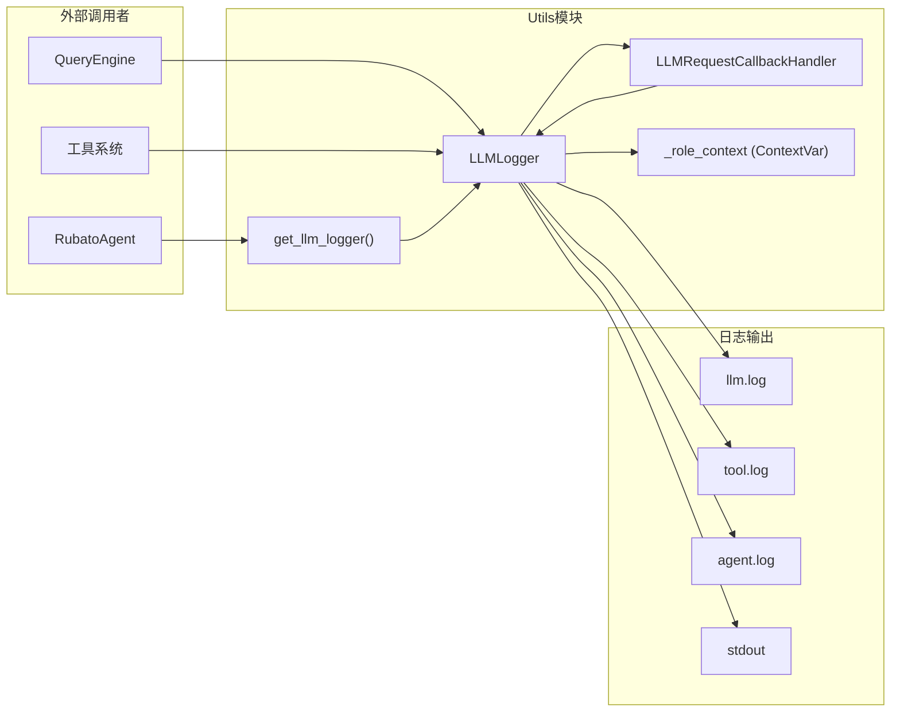
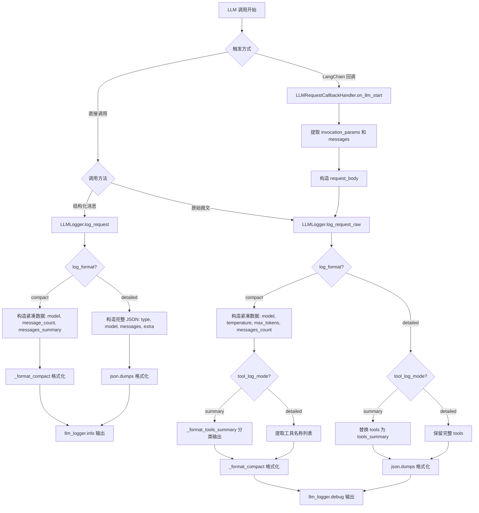
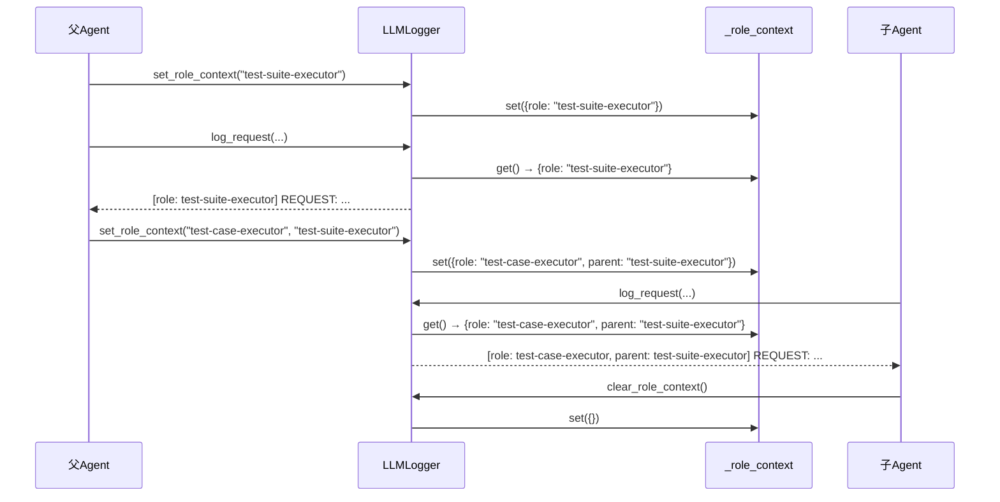

# Utils 模块设计文档

## 1. 模块概述

Utils 模块提供 LLM 日志记录基础设施，管理三类日志通道（LLM/工具/Agent），支持 compact/detailed 双格式输出和角色上下文追踪。

| 文件 | 职责 |
|------|------|
| `src/utils/logger.py` | 日志记录器核心实现 |
| `src/utils/__init__.py` | 模块导出（LLMLogger, get_llm_logger） |

***

## 2. 核心组件

### 2.1 模块级变量

| 名称 | 类型 | 说明 |
|------|------|------|
| `_role_context` | `ContextVar[Dict[str, Optional[str]]]` | 角色上下文变量，存储当前角色和父角色名称，支持异步上下文隔离 |
| `_llm_logger` | `Optional[LLMLogger]` | 全局 LLMLogger 单例实例 |

### 2.2 LLMLogger 类

**定义位置**: `src/utils/logger.py`

**核心职责**: LLM 请求/响应日志记录器，管理三类日志通道并提供双格式输出

#### 核心属性

| 名称 | 类型 | 说明 |
|------|------|------|
| `log_dir` | `Path` | 日志目录路径 |
| `tool_log_mode` | `str` | 工具日志模式："summary" 或 "detailed" |
| `log_format` | `str` | 日志格式："compact" 或 "detailed" |
| `llm_logger` | `logging.Logger` | LLM 日志通道 → llm.log |
| `tool_logger` | `logging.Logger` | 工具日志通道 → tool.log |
| `agent_logger` | `logging.Logger` | Agent 日志通道 → agent.log |

#### 初始化与配置

`__init__(log_dir="logs", tool_log_mode="summary", log_format="compact")` — 创建日志目录，初始化三个日志记录器（FileHandler DEBUG + StreamHandler INFO，统一使用 `_LOG_FORMAT` 格式）

配置方法：`set_tool_log_mode(mode)`、`set_log_format(format_type)`

#### 角色上下文管理

`set_role_context(role_name, parent_role)` / `clear_role_context()` / `get_role_prefix()` — 通过 `_role_context` ContextVar 管理角色上下文，`_get_role_str()` 封装前缀获取逻辑

#### 日志记录方法

| 方法 | 通道 | 级别 | 说明 |
|------|------|------|------|
| `log_request(messages, model, **kwargs)` | llm | INFO | 记录 LLM 请求 |
| `log_request_raw(request_body, model)` | llm | DEBUG | 记录 LLM 原始请求报文（仅写文件） |
| `log_response(response, model)` | llm | INFO | 记录 LLM 响应 |
| `log_tool_call(tool_name, arguments)` | tool | INFO | 记录工具调用 |
| `log_tool_result(tool_name, result, error)` | tool | INFO | 记录工具结果 |
| `log_agent_thinking(thought)` | agent | INFO | 记录 Agent 思考过程 |
| `log_agent_action(action, details)` | agent | INFO | 记录 Agent 行动 |
| `log_error(source, error)` | agent | ERROR | 记录错误 |

#### 辅助方法

- **格式化**：`_format_compact`、`_format_simple_dict`、`_format_value`、`_format_list`、`_is_simple_dict` — compact 模式下的字典/值/列表格式化与截断
- **序列化**：`_serialize_messages`、`_serialize_response`、`_get_content`、`_truncate` — detailed 模式下的消息/响应序列化与文本截断
- **工具摘要**：`_format_tools_summary` — 按内置/MCP/其他分类输出工具名称；`_extract_tool_name`（静态方法）— 从多种格式提取工具名称
- **回调**：`get_callback_handler()` — 返回 `LLMRequestCallbackHandler` 实例

### 2.3 LLMRequestCallbackHandler 类

**继承**: `langchain_core.callbacks.BaseCallbackHandler`

LangChain 回调处理器，在 `on_llm_start` 时提取 invocation_params 和 messages，构造请求体调用 `log_request_raw` 记录。

### 2.4 模块级工厂函数

`get_llm_logger(log_dir="logs")` — 获取全局 LLMLogger 单例，首次调用时创建

***

## 3. 组件关系

***

## 4. 关键流程

### 4.1 LLM 请求记录流程

### 4.2 角色上下文追踪流程

***

## 5. 技术实现要点

### 5.1 双格式输出

| 维度 | compact | detailed |
|------|---------|----------|
| 数据结构 | 紧凑键值对（`_format_compact`） | JSON 序列化（`json.dumps`） |
| 内容截断 | 积极截断（100-300字符） | 适度截断（500-2000字符） |
| 消息内容 | 前5条摘要 | 完整序列化 |

### 5.2 工具信息双模式

`tool_log_mode` 仅影响 `log_request_raw` 中工具信息的展示粒度：summary 按内置/MCP/其他分类输出名称列表；detailed 输出完整工具名称列表或定义。

### 5.3 角色上下文隔离

使用 `contextvars.ContextVar` 实现异步安全的角色上下文隔离，每个协程拥有独立上下文副本，支持子 Agent 嵌套设置。

### 5.4 工具名称提取

`_extract_tool_name` 静态方法支持：OpenAI 格式 dict → `tool['function']['name']`；普通 dict → `tool['name']`；对象 → `tool.name`；其他 → `str(tool)`。
